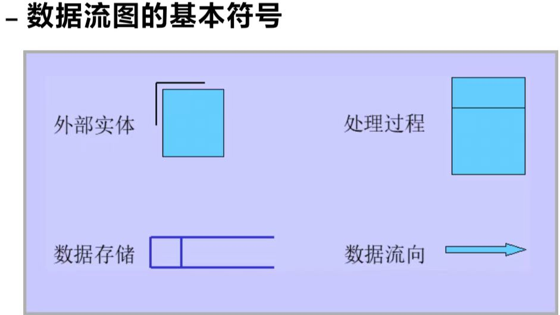

# 数据库概论

## 一、发展历史

- 人工管理阶段

	>硬件：外部存储器只有磁带、卡片、纸带
	>软件：无操作系统，无数据管理软件
	>
	>特点：
	>
	>- 数据面向应用
	>- 数据不能保存
	>- 数据不能共享
	>- 不具有数据独立性

- 文件系统管理
	>硬件：直接存取设备
	>软件：文件系统
	>
	>特点：
	>
	>- 数据有一定的共享性
	>- 冗余
	>- 缺乏数据独立性

- 数据库系统管理
	>- 应用程序具有数据独立性
	>
	>	***


## 二、数据库概念

**数据库是长期存储在计算机内、有组织的、统一管理的、可共享的相关数据的集合**

### 1、数据管理的特点

- 采用数据模型组织数据
- 数据面向整个应用领域
- 数据由DBMS统一管理和控制
- 数据具有独立性

### 2、数据库管理系统DBMS

- 数据库的定义
- 数据操纵
- 数据的组织存储和管理
- 数据库的事务管理和运行管理（控制功能）
- 数据库的维护

### 3、数据库系统

>用户
>
>>应用程序
>>>应用开发工具
>>>>
>>>>DBMS
>>>>>操作系统OS
>>>>>>数据库

### 4、数据库管理员DBS

***

## 三、数据库系统结构

### 1、三级体系结构

| ANSI/SPARC体系结构的层次 | DBTG报告中的体系结构层次的层次 | 对应的抽象视图       | 用数据定义语言描述后的模式 |
| ------------------------ | ------------------------------ | -------------------- | -------------------------- |
| 外部级                   | 视图层                         | 用户视图             | 外模式（子模式）           |
| 概念级                   | 逻辑层                         | 全局视图（概念视图） | 概念模式（逻辑模式）       |
| 内部级                   | 物理层                         | 存储视图             | 内模式（存储模式）         |

### 2、实例和模式

实例：一个特定时刻数据库的即时数据

模式：

- 概念模式：**概念级**数据视图的描述，也称作逻辑模式，是数据库中全体数据的逻辑结构和特征的描述
- 外模式：数据库用户能看见和使用的局部数据的逻辑结构和特征的描述
- 内模式：数据库**物理存储结构和存储方式**的描述

概念模式与内模式可视为**设计与实现**的关系

注意：

- 概念模式独立于其他，设计数据库模式结构时应首先明确
- 内模式独立于外模式，独立于具体的存储设备但是依赖于概念模式
- 外模式定义在概念模式之上，独立于内模式和存储设备，面向具体的应用程序

***

## 四、数据的独立性

数据结构是数据对象在计算机中的组织方式，物理结构是数据在物理存储空间的存储方式

数据独立性是指用户的应用程序与其所处理的数据是相互独立的，当数据的逻辑结构或者物理结构变化时，应用程序保持不变
是在数据库系统中的某个层次修改模式而无需修改上一层模式的能力

- 物理独立性：修改内模式而无需修改概念模式
- 逻辑独立性：修改概念模式而无需修改外模式

***

## 五、数据模型

现实世界—>概念模型—>数据模型


### 1、概念模型

可用ER图（实体entity 联系）来描述，方框表示实体，菱形表示联系，无向边表明联系的类型（一对一、一对多、多对多）

**实体** 客观存在并且可以相互区别的实物
**实体型entity type** 用属性名来抽象和刻画同类实体 
**实体集entity set** 同型实体的集合
**属性attribute** 实体所具有的某一类特性 

>简单属性（原子属性）&复合属性
>存储属性（基本属性）&派生属性（导出属性）
>**域domain** ：属性的取值范围

**关键字key** 能**唯一**标识属性的**最小**属性集
每一个实体一定有关键字

**联系**

>实体集内、实体间的联系
>一元、多元联系
>
>两个实体集间的二元联系：
>
>- 1:1 对A中每一实体，B中至多有一个实体与之联系，反之亦然
>- 1:n 对A中每一实体，B中有n(n>=0)个实体与之联系,对B中实体则A中至多有1个实体与之联系
>- n:n
>
>**IS-A联系**对实体集A的一个子集，可以构造一个新的实体B，实体类型A成为超类，B成为子类
>B可以继承A的所有属性和与A相关的联系，同时有自己特有的属性（在ER图中用三角形）
>例如：type学生 type研究生
>
>**联系的属性** 联系本身也是一种实体型，也可以有属性

### 2、数据模型的组成要素

- 数据结构：

	> 描述数据库的组成对象以及对象之间的联系，反映的是数据静态特性

- 数据操作
	>对数据库中各种对象的实例允许执行的操作的集合，反映的是系统数据的动态变化
	>主要有**查询**和**更新**（插入删除修改）两大类

- 完整性约束
	>制约和依存限制，保证数据的正确，有效，相容

### 3、数据模型的演变

- 层次模型
	>基于树的结构
	>只能表示 1：n 的关系

- 网状模型
	>描述多对多
	>数据结构复杂，编程难度高

- **关系模型**
	**每个关系的数据结构都是一张规范的二维表**

- 半结构化模型
	>类似树，是节点的的集合，每个节点都从根节点可达

- 面向对象数据模型

### 4、关系模型概述

关系：满足一定语义的 D1 x D2 x … x D n的子集叫做在域D1、D2……上的关系

- 在关系模型中只有单一的数据结构——关系
- 关系既可以用来表示概念模型中的实体，也可以表示实体之间的各种联系

| 概念模型     | 关系模型     |
| ------------ | ------------ |
| 实体         | 关系         |
| 实体型       | 关系模式     |
| 实体集       | 关系实例     |
| 属性         | 属性         |
| 域           | 域           |
| 关键字（码） | 候选键（码） |

关系**R(U,D,Dom,F)**

R:关系名
U:组成该关系的属性集合 
D:属性组U中属性来自的域（**域都是原子数据的集合(表中不能再有表)——第一范式条件**）
Dom:属性向域的映像的集合（属性的类型和长度）
F:属性间数据的依赖关系（关系的属性之间的约束关系）


简化版**R(A1,A2,A3…An)**

关系R的实例 r(R) 动态

- 一个给定关系某一时刻的元组 的集合，即为当前关系的值

### 5、关系数据库

>应用领域中所有实体及实体之间联系所形成的关系的集合

| 集合的关系             | 关系模型中的关系                               |
| ---------------------- | ---------------------------------------------- |
| 关系可以是一个无限集合 | 关系必须是有限集合                             |
| 关系中每个元组是“序组” | 为关系的每个属性添加一个属性名取消分量的有序性 |

### 6、候选键和外键

#### 候选键

- 关系中能够**唯一**标识一个元组的**最小**属性集
- 若一个关系有多个候选键，选择其一位**主键**
- 包含候选键的属性集成为**超键**
- 若关系只有一个候选键，并且其包含了关系的所有属性，称之为**全键**
- 构成候选键的每个属性成为**主属性**

#### 外键

- 关系R的一个属性集F 与关系S的主键Ks对应
	即 关系R中的元组在F上的取值与关系S中元组的Ks上的值对应，则称该属性集F为关系R的外键
- R 参照关系（引用关系）
- S 被参照关系（目标关系）

>注意：
>外键与对应的主键必须定义在相同的值域上，即属性值的数据类型要完全一致


### 7、关系模型的完整性约束

#### 实体完整性规则

- 若属性A是关系R的主属性，则属性A的值不能为NULL


#### 参照完整性规则

- 若F是关系R的外键（对应S中的主键Ks）则其取值为：
	1.NULL
	2.S中某个元组的Ks值
- 实质是不允许引用不存在的实体


#### 用户定义完整性

- 针对某一具体关系数据库的约束条件，反映某一具体应用所涉及的数据必须满足的语义要求（如学生成绩数据库限制分数范围）


## 六、关系代数

**相容关系**：定义在一组相同域上的不同关系

>两个关系有相同的目，且相应的属性取值来自同一个域


#### 并

对于相容的关系R和S，并运算的结果是一个与之相容的关系，且其元组由属于R或S的元组组成

#### 差

相容关系R-S，R去掉R与S都有的的元组

#### 交

相容关系R和S都有的元组


#### 投影运算

>投影运算是一元的、对属性进行操作的与暖啊
>从关系中选择若干年属性列形成一个新的关系

π


#### 选择运算

>**一元的、对元组进行操作**的运算
>在关系中选择满足条件F的元组

δ


#### 乘积运算（广义笛卡尔积）

m目k1个元组的关系R与n目k2个元祖的关系S的笛卡尔积是一个m+n目，k1k2个元组的关系

若R、S有同名的属性A ，需要用R.A S.A区分

将两个关系进行笛卡尔积操作后有些元组是没有实际语义的，需要选择操作


#### 连接运算

Θ-连接运算从两个关系的笛卡尔积中选取属性之间满足一定条件的元组

- 当Θ为“=”时候，Θ-连接运算成为等值连接

- 自然连接是一种特殊的等值连接（去掉相同属性列）

- 外连接：在自然连接的结果上保留因在公共属性上没有相同属性值而被舍弃的元组(悬浮元组)，并且在这些元组新增加的属性赋空值
	>左外连接：只保留运算符左边关系中的悬浮元组
	>右外连接：只保留运算符右边关系中的悬浮元组

- 重命名 ρ s


#### 除法

注意，A / B 则B中属性类型为A中的真子集


#### 关系代数表达式


---

## 七、SQL语言

###  1、SQL概述

- structured query language

1. 综合统一
	>集成DDL DML DCL
	>
	>独立完成数据库生命周期的全部活动
	>
	>数据操作符统一

2. 高度非过程化
	>无需了解存取路径

3. 面向集合的操作方式

4. 同一种语法提供两种使用方法

5. 语言简单

	| 功能     | 动词                 |
	| -------- | -------------------- |
	| 数据查询 | SELECT               |
	| 数据定义 | CREATE,DROP,ALTER    |
	| 数据操纵 | INSERT,UPDATE,DELETE |
	| 数据控制 | GRANT,REVOKE         |


#### 基本表

1. 本身独立存在的表
2. SQL中一个关系对应一个基本表
3. 一个或多个基本表对应一个存储文件
4. 一个表可以带若干个index


#### 存储文件

1. 逻辑结构组成了关系数据库的内模式
2. 物理结构是任意的，对用户透明

#### 视图

1. 从一个或多个基本表==导出==的表
2. 是一个==虚表==（不独立存储在数据库中）
3. 数据库中**只存放视图的定义不存放视图对应的数据**
4. 可以在视图上再次定义视图

### 2、SQL数据定义

模式定义、表定义、视图和索引的定义

|      | 创建        | 删除       | 修改        |
| ---- | ----------- | ---------- | ----------- |
| 表   | CREAT TABLE | DROP TABLE | ALTER TABLE |
| 视图 | CREAT VIEW  | DROP VIEW  |             |
| 索引 | CREAT INDWX | DROP INDEX |             |

#### 定义模式

```sql
CREAT SCHEMA <模式名> AUTHORIZATION <用户名>
例如：
CREAT SCHEMA "S-T" AUTHORIZATION ZYH;
```


说明：

- 未指定模式名，schema默认为用户名
- 在CREAT SCHEMA中，可以接受CREAT TABLE\VIEW和CREAT字句
- 执行创建模式语句必须有DBA权限，或者DBA授予CREAT SCHEMA的权限


#### 删除模式

```sql
DROP SCHEMA <模式名> <CASCADE|RESTRICT>;
```

说明：

- CASCADE和RESTRICT二选一
- CASCADE（级联）：删除模式的同时把所有数据库对象删除
- RESTRICT（限制）：如果该模式中定义了下属的数据库对象（表、视图等），则拒绝执行删除语句

---

#### 表的定义

```sql
#尖括号<>表示根据实际情况写，方括号[]表示可有可无
CREATE TABLE <表名>
(<列名><数据类型>[<列级完整性约束条件>]
 [,<列名><数据类型>[<列级完整性约束条件>]]...
 [,<表级完整性约束条件>]
)；
```

说明：

- 如果完整性约束条件涉及到该表的多个属性列，则必须定义在表级，不然可以定义在列级或表级


例：

```sql
CREATE TABLE Student
(Sno CHAR(9) PRIMARY KEY,
 Sname CHAR(20) UNIQUE,
 Ssex CHAR(2),
 Sage SMALLINT,
 Sdept CHAR(20)
)
```

外键约束例：

```sql
CREATE TABLE Course
(Cno CHAR(4) PRIMARY KEY,
 Cname CHAR(40),
 Cpno CHAR(4),
 Ccredit SMALLINT,
 FOREIGN KEY (Cpno) REFERENCES (Course(Cno))
)
#Cpno是外码，被参照表是Course,被参照列是Cno
```

#### 数据类型

- CHAR(n) 定长字符串
- VARCHAR(n) 最大长度为n的字符串
- INT 整型
- SMALLINT 短整数
- NUMERIC(p,d) 定点数，p位数字（不包括符号小数点），小数点后d位数字
- REAL 取决于机器的浮点数
- Double Precision 取决于机器精度的双精度浮点数
- FLOAT(n) 浮点数
- DATE 日期 YYYY-MM-DD
- TIME 时间 HH:MM:SS


#### 模式和表

每一个基本表都属于某一个模式，一个模式包含多张基本表

创建基本表时，若没有指定模式，系统会搜索路径来确定：

1. 显示当前的搜索路径
	`SHOW search_path`
2. 搜索路径的当前默认值
	`$user,PUBLIC;`
3. DBA用户可以指定搜索路径
	`SET search_path TO "S-T",PUBLIC;`

找到后放到搜索路径的第一个，找不到就放到public，若都不存在报错

##### 创建基本表

1. 创建表的时候给出模式名

	```sql
	CREATE TABLE "S-T".Student(...)
	#属于模式"S-T"的表Student
	```

2. 同时创建

	```SQL
	CREATE SCHEMA ex AUTHORIZATION ZYH
	CREATE TABLE TAB1(...);
	```

3. 设置所属模式，创建表时不需给出模式名

---


#### 修改基本表

```sql
ALTER TABLE <表名>
[ADD[COLUMN]<列名><数据类型>[完整性约束]]
[ADD <表级完整性约束>]
[DROP [COLUMN] <列名> [RESTRICT|CASCADE]]
[ALTER COLUMN <列名> <数据类型>]；
```

说明：

1. ADD增加新列，新增加的列一律为NULL
2. DROP COLUMN 删除列，注意两种删除方法
3. DROP CONSTRAINT 删除指定的完整性约束
4. ALTER COLUMN修改原有的列定义

#### 删除基本表

```sql
DROP TABLE <表名> [CASCADE|RESTRICT]；
```

说明：

基本被删除，数据被删除，表上建立的索引、视图、触发器一般都被删除


#### 索引的建立与删除

建立的目的：加快查询速度

谁能建立索引：DMA或表的属主

DBMS一般会建立以下列的索引：

1. PRIMRAY KEY
2. UNIQUE

维护索引：DBMS自动完成

使用索引：DBMS自动选择


- 索引是数据库内部实现技术，属于内模式
- CREATE INDEX语句定义索引时，可以定义唯一索引、非唯一索引，或聚簇索引


语句格式：

```sql
CREATE [UNIQUE][CLUSTER]INDEX<索引名> ON <表名>(<列名>[<次序>][,<列名>[<次序>]]...)
```

例:

```sql
CREATE UNIQUE INDEX Stusno ON Student(Sno);
CREATE UNIQUE INDEX SCno ON SC(Sno ASC,Cno DESC)
#ASC升序，DESC降序
```

聚簇索引：

CLUSTER索引是指索引顺序与表中记录的物理顺序一致的索引组织（放在连续的存储空间）

- 在最经常查询的列建立聚簇索引能提高效率
- 一个基本表最多建立一个聚簇索引
- 经常更新的列不宜建立聚簇索引

删除索引：
`DROP INDEX <索引名>；`

删除索引时，系统会从数据字典删去有关该索引的描述

---

#### 数据字典

- DB内部的一组系统表
- 记录了数据库中的所有定义信息
- RDBMS执行SQL数据定义时，实际就是更新字典

---

### 3、数据查询

格式：

```sql
SELECT [ALL|DISTINCT]<目标表达式>[,<目标表达式>]...
FROM <表名或视图名>[,<表名或视图名>]..
[WHERE<条件表达式>]
[GROUP BY<列名>[HAVING<条件表达式>]]
[ORDER BY<列名>[ASC|DESC]]；
```

##### 3.1 单表查询

功能：对一个表的内容进行查询

1. 选择表中的若干列

	1. 查询指定列
		格式：

		```sql
		SELECT Sno,Sname FROM Student;
		```

	2. 查询全部列
		格式：

		```sql
		SELECT * FROM Student
		```

	3. 查询经过计算的值
		功能：选中指定列，计算后输出
		格式：

		```sql
		SELECT <> FROM 
		/*
		<>中可以是：
		算数表达式
		字符串常量
		函数
		列别名
		*/
		SELECT 2025-Sage FROM Student ;
		SELECT Sname,"year of birth:",2025-Sage,LOWER(Sdept) FROM Student;
		```

		使用列别名改变查询结果的列标题：

		```sql
		SELECT Sname NAME,"year of birth" BIRTH,2025-Sage BIRTHDAY,LOWDER(Sdept) DEPARTMENT FROM Student;
		```

2. 选择表中的若干元组

	1. 消除取值重复的行
		如果没有指定DISTINCT关键字，则缺省为ALL
		例：
		`SELECT Sno FROM SC;`
		等价于
		`SELECT ALL Sno FROM SC;`
		指定 DISTINCT关键字，去掉重复的行
		`SELECT DISTINCT Sno FROM SC;`

	2. 查询满足条件的元组

		| 查询条件             | 谓词                        |
		| -------------------- | --------------------------- |
		| 比较                 | =，<,>,!=                   |
		| 确定范围             | BETWEEN AND,NOT BETWEEN AND |
		| 确定集合             | IN,NOT IN                   |
		| 字符匹配             | LIKE,NOT LIKE               |
		| 空值                 | IS NULL,IS NOT NULL         |
		| 多重条件（逻辑运算） | AND,OR,NOT                  |

		例：
		集合：`SELECT Sname FROM Student WHERE Sdept IN("CS","IS")`

		字符匹配：`LIKE "<匹配串>" [ESCAPE "<换码字符>"]`

		>匹配串为含通配符字符串
		>
		>例：查询所有姓周的学生姓名
		>
		>`SELECT Sname FROM Student WHERE Sname LIKE "周%";`
		>
		>查询姓周且全名2个字
		>`SELECT Sname FROM Student WHERE Sname LIKE "周_";`
		>
		>查询第二个字为宇的
		>
		>`SELECT Sname FROM Student WHERE Sname LIKE "_宇%";`

		使用换码字符将通配符转义为普通字符（就是说我后面的字符就是单纯的字符，不表示特殊含义）：

		>`SELECT Cno FROM Course WHERE Cname LIKE "DB\_DESIGN ESCAPE '\'"`
		>
		>```SQL
		>#查询DB_开头且倒数第三个字符为i的课程的详细信息
		>SELECT * FROM Course 
		>WHERE Cname LIKE 'DB\_%i__' ESCAPE '\' 
		>```

		涉及空值的查询
		>`IS NULL` 或 `IS NOT NULL`
		>
		>例如：
		>
		>```SQL
		>#查询缺考的学生学号
		>SELECT Sno FROM SC
		>WHERE Grade IS NULL;
		>```

		多重条件查询

		>AND优先级高于OR

	3. ORDER BY 字句
		可以按照一个或多个属性列排序
		ASC DESC
		缺省值为升序
		当排序列含有空值：（空值默认最大）
		ASC/DESC排序列为空的元组最后/先显示

	4. 聚集函数

		```sql
		COUNT (DISTINCT|ALL *) 统计元组个数
		COUNT (DISTINCT|ALL <列名>) 统计一列中值的个数
		SUM (DISTINCT|ALL) <列名> 计算一列值的总和
		AVG (DISTINCT|ALL) <列名> 计算一列值的平均值
		MAX (DISTINCT|ALL) <列名> 最大值
		MIN (DISTINCT|ALL) <列名> 最小值
		```

		聚集函数不能写在 WHERE 之后

	5. GROUP BY字句
		作业：按照指定的一列或多列值分组，值相等的为一组，来细化聚集函数的作用对象
		**分组的好处在于能够使得聚集函数作用于需要的分组，否则作用于整个查询结果**
		**使用group by AAA 之后 SELECT后面只能跟AAA和作用于AAA的聚集函数**

	6. GROUP BY 分组之后，可以用HAVING单一指定筛选条件

		```sql
		#查询选了3门以上课程的学生
		SELECT Sno FROM SC GROUP BY Sno HAVING COUNT(*) > 3
		```

		区别WHERE和HAVING:

		- WHERE作用于基表或视图，选择满足条件的元组，HAVING短语作用于组，再次选择满足条件的组
		- WHERE中无法使用聚集函数（**WHERE之后只能有显然的观测，无法复杂运算**）


##### 3.2 连接查询

###### 等值与非等值查询

连接查询的WHERE子句中用来连接两个表的条件成为==连接条件或连接谓词==一般格式：

格式一：

`[<表名1>.]<列名1> <比较运算符> [<表名2>.]<列名2>；`

其中，比较运算符有：`=  >  <  >=  <=  !=`

格式二：

`[<表名1>.]<列名1> BETWEEN [<表名2>.]<列名2> AND [<表名3>.]<列名3>;`


- 当连接符号为 = ，称为==等值连接==，其他运算称为非等值连接
- 连接谓词中的列名称为连接字段，并且各连接字段必须是可比的，名字不必相同

自然连接:去掉重复列的等值连接

```sql
SELECT sname, cid, grade
FROM Student
NATURAL JOIN Score;


```

###### 自身连接

说明：

- 需要给表取别名来区分

例：求先修课的先修课

###### 外连接

左外连接：保留左边的悬浮元组

`LEFT OUT JOIN  ON`

右外连接：保留右边的悬浮元组

`RIGHT OUT JOIN ON`

```SQL
SELECT Student.Sno,Sname,Sage,Cno,Grade
FROM Student LEFT OUT JOIN SC ON (Student.Sno=SC.Sno)
```

###### 多表连接

连接2个以上的表


---

##### 3.3 嵌套查询

一个 `SELECT-FROM-WHERE`语句称为一个查询块

所谓嵌套查询，就是指将一个查询块嵌套在另一个查询块的WHERE子句或HAVING短语条件中的查询

说明：

1. 子查询中不能使用ORDER BY
2. 层层嵌套方式反映了SQL语言的结构化
3. 有些嵌套查询可以用链接运算符替代
4. 外层查询（父查询），内层查询（子查询）

嵌套查询中，子查询的结果往往是集合，用IN谓词表示父查询的条件在子查询的集合中

```sql
#查询和zyh在一个系的学生
SELECT Sno,Sname FROM Studen
WHERE Sdept IN
(SELECT Sdept FROM Student
WHERE Sname = 'zyh');

#法二
SELECT S1.Sno,S1.Sname,S1.Sdept
FROM Student S1,Student S2
WHERE S1.Sdept = S2.Sdept AND S2.Sname = 'zyh' ;
```


- 不相关子查询：子查询不依赖父查询
- 相关子查询：依赖

当确切知道内层查询返回单值时，可以用比较运算符

```sql
查询每个学生超过选修课程平均成绩的课程号
SELECT Sno,Cno
FROM SC x
WHERE Grade >=
(SELECT AVG(Grade)
 FROM SC y
 WHERE x.Sno=y.Sno
);
```


###### 带有ANY(SOME)或ALL谓词的子查询

ANY 任意一个值

ALL 所有值

例：

```sql
>ANY 大于某一个即可
>ALL 大于所有
!=ANY 不等于某一个即可
!=ALL 不等于所有
```

```SQL
SELECT Sname,Sage
FROM Student
WHERE  Sage < ANY (SELECT Sage FROM Student WHERE Sdept ='CS')
ADD Sdept != 'CS';
#使用聚集函数也可以完成
子查询改为：
SELECT MAX(Sage) FROM Student WHERE Sdept = 'CS'
```

###### 带有EXISTS谓词的子查询

EXISTS谓词代表存在量词 ，带有EXSITS谓词的子查询只返回逻辑值True 或 False

例子：

查询所有选修1号课程的学生姓名
>思路：
>
>1. 涉及Student和SC
>2. 在Student中一次取每一个 `Sno` 值，用这个值检查SC关系
>3. 若SC存在这样的元组，其 `Sno`值等于 `Student.Sno`且 `Cno='1'`，则选这个 `Student.Sname`进入结果关系

带有EXISTS的子查询都用 `SELECT *` 


NOT EXISTS谓词

取反即可


所有带有 IN,比较运算符，ANY,ALL的子查询都可以被EXISTS替换


可以用EXISISTS/NOT EXSISTS实现全程量词

$
\forall x\, p(x) \equiv \neg \exists x\, \neg p(x)
$

```sql
查询选修了全部课程的学生的姓名
等价于：没有一门课不选
SELECT Sname FROM Student
WHERE NOT EXISTS
(SELECT * FROM Course
 WHERE NOT EXISTS
 (SELECT * FROM SC
  WHERE Sno = Student.Sno AND Cno=Course.Cno
 )
);
```

---

##### 3.4 集合查询

集合操作：交 并查

###### 并操作UNION

`UNION` 将多个结果合并起来系统自动去掉重复元组

`UNION ALL` 将多个结果合并起来，保留重复元组

###### 交操作 INTERSECT

```sql
SELECT * FROM Student WHERE Sdept = 'MIS'
INTERSECT
SELECT * FROM Student WHERE Sage <= 20;
```

###### 差操作EXCEPT


注意：

参加集合操作的各查询结果的列数必须相同，数据类型也必须相同


###### 基于派生表的查询

子查询不仅可以出现在WHER子句，还可以出现在FROM子句中，这时子查询生成的临时派生表（derived）

例：

找出每个学生超过自己选修课程平均分数的课程号

```sql
SELECT Sno,Cno FROM SC,(SELECT Sno,AVG(Grade) FROM SC GROUP BY Sno) AS Avg_sc(avg_sno,avg_grade)
WHERE SC.Sno = Avg_sc.sno AND SC.Grade >= Avg_sc.avg_grade;

#分析：SELECT Sno,AVG(Grade) FROM SC GROUP BY Sno 作用是求出每个学生的平均成绩
#AS Avg_sc(avg_sno,avg_grade)就是一个新的表，后续只要在新的表里查询学号一样且分数高就可以了
```

如果子查询中没有使用聚集函数，则派生表可以不指定属性列(也就是说没有新的属性列)，子查询SELECT子句后面的列名为其默认属性

```sql
SELECT Sname FROM 
Student,(SELECT FROM SC WHERE Cno = '1') AS SC1 
WHERE Student.Sno = SC.Sno
#
SELECT Sname FROM
Student
NATURAL JOIN SC
WHERE Cno = '1'
```

```sql
SELECT [DISTINCT] 列1, 列2, 聚合函数(...)
FROM 表名1 [别名1]
    [JOIN 类型] 表名2 [别名2] ON 连接条件
WHERE 筛选条件
GROUP BY 分组列
HAVING 分组后筛选条件
ORDER BY 排序列 [ASC | DESC]

```

---

### 4、数据更新

#### 4.1 插入数据

##### 插入元组

格式：

```sql
INSERT INTO <表名> [(<属性列1>[,<属性列2>]]...)]
VALUES (<常量1>[,<常量2>]...)；
```

```sql
INSERT INTO Student (Sno, Sname, Ssex, Sage, Sdept)
VALUES ('20250001', '周末', '男', 20, '信息管理');

```

说明：

- VALUES子句提供的值必须与上面顺序匹配，数据类型一致

##### 插入子查询结果

格式：

```sql
INSERT INTO <表名> [(<属性列1>)[,<属性列2>]...]
子查询；
#SELECT子句目标必须与INTO子句匹配，值的个数，类型都要一致
```

例如：

```sql
INSERT INTO TempStu (Sno, Sname)
SELECT Student.Sno, Sname
FROM Student
JOIN SC ON Student.Sno = SC.Sno
WHERE Cno = '1';
#把选修了1号课程的学生编号和名字插入表中
```

---

#### 4.2 修改数据

```sql
UPDATE <表名>
SET <列1>=<表达式>,<列2>=<表达式>...
WHERE ...;
```

注意：

- `SET`指定修改方式，修改的列，修改后的值
- `WHERE` ==必须要写！== 指定要修改的列，不写整个表改

---

#### 4.3 删除数据

```sql
DELETE FROM <表名> [WHERE <条件>]
```

说明：

- `WHERE`子句指定要删除的元组，缺省则删除表中全部数据，表的定义还在

例：

```sql
DELETE 
FROM SC
WHERE Sno IN
(SELECT Sno FROM Student
 WHERE Sdept = 'CS'
);
```

---

#### 4.4 空值的处理

##### 允许取NULL的情况：

- 属性有值，但当前不知道具体值
- 该属性不应该有值
- 出于某种原因不便于填写

##### NULL特性说明：

- `NULL` ≠ 0，也 ≠ ''（空字符串），而是**“无值”或“未知”**

- 任何和 `NULL` 参与的算术或比较运算结果都是 `NULL`（除了 `IS NULL` 和特定函数）

- `NULL` 和任何值比较都不是 `TRUE`，而是 `UNKNOWN`（三值逻辑的一部分）

##### 约束条件：

1. 属性定义（或者域定义）有NOT NULL约束条件的不能取空值
2. 增加了UNIQUE约束的属性不能取空值
3. 码属性不能取空值

##### 空值的运算

算术运算：空值和另一个值的算术运算结果为空值

比较运算：结果为UNKNOWN

逻辑运算：

> - 如果表达式里出现了 `NULL`，整个逻辑结果就可能变成 `UNKNOWN`
>
> - `WHERE`子句只筛选出**结果为 `TRUE`** 的行，`FALSE` 和 `UNKNOWN` 都被过滤掉
>
> - 这就是为什么 `WHERE col = NULL` 查询不到任何数据，因为 `col = NULL` 的结果是 `UNKNOWN`，不满足筛选条件

例：

```sql
#查询课程1没及格的学生
SELECT Sno
FROM SC
WHERE Grade<60 AND Cno = '1';
#其实这样不够，因为没考虑到缺考学生，修改WHERE子句
WHERE Cno='1' AND (Grade < 60 OR Grade IS NULL);

```

---

### 5、视图


> **视图（`VIEW`）**是基于一个或多个表的查询结果虚拟表，它本身不存储数据，只存储查询逻辑，是“可重用的SELECT查询”，是让SQL变得**清晰、简洁、安全**的利器

可以把视图想象成：

- 表的“窗口”，你通过它看到了表的一部分
- 表的“封装函数”，屏蔽复杂细节，提升复用和安全性

特点：

1. 虚表，是从一个或多个基本表（或视图）导出
2. 只存放视图的定义，不存放视图对应的数据
3. 表中的数据变化，视图中查询出的数据也就随之变化

#### 5.1 定义视图

语句格式：

```sql
CREATE VIEW <视图名> [(<列名1>)[,<列名2>]...] AS 
SELECT ... FROM ...
WHERE ...;
```

 例：

```sql
CREATE VIEW SC_C1 AS
SELECT Student.Sno, Sname, Grade
FROM Student JOIN SC ON Student.Sno = SC.Sno
WHERE Cno = '1';

```

说明：

- 组成视图的属性列名：全部省略或全部指定
- 子查询不允许含有ORDER BY子句和DISTINCT短语
- RDBMS执行CREAT VIEW只是把视图的定义存在数据库，不执行其中的SELECT语句
- 在对视图查询时，按照试图的定义从基本表中查询

##### 受限更新

`WITH CHECK OPTION` 数据库会在你用 `INSERT` 或 `UPDATE` 时，**强制检查你插入/更新后的数据是否还满足视图定义的条件**，否则就报错

---

#### 5.2 删除视图

格式：

```sql
DROP VIEW <视图名>[CASCADE]
```

说明：

- 删除指定的视图定义
- 如果该视图上还导出了其他视图，使用级联会删除导出的视图
- 删除基表时，由该基表导出的所有视图定义都必须显式地用DROP VIEW删除

---

#### 5.3 查询视图

RDBMS实现视图查询的方法–视图消解法

1. 进行有效性检查
2. 转换成等价的对基本表的查询
3. 执行修正后的查询

---

#### 5.4 更新视图

通过视图来插入、删除数据，实际上是通过视图消解对实际表进行更新操作

注意：未来防止在更新视图时出错，定义视图时要加CHECK OPTION子句

**一些局限性**

一些视图无法更新，因为对这些视图的更新不能唯一有意义的转换成对相应基本表的更新

#### 5.5 视图的作用

1. 简化用户操作
2. 多种角度看待同一数据
3. 视图对重构数据库提供一定程度的逻辑独立性
4. 对机密数据提供安全保护
5. 更加清晰的表达查询

---

### 6、数据控制

一定程度上保证了数据库中数据的安全性、完整性，并提供了一定的并发控制及恢复能力

#### 6.1 完整性

是指数据库中数据的正确性和相容性

#### 6.2 并发性

并发控制：多个用户同时操作，对他们加以协调、控制，以保证并发操作正确执行，保持数据库的一致性

#### 6.3 恢复

当发生各种类型的故障导致数据库处于不一致状态时，将数据库恢复到一致状态的功能

#### 6.4 安全性

保护数据库，防止不合法的使用造成的数据泄露或破坏

主要措施：

- 存取控制：控制用户只能存取其有权存取的数据
- 规定不同用户对于不同数据对象所允许执行的操作

DBMS实现安全性保护的过程：

1. 用户或DBA把授权告知系统
2. SQL的GRANT和REVOKE
3. DNMS把授权的结果存入数据字典
4. 用户提出操作请求时，DBMS根据授权定义检查，以决定是否执行操作请求

##### `GRANT`命令

`GRANT` 命令用于把对数据库对象（如表、视图、存储过程）的特定操作权限授予用户或角色。比如，你可以允许某位用户查询（SELECT）、插入（INSERT）、更新（UPDATE）或者删除（DELETE）一个表中的数据。

```sql
GRANT 权限列表 #常见的包括 SELECT, INSERT, UPDATE, DELETE 等
ON 对象名称           #某张表或视图
TO 用户或角色 [WITH GRANT OPTION];
WITH GRANT OPTION #可选，允许再次分发权限
```

##### `REVOKE`命令

`REVOKE` 命令正好相反，用于回收或撤销先前授予给某个用户或角色的权限。它可以确保当某个用户不再适合持有某些敏感操作权限时，及时地把门票收回来

```sql
REVOKE 权限列表
ON 对象名称
FROM 用户或角色;
```

```sql
例如
REVOKE UPDATE
ON Employee
FROM Bob;
```

权限具有级联回收，高等级权限被收了，其下发权限一并回收

---

## 八、关系数据理论

### 8.1 问题的提出

#### 关系模式的表示

五部分组成：$R(U,D,DOM,F)$

- R 关系名 是符号化的元组语义
- U 一组属性
- D 属性组U中的属性来自的域
- DOM 属性到域的映射
- F 为属性组U上的一组数据依赖

说明：

1. 由于D，DOM和模式设计关系不大，故可以简化为一个三元组
	$R<U,F>$
2. 当且仅当U上的一个关系r满足F时，r称为$R<U,F>$的一个关系
3. 作为二维表，关系要符合一个最基本的条件：每个分量必须不可再分， 满足这个条件的关系模式称为==第一范式==


#### 数据依赖

> 是一个关系内部属性和属性之间的一种约束关系，是通过属性间值的相等与否体现出来的数据间相互联系

主要类型：

- 函数依赖FD
- 多值依赖MVD

#### 函数依赖存在的问题

1. 数据冗余
	浪费大量的存储空间
2. 更新异常
	由于数据冗余，在更新数据时为了维护数据完整性，修改大量的数据
3. 插入异常
4. 删除异常
	比如删除一个专业的学生信息，系主任信息丢失

#### 函数依赖的解决方式

单一模式分解为多个模式

### 8.2 函数依赖

#### 平凡函数依赖

定义：

> 一个关系中，若给定属性集 **X** 的值，可以**唯一确定**属性集 **Y** 的值，就说 **Y 函数依赖于 X**，记作：X→Y

一些术语

1. X –> Y ，且Y⊈ X，则称X –> Y 是==非平凡的函数依赖==

2.  X→Y，且Y⊆X，则称 X→Y是==平凡的函数依赖==
	>平凡就是很正常很普通，一个集合当然决定自己的一部分

3. 若X→Y，则x称为这个函数依赖的==决定属性组==，也成为决定因素

4. 若X→Y，并且Y→X，则记作 X<–>Y

5. 若Y不依赖于X记作X-/–>Y


#### 完全函数依赖

定义：

在R(U)中，如果X→Y，并且对于X的任何一个真子集X’，都有X’--/–>Y,则称**Y对X完全函数依赖**（缺一不可）

若X→Y，但Y不完全函数依赖于B，则称Y对X部分依赖（记作X→(箭头上加p)Y）


#### 传递函数依赖

定义：

如果属性集 X 决定属性集 Y，而 Y 又决定属性集 Z，那么就说 Z **传递函数依赖于** X，记作：

X→Y且Y→Z⇒X→Z

这里的 X→Z 就是一个**传递函数依赖**

---

### 8.3 码（关键字，键）

#### 候选键

在关系模式 R(U) 中，属性集 $K \subseteq U$是候选键，当且仅当：

1. **唯一性**（唯一标识性）：
	 对于关系中的任意两个不同元组 t1≠t2​，有

	$t1[K]≠t2[K]$

2. **最小性**（不能有冗余）：
	 任意 K′⊂K，都不满足唯一性（不能再删属性了)

#### 超码

U部分依赖于K，称K是U的超码，很容易得知，候选键是最小的超键

#### 主键

若关系模式R有多个候选码，选一个作为主码

#### 主属性

包含在任何一个候选码中的属性

非主属性：不包含在任何码中的属性

#### 全码

整个属性组是码，称为全码                     

#### 外码

R中一个属性X不是R的码，但X是另一个关系模式的码，则称X是R的外码

外码是连接不同关系的桥梁

### 8.3 范式

>范式（**Normal Forms**）是关系数据库设计中的一组规则，用来**消除数据冗余**、**避免数据异常（插入、删除、更新异常）**，让表结构更科学、可靠、易维护

==范式是符合某一级别的的关系模式的集合==

关系数据库中的关系必须满足一定的要求，满足不同程要求的为不同范式

分类：

- 第一范式（1NF）==字段原子性==
	>所有属性的值必须是**原子值（不可再分）**，即每个单元格只能存一个值

- 第二范式（2NF）==消除部分依赖(必须完全依赖)==
	>在满足 1NF 的基础上，**每个非主属性都要完全依赖于主码**，不能只依赖主码的一部分

	例子：学生表 Student 和选课表 SC 为什么分开，就是由于合并就会出现只需要知道Sno 就可以推出 Sname,出现部分依赖

	不属于2NF会出现一些问题：

	- 插入异常
	- 删除异常
	- 修改复杂

	解决方式：**用投影分解把关系模式分解**

- 第三范式（3NF）==消除**传递依赖**==
	>在满足 2NF 的基础上，**非主属性不能传递依赖于主键**

	错误示范：

	| 学号 | 系编号 | 系名称   |
	| ---- | ------ | -------- |
	| 1001 | CS     | 计算机系 |

	函数依赖：

	- 学号 → 系编号
	- 系编号 → 系名称
		 ⇒ 学号 → 系名称（传递依赖）❌

	✅ 正确做法：拆成两个表

	- 学生表（学号, 系编号）
	- 系信息表（系编号, 系名称）

- BCNF

	扩充的第三范式

	定义：设关系模式R<U,F>∈1NF，若X—>Y且Y⊈X时X必含有码，则R<U,F>∈BCNF

	也就是说，如果每一个决定属性集都含有候选码，则R∈BCNF

	性质：

	- 所有非主属性都完全函数依赖于每个候选码
	- 所有主属性都完全依赖于每个不包含它的候选码
	- 没有任何属性完全函数依赖于非码的任何一组属性

	>BCNF 更讲“权力集中”：
	> 谁要决定别人，必须能决定全世界（是超键）
	> 有一丁点“越权”，就得分拆

	满足BCNF，实现了模式的彻底分解

	---

### 8.4 4NF

>4NF 解决的是：同一个主键下不应该有多个独立多值属性
>
>换句话说：
>
>- 如果一个主键决定多个**彼此无关的多值属性**，那就应该拆表！
>- 否则就违反了 4NF

> 如果一个主键下面有两个或更多**彼此不相关**的“多值”列，那就是多值依赖，**赶紧拆！**

### 8.5 规范化小结

将低级的范式的关系模式分解为高级的范式，称为规范化

原则：概念单一化一事一地，就是说应该描述一个实体或实体间的一种联系，不要混合

要求：通过自然连接可以还原

| 范式     | 满足条件（简洁描述）                                    | 解决的问题                   |
| -------- | ------------------------------------------------------- | ---------------------------- |
| **1NF**  | 所有字段都是**原子值**（不可再分）                      | 消除重复组，结构规范         |
| **2NF**  | 满足1NF，且**每个非主属性完全依赖于主码**（无部分依赖） | 消除部分依赖，避免插入异常   |
| **3NF**  | 满足2NF，且**无传递依赖**（非主属性不依赖于非主属性）   | 消除传递依赖，避免更新异常   |
| **BCNF** | 满足3NF，且**每个决定因素都是超键**                     | 强化主键约束，防止“越权决定” |
| **4NF**  | 满足BCNF，且**无非平凡的多值依赖**                      | 消除笛卡尔积式冗余，多值独立 |

## 九、数据库设计

### 9.1 数据库设计概述

定义：

是指对于一个给定的应用环境，构造，优化的数据库的==逻辑模式==和==物理结构==，并据此建立数据库及其应用系统，使之能够有效地存储和管理数据，满足用户的应用需求，信息管理需求和数据操作需求


信息管理要求：

应该存储和管理哪些数据对象


数据操作要求：

查询，增删改查


高效率的运行环境：

1. 数据的存取效率高
2. 存储空间的利用率高
3. 数据库系统运行管理的效率高


设计的特点：

结构设计（数据）和行为（处理）设计结合

#### 数据库设计方法

##### 规范设计法

基本思想：==过程迭代==和==逐步求精==

典型方法：

1. 新奥尔良方法
	>将数据库设计氛围四个阶段：
	>
	>1. 需求分析
	>2. 概念设计（信息分析和定义）
	>3. 逻辑设计（设计实现）
	>4. 物理设计（物理数据库设计）

2. 基于 E-R 模型的数据库设计方法

3. 3NF的设计方法

4. 面向对象的数据库设计方法

5. 统一建模语言UML方法

### 9.2 数据库设计的基本步骤

#### 9.2.1 需求分析阶段

需求分析的任务：

- 详细调查现实世界要处理的对象，充分了解原系统工作概况，明确用户的各种需求
- 在此基础上确定新系统的功能，需要考虑未来的扩充和改变，不要局限于当下
- 重点是调查、手机和分析用户在数据管理中的**信息要求、处理要求、安全性和完整性要求**

包括的基本活动有：

1. 调查分析用户的活动
2. 收集和分析需求数据，确定系统边界
3. 编写需求分析说明书


确定用户最终需求的难点：

1. 用户，表达不清晰
2. 设计人员，误解需求
3. 新技术的出现，使用户需求改变

解决方法：深入交流

需求分析的方法：

1. 调查清楚用户的实际需求，并进行初步分析
2. 与用户达成共识
3. 进一步分析和表达需求


分析和表达用户需求的常用方法：

==自顶向下的结构化分析法==（structured analysis）简称SA方法

>自顶向下的结构化分析法是**从整体业务需求出发**，**逐层细化系统功能和数据流程**，最终形成系统的功能结构和数据模型的分析方法

从最上层的系统组织机构入手，采用逐层分解的方法分析系统，并用==数据流图==和==数据字典==描述系统

| 工具                | 用途                                   |
| ------------------- | -------------------------------------- |
| **DFD**（数据流图） | 描述数据在系统中如何流动、处理的过程   |
| **数据字典**        | 描述数据项、数据结构、数据流等的定义   |
| **E-R 图**          | 描述数据实体及其之间的关系             |
| **结构图/模块图**   | 描述系统功能的分解层次与模块间调用关系 |

##### 数据流图

一种最常用的结构化分析工具，从数据传递和加工角度，用图形的方式刻画系统内的数据运动情况



##### 数据字典

数据字典是系统分析与设计阶段的一个重要工具，用于**准确、统一地描述系统中所有的数据元素**（包括数据项、数据结构、数据流、数据存储等）的**定义、格式、用途和约束**

包含内容：

| 类别         | 说明                                 | 举例                               |
| ------------ | ------------------------------------ | ---------------------------------- |
| **数据项**   | 系统中最基本的、不可再分的单位       | 姓名、学号、成绩、日期             |
| **数据结构** | 有组织的数据项集合，组成数据流或存储 | 学生信息 = {学号, 姓名, 专业}      |
| **数据流**   | 系统中数据在处理之间流动的路径       | “选课请求”、“成绩提交”、“查询响应” |
| **数据存储** | 数据在系统中临时或长期保存的位置     | 课程表、选课记录库、用户信息表     |

#### 9.2.2 概念设计阶段

##### 概念设计定义

- 需求分析阶段描述的用户应用需求是现实世界的具体需求
- 姜需求分析得到的用户需求差抽象为信息结构的过程就是概念结构设计
- 概念结构是各种数据模型的共同基础，比数据模型更抽象，更稳定
- 使整个数据库设计的关键

##### 概念结构设计特点

- 能真实、充分反映现实世界，包括事物和事物之间的联系，能满足用户对数据的处理要求
- 易于理解，从而可以用它和不熟悉计算机的用户交换意见
- 容易更改
- 容易向关系、网状、层次等数据模型转换

##### 描述概念模型的工具——E-R模型

| 元素类型                 | 图形符号           | 说明                                           | 示例                    |
| ------------------------ | ------------------ | ---------------------------------------------- | ----------------------- |
| **实体（Entity）**       | 矩形 `▭`           | 表示一个可以独立存在的数据对象或对象集合       | 学生、课程、图书        |
| **属性（Attribute）**    | 椭圆形 `◯`         | 实体或关系的性质或特征                         | 姓名、学号、价格        |
| **主键属性（Key）**      | 椭圆形 + 下划线    | 能唯一标识实体的属性                           | `学号`、`课程编号`      |
| **多值属性**             | 双圈椭圆 `◎`       | 一个实体可能有多个该属性值                     | 电话号码、兴趣          |
| **派生属性**             | 虚线椭圆 `◯--`     | 可由其他属性推导而来                           | 年龄（由出生日期计算）  |
| **联系（Relationship）** | 菱形 `◇`           | 表示两个或多个实体之间的逻辑联系               | 选修（学生选课程）      |
| **联系中的属性**         | 附加在菱形上的椭圆 | 联系也可以有自己的属性（如成绩）               | 成绩（在“选修”联系中）  |
| **弱实体**               | 双矩形 `▭▭`        | 无主键，必须依赖强实体存在，需用**部分键**识别 | 订单明细、借书记录      |
| **识别关系**             | 双菱形 `◇◇`        | 将弱实体与其依赖的强实体关联起来               | 借书记录 → 借书（学生） |

##### 设计方法

- 自顶向下
- 自底向上（常用）


自底向上：

1. 抽象数据并设计局部视图
2. 集成局部视图，得到全局概念结构

#### 9.2.3 逻辑结构设计阶段

#### 9.2.4 数据库物理设计阶段

#### 9.2.5 数据库实施阶段

#### 9.2.6 数据库运行和维护阶段
