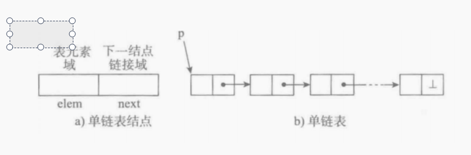
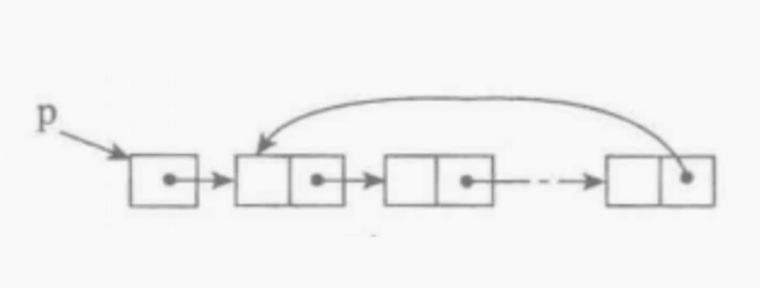
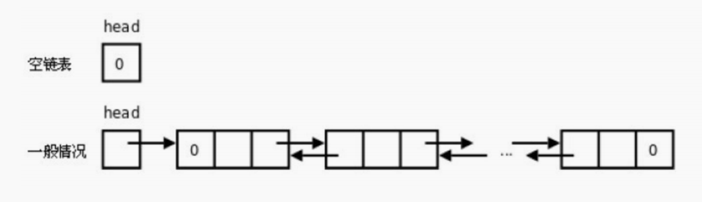
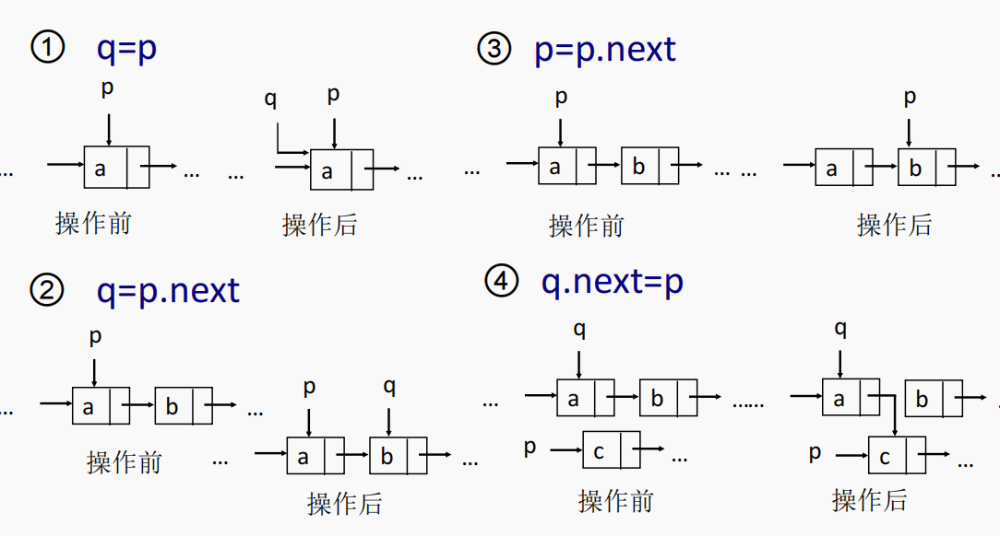
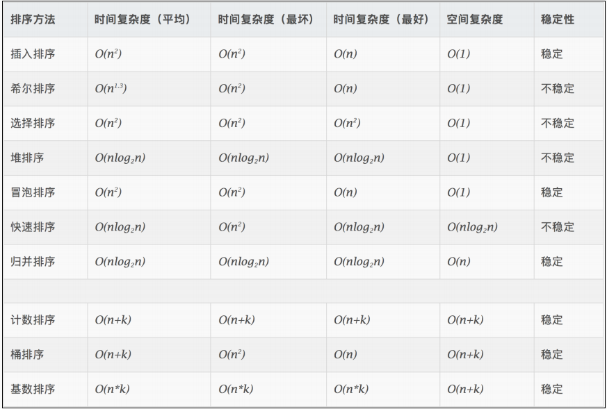
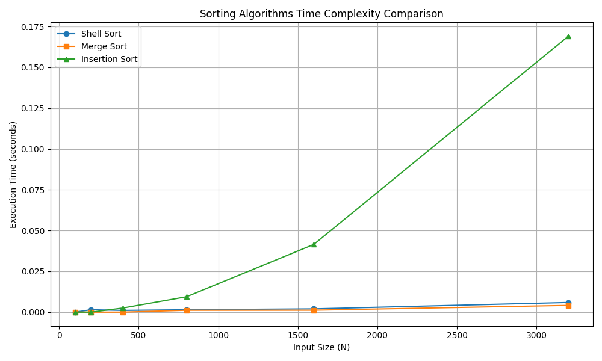
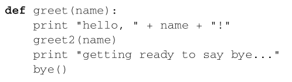
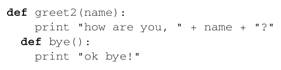
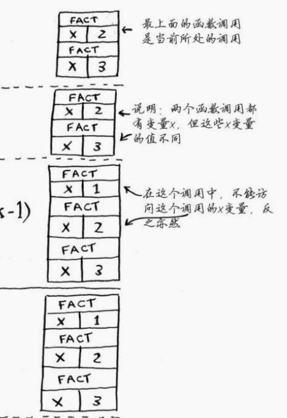
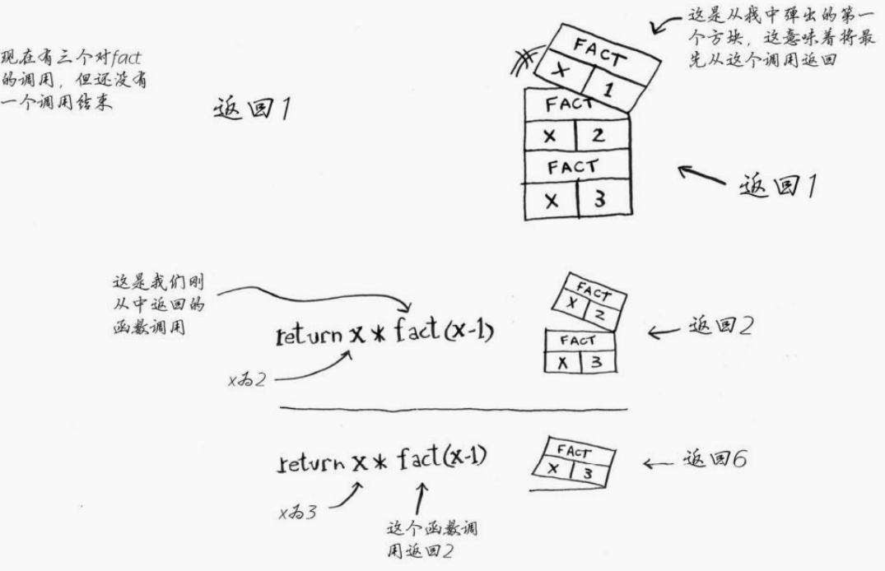

# 一、概述

## 1 数据结构的研究对象

线性表

树

图

## 2 数据结构的研究内容

**研究非数值计算的程序设计问题中计算机的操作对象以及它们之间的关系和操作**


## 3 一些基本概念

### 数据

- 一切能输入到计算机中并能被计算机程序识别和处理的符号集合
- 数值性数据：整数、实数等
- 非数值性数据：图形、图象、声音、文字等

### 数据元素data element

- 数据的基本单位，在计算机程序中通常将其作为一个整体进行考虑和处理，也称结点（node）或记录（record）

### 数据项

- 是构成数据元素的不可分割的最小单位，也被称为字段、域或属性

### 数据对象

- 具有相同性质的数据元素的集合，是数据的一个子集

### 数据结构

- 数据结构是相互之间存在一种或多种特定关系的数据元素的集合

- 通常这些数据元素都不是孤立存在的，而是通过某种关系将所有数据元素联系起来，我们将这种关系称为“结构” 

- 这种关系是抽象的， 即并不涉及数据元素的具体内容。是数据元素及其相互间的关系的数学描述

### 逻辑结构

数据元素间抽象化的相互关系，与数据的存储无关，独立于计算机，它是从具体问题抽象出来的数学模型
>集合（数据元素除了同属于一个集合外，无其他关系）
>
>线性结构（一一对应）
>
>树形结构（一对多）
>
>图形结构（多对多）


### 存储结构

- 顺序存储
	用一组连续的存储单元一次存储数据元素，数据元素之间的逻辑关系由元素的存储位置来表示
- 链式存储
	用一组任意的存储单元存储数据，数据元素之间的逻辑关系用==指针==来表示
- 索引存储
	用节点的索引号来确定节点存储地址，优点是检索速度快，缺点是索引表占用较多的存储空间
- 哈希存储
	存储位置与关键码之间建立对应关系


### 数据运算

>哪怕是逻辑结构和存储结构都相同，但运算不同则数据结构也不同，比如栈和队列

常见运算：插入 删除 修改 查找 排序


### 数据类型

类型是指一组值的集合，而数据类型则是指一组值的集合及定义在这组值上的一组操作的总称

#### number

Python中的数字数据类型用于存储数值，如整型、浮点型和复数型，定义在其上的操作有加、减、乘和除等

#### string

字符串是Python中最为常用的数据类型之一，通常使用单引号或双引号来创建。定义在其上的操作有字符串连接（“+”）、重复输出字符串（“*”）、通过索引获取字符串中的字符（“[]”）、截取字符串中的一部分（“[:]”）、若包含指定字符则返回True（“in”）、若不包含指定字符则返回True（“not in”）、原始字符串（“r/R”）和格式字符串（“%”）等

#### list

列表是Python中最常用的数据类型之一，通常使用方括号来创建。定义在其上的操作有访问列表中的值、更新列表和删除列表元素等，同时与字符串类似，列表也包括连接、重复和截取等操作

#### tuple

Python中元组与列表类似，但元组使用小括号创建，并且其中的元

素不能修改。定义在元组上的操作有访问元组、修改和删除元组，同时元组也包括连接、重复和截取等操作

#### set

集合是由一组无序且不重复的元素组成的序列，常使用{}或者set()函数来创建。定义在其上的操作有进行成员关系测试和删除重复元素等

#### 字典

Python中字典形如{key1:value1,key2: value2,…}，其中key1和key2部分被称为键（必须是唯一的），value1和value2被称为值。定义在字典上的操作有修改和删除等

#### 抽象数据类型

**(ADTs: Abstract Data Types)**

由用户定义，用来表示应用问题的数据模型，由基本的数据类型组成，并包括一组相关的操作

ADT = （D，S，P）
>D 数据对象
>
>S D上的关系集
>
>P D上的操作集

## 4 算法与算法分析

### 算法的特性

1. 输入 
	0或多个输入
2. 输出
	一或多个输出
3. 确定性
	每一步定义都是确切无歧义的
4. 有穷性
	算法应该在执行有穷步结束
5. 有效性


### 算法的评价

- 正确性
	>程序对于一切合法的输入数据，都能够得出满足要求的结果

- 可读性
	>注释+变量命名

- 健壮性
	>当输入的数据不合法或运行环境改变时，算法能恰当地做出反应或进行处理，而不是产生莫名其妙的输出结果

- 高效性（时间代价，空间代价）
	>时间复杂度，空间复杂度

### 算法效率的度量

1. 事后统计
2. 事前分析估计
	大O表示法

| 表达式       | 名称         | 举例                           | 说明                         |
| ------------ | ------------ | ------------------------------ | ---------------------------- |
| O(1)         | 常数时间     | 访问数组中某个元素 `arr[i]`    | 无论多少数据，时间不变       |
| O($log⁡{n}$)  | 对数时间     | 二分查找                       | 每次减半，效率惊人           |
| O(n)         | 线性时间     | 遍历数组                       | 每个元素只访问一次           |
| O(n$log{n}$) | 线性对数时间 | 快速排序、归并排序             | 常见的高效排序算法           |
| O($n^2$)     | 二次时间     | 冒泡排序、选择排序             | 两层嵌套循环，常见于暴力解法 |
| O($n^3$)     | 三次时间     | Floyd最短路径算法              | 三层循环，计算更慢           |
| O($2^n$)     | 指数时间     | 子集枚举、旅行商问题（暴力法） | 随着 n 增长飞快爆炸          |
| O(n!)        | 阶乘时间     | 全排列                         | 排列组合的地狱级复杂度       |

# 二、 数组和链表

## 1 数组

- 有序的元素序列，组成数组的各个变量称为数组的分量，也称为数组的元素
- 编号从0开始

## 2 链表

- 与数组的主要区别：链表中的元素可以存储在内存的任何地方，由于每个元素都存储了下一个元素的地址，从而将一系列随机的内存地址串在一起
- data+next
- 单链表，每一个节点只包含一个指针域的链表否则称为多练表
- 为操作方便，总是在链表的第一个节点之前附设一个表头节点(head)指向第一个节点。表头节点的值域可以不存储任何信息

### 链表的几种形式

#### 单向链表



#### 单向循环链表



最后一个节点的链接域不再为none而是指向头节点

#### 双向链表



### 链表中常用的指针操作



## 3 数组与链表对比

### 查找元素

数组更便捷，按照索引查即可，而在链表中需要从头开始

### 插入元素

链表更简单，只需要修改前驱指向的地址，而使用数组需要将后面所有元素后移

### 删除元素

链表更简单，只需要将需要删除节点的前驱节点指向下一个节点即可

### 二者的优缺点

|      | 数组                                           | 链表                                         |
| ---- | ---------------------------------------------- | -------------------------------------------- |
| 优点 | 内存占用小，数组内部可以随机访问               | 动态添加删除没大小可变，内存分散，可扩展性好 |
| 缺点 | 增加困难需要移动后续所有元素，预留内存造成浪费 | 不具备随机访问性，链表的指针会占据更多内存   |

### 数组的实现

```python
#定义一个数组
list = [1,2,3,"fff",None]
#索引查找
item1 = list[1]
#插入实现
def insert_list(list,item,pos):
    key = len(list)-1
    #判断数组是否满，满则无法添加
    if list[key] is None:
        while key < pos:
            list[key],list[key-1] = list[key-1],list[key]
            key-=1
        list[pos] = item
    else:
        return'数组满了加不了'
    return list
#删除实现
def delete_list(list,pos):
    list[pos] = None
    key = pos+1
    item= list[key]
    while item is not None:
        list[key],list[key-1]=list[key-1],list[key]
        key+=q
    return list
        
```

## 4 二分查找

### 查找的基本概念

1. 查找表
	>相同类型的数据元素组成的集合，每个元素通常由若干数据项构成

2. 关键字
	>数据元素中某个或几个数据项的值，它可以标识一个数据元素。若关键字能唯一标识一个数据元素，则关键字称为主关键字；将能标识若干个数据元素的关键字称为次关键字

3. 查找
	>根据给定的Key值，在查找表中确定一个关键字等于给定值的记录或数据元素。若是查找表中存在满足条件的记录，查找成功，返回所查找的记录信息或记录在查找表中的位置，若是查找表中不存在满足条件的记录，查找失败

4. 静态查找
	>在查找时只对数据进行查询或检索，查找表称为静态查找表

5. 动态查找
	>在实施查找的同时，插入查找表中不存在的记录，或从查找表删除已存在的某个记录，查找表称为动态查找表

6. 顺序表的查找
	>将给定的k值与查找表中记录的关键字逐个进行比较，找到要查找的记录

7. 散列表的查找
	>根据给定的k 值直接访问查找表，从而找到要查找的记录

### 顺序查找

从一段开始依次比较

平均查找长度 $(1+n)/2$,查找不成功时需要N+1次比较

### 二分查找

从中间开始，进入左半边或者右半边，重复进行，适用于有序数组

代码实现：

```Python
def binary_search(list,item):
    #查找范围，分上下界
    low = 0
    high = list[len(list)-1]#第一次查找的上下界是整个数组
    while low<=high:
        mid = (low+high)//2#向下取整
        guess = list[mid]
        if guess = item:
            return mid#直接在中间找到了
        elif guess>item:
            high = mid - 1#猜大了，把上界放小
        else:
            low = mid + 1
    return None#上下界相等还是没找到返回空
```

| 目标元素存在情况 | 最好情况 | 最坏情况 | 普通情况 |
| ---------------- | -------- | -------- | -------- |
| 存在             | 1        | n        | n/2      |
| 不存在           | n        | n        | n        |

对于有序列表顺序查找，有

| 目标元素存在情况 | 最好 | 最坏 | 一般 |
| ---------------- | ---- | ---- | ---- |
| 存在             | 1    | n    | n/2  |
| 不存在           | 1    | n    | n/2  |

可以发现只有在不存在目标元素时，有序排列元素才会提高搜索效率

### 顺序查找比较二分查找

顺序：线性时间

二分：对数时间

虽然二分查找在消耗的时间上优于顺序查找，但也要考虑到**对数据项排序**的开销；

-  如果一次排序后可以进行多次查找，那么二分查找是好的选择

-  如果搜索的数组经常变动，而查找次数相对较少，那无序数组搭配顺序查找或许是更好的选择

-  在算法选择问题上，往往要考虑到实际应用的情况

# 三、大O表示法

**大O表示法**用来描述**算法的时间或空间复杂度的上界**，即：

> **当输入规模 n趋近于无穷时，算法执行所需的最大操作次数（或空间）增长得有多快？**

它**忽略常数项和低阶项**，只保留最高阶的增长趋势，用来比较算法效率

| 表达式       | 名称         | 举例                           | 说明                                   |
| ------------ | ------------ | ------------------------------ | -------------------------------------- |
| O(1)         | 常数时间     | 访问数组中某个元素 `arr[i]`    | 无论多少数据，时间不变                 |
| O($log⁡{n}$)  | 对数时间     | 二分查找                       | 每次减半，效率惊人                     |
| O(n)         | 线性时间     | 遍历数组                       | 每个元素只访问一次                     |
| O(n$log{n}$) | 线性对数时间 | 快速排序、归并排序             | 常见的高效排序算法                     |
| O($n^2$)     | 二次时间     | 冒泡排序、选择排序             | 两层嵌套循环，常见于暴力解法           |
| O($n^3$)     | 三次时间     | Floyd最短路径算法              | 三层循环，计算更慢                     |
| O($2^n$)     | 指数时间     | 子集枚举、旅行商问题（暴力法） | 随着 n 增长飞快爆炸                    |
| O(n!)        | 阶乘时间     | 全排列                         | 排列组合的地狱级复杂度，比如旅行商问题 |

# 四、排序

## 1 简介

- 有些算法很直观朴素，描述简单，但通常效率较低
- 有些算法更深刻地反映了排序问题的某些本质，因此效率较高，但通常也更复杂一些
- 对于小型集合，采用复杂的排序算法可能得不偿失;对于大型集合，需要尽可能充分地利用各种改善措施

### 经典排序算法分类

1. 比较类排序
	通过比较来决定元素间的相对次序，由于其时间复杂度不能突破O($nlogn$)，因此也称为非线性时间比较类排序

	>1. 交换排序
	>	1. 冒泡排序
	>	2. 快速排序
	>2. 插入排序
	>	1. 简单插入排序
	>	2. 希尔排序
	>3. 选择排序
	>	1. 简单选择排序
	>	2. 堆排序
	>4. 归并排序
	>	1. 二路归并排序
	>	2. 多路归并排序

2. 非比较类排序

	不通过比较来决定元素间的相对次序，它可以突破基于比较排序的时间下界，以线性时间运行，因此也称为线性时间非比较类排序
	>- 计数排序
	>- 桶排序
	>- 基数排序

### 稳定排序与非稳定排序

在待排序的文件中，如果存在多个排序码相同的记录，经过排序后，相同排序码记录的相对次序如果保持不变，则称这种排序方法是稳定的，否则是不稳定的

### 评价排序算法

- 执行算法所需的时间，比较次数，移动次数
- 执行算法所需要的附加空间
- 算法本身的复杂程度



## 2 选择排序

>工作原理：首先在未排序序列中找到最小（大）元素，存放到排序序列的起始位置，然后，再从剩余未排序元素中继续寻找最小（大）元素，然后放到已排序序列的末尾。以此类推，直到所有元素均排序完毕

```Python
#找最小
def find_min(arr):
    min_val = arr[0]
    min_index = 0
    for i in range(1, len(arr)):
        if arr[i] < min_val:
            min_val = arr[i]
            min_index = i
    return min_index

#排序函数
def selection_sort(arr):
    sorted_arr = []
    while arr :
        sorted_arr.append(find_min(arr))
        arr.pop(find_min(arr))
    return sorted_arr
```

## 3 冒泡排序

> 名字由来是因为越小的元素会经由交换慢慢“浮”到数列的顶端（升序或降序排列），就如同如同碳酸饮料中二氧化碳的气泡最终会上浮到顶端一样，故名“冒泡排序”

工作原理：

- 比较相邻元素，前者大则交换，这样将最大元素放到最后(最前)
- 对没有排好的元素重复比较

```python
def bubble_sort(arr):
    n = len(arr)
    for i in range(n):
        for j in range(0,n-i-1):#
            if arr[j]>arr[j+1]:
                arr[j],arr[j+1]=arr[j+1],arr[j]
    return arr
        
```

### 时间复杂度

最坏情况：初始反序，要进行n-1次大循环，每次大循环要比较n-i次，复杂度是 $O(n^2)$

### 冒泡比较选择

冒泡排序当相邻两个元素大小一致时，这一步操作就不需要交换位置，因此冒泡排序是一种严格的稳定排序算法，它不改变序列中相同元素之间的相对位置关系

## 4 插入排序

时间复杂度$O(n^2)$

原理：维持一个已经排好序的子列表，位置在列表的前方，逐渐扩大这个有序的子列表到全表

- 第一趟，子列表仅有第一个数据项，把第二个数据项插入到合适位置
- 后续，每次进行比较，插入到合适位置
- n-1趟扩展到全表，排序完成


最差情况：每次插入都要和前面每一项比对

最好情况：每次只需要比对一次，总次数O(n)

```python
def insert_sort(arr):
    for i in range(1,lem(arr)):
        key = arr[i]#当前要插入的元素
        j = i-1#左侧已经排好序的元素
        if arr[j]>key and j>=0:#如果左侧大（限制条件，左侧不能空）
            arr[j+1] = arr[j]#左侧大的拿到右边
            j-=1#继续向左比较
        arr[j+1] = key#跳出循环后找到合适位置，插入
    return arr
```

## 5 希尔排序

>又称递减增量排序算法，是插入排序的更高效的改进版本，是非稳定排序算法希尔排序是基于插入排序的以下两点性质而提出改进方法的：
>
>-  插入排序在对几乎已经排好序的数据操作时，效率高，即可以达到线性排序的效率；
>- 但插入排序一般来说是低效的，因为插入排序每次只能将数据移动一位

- 基本思想：先把整个待排序的记录序列分割成几个子序列，分别进行直接插入排序，待整个序列中的记录“基本有序”，再对全体进行直接插入排序

- 关键：如何切分列表

```Python
def shell_sort(arr):
    n =len(arr)
    gap = n//2
    while gap>0:
        for i in range(gap,n):
            current = arr[i]
            j= i
            #插入排序，但是每次跳gap步
            while j>=gap add arr[j-gap]>gap:
                arr[j] = arr[j-gap]
                j-=gap
            arr[j] = current#跳出循环找到合适位置
        gap //=2
    return arr
```

当然，gap序列的选择很多元

## 6 归并排序

>是建立在归并操作上的一种有效的排序算法。该算法是采用分治法的一个非常典型的应用。将已有序的子序列合并，得到完全有序的序列；即先使每个子序列有序，再使子序列段间有序。若将两个有序表合并成一个有序表，称为2-路归并

一种递归思想

- 把长度为n的序列切分为两个n/2的子序列
- 子序列采用归并排序
- 排序好的子序列合并


```python
def merge_sort(arr):
    #基本情况
    if len(arr)<=1:
        return arr
    #分成两半,每一半都要归并排序
    mid = len // 2
    left = merge_sort(arr[:mid])
    right =merge_sort(arr[mid:])
    return merge(left,right)#合并左右两边

#合并函数实现
def merge(left,right):
    i = j = 0
    result = []
    while i < len(left) and j < len(right):
        if left[i] <= right[j]:
            result.aappend(left[i])
            i += 1#哪怕是相同大小，也会先放左边，保证了稳定性
        else:
            result.append(right[j])
            j += 1#小的先进去，大的后进去
    result.extend(left[i:])#两边如果有没用完的一起粘上
    result.extend(right[j:])
    return result
```

## 7 应用分析


- 若n较小(如n≤50)，可采用插入或选择排序；
- 若文件初始状态基本有序(指正序)，则应选用插入、冒泡或快速排序为宜；
- 若n较大，则应采用时间复杂度为O($nlog{n}$)的排序方法：堆排序、归并排序或快速排序
- 若要求排序稳定，则可选用归并排序。但前面介绍的从单个记录起进行两两归并的排序算法并不值得提倡，通常可以将它和插入排序结合在一起使用。先利用插入排序求得较长的有序子序列，然后再两两归并之。因为插入排序是稳定的，所以改进后的归并排序仍是稳定的

### 例一：合并不严格单增序列

- 给你两个按**非递减顺序排列**的整数数组 nums1 和 nums2，另有两个整数m 和 n ，分别表示 nums1 和 nums2 中的元素数目。请你合并 nums2 到 nums1 中，使合并后的数组同样按**非递减顺序**排列,注意：最终，合并后数组不应由函数返回，而是存储在数组 nums1 中。为了应对这种情况，nums1 的初始长度为 m + n，其中前 m 个元素表示应合并的元素，后 n 个元素为 0 ，应忽略nums2 的长度为 n

本人写法:

```python
#整体逻辑是归并排序里面的归并操作
def merge_nums(nums1,nums2,m,n):
    i = j = 0
    result = []
    while i<m and j<n:
        if nums1[i]<=nums2[j]:
            result.append(nums1[i])
            i+=1
        else:
            result.append(nums2[j])
            j+=1
    result.extend(nums1[i:m])#避免把0加进来
    result.extend(nums2[j:])
    nums1[:m+n] = result
    
```

参考写法：

```Python
def merge_nums(nums1, nums2, m, n):
    i = m - 1  # 指向 nums1 有效部分的最后一个元素
    j = n - 1  # 指向 nums2 的最后一个元素
    k = m + n - 1  # 指向 nums1 最末尾的位置

    while i >= 0 and j >= 0:
        if nums1[i] > nums2[j]:
            nums1[k] = nums1[i]
            i -= 1
        else:
            nums1[k] = nums2[j]
            j -= 1
        k -= 1

    # 如果 nums2 还有剩余，复制进去（nums1 剩余部分本来就在位置上）
    while j >= 0:
        nums1[k] = nums2[j]
        k -= 1
        j -= 1
```

### 例二：发饼干

- 假设你是一位很棒的家长，想要给你的孩子们一些小饼干。但是，每个孩子最多只能给一块饼干。对每个孩子 i，都有一个胃口值 g[i]，这是能让孩子们满足胃口的饼干的最小尺寸；并且每块饼干 j，都有一个尺寸 s[j] 。如果 s[j] >= g[i]，我们可以将这个饼干 j 分配给孩子 i ，这个孩子会得到满足。你的目标是尽可能满足越多数量的孩子，并输出这个最大数值

```Python
g.sort()#原地修改列表，没有返回值（None）
s.sort()
count = 0
i = j = 0
while i < len(g) and j < len(s):
    if g[i] <= s[j]:
        count +=1
        i+=1
        j+=1
    else:
        j+=1
print(count)
```

### 作业一：

希尔排序和归并排序算法复杂度分析

1. 以某简单线性表为例，分析算法复杂度；
2. 实现希尔/归并排序在不同大小线性表（N）时，记录程序的运行时间；并分别画出与另外至少一种排序算法的时间曲线图

>希尔排序：最好时间复杂度 $O(nlog{n})$ ,最坏时间复杂度 约$O(n^2)$ ,特点：原地排序，不稳定，适合中等规模数据

>归并排序：时间复杂度$O(nlog{n})$ (最好、最坏、平均)，特点：稳定，适合大数据集

>插入排序：最好情况$O(n)$，最坏情况$O(n^2)$,适合小规模数据，或者与其他算法混合使用

>小数据量（N <= 400）时，插入排序性能还可以，甚至能追上归并。
>
>随着 N 增大：
>
>- **归并排序**的增长最平稳，适合大规模排序。
>- **希尔排序**在中等规模表现不错，尤其比插入排序优秀。
>- **插入排序**增长最陡，性能最差



# 五、递归

> 调用自身的编程方法称为递归

思想内涵：递归问题可以分解为几个规模较小，但是形式与原问题相同的子问题，这些子问题用相同的解题思路解决

- 递：分解为小问题
- 归：有明确的临界点，到达之后问题解决，也就是必须要有==明确的结束条件==否则无限递归

## 1 递归函数组成

基线条件，指函数不再调用自己，避免无限循环

递归条件，指函数调用自己

简单例子：

```python
def countdown(i):
    print(i)
    if i <= 0:
        return
    else:
        countdown(i-1)
```

怎么写一个递归程序：

1. 明确递归终止条件
2. 给出递归终止时的处理办法
3. 提取重复的逻辑，缩小问题规模

## 2 栈

- 栈：是限制在表的一端进行插入和删除操作的线性表，后进先出，先进后出线性表
- 栈顶：允许进行插入、删除操作的一段，又称为表尾，用栈顶指针（top）来指示栈顶元素
- 栈底：固定端，又称表头
- 空栈：当表中没有元素

### 顺序栈

- 栈的顺序存储结构称为顺序栈，类似于线性表，用一维数组来存储栈，栈底固定不变，栈顶随着进栈出栈操作变化
- 用 top=-1表示栈的初始状态
- **结点进栈：**首先执行top加1，使top指向新的栈顶位置，然后将数据元素保存到栈顶(top所指的当前位置)。
- **结点出栈：**首先把top指向的栈顶元素取出，然后执行top减1，使top指向新的栈顶位置

### 链栈

- 栈的**链式存储**结构称为链栈，是运算受限的单链表。其插入和删除操作只能在表头位置上进行。因此，链栈没有必要像单链表那样附加头结点，栈顶指针top就是链表的头指针

### 栈的应用

1. 括号匹配问题
	>从左至右扫描一个字符串(或表达式)，则每个右括号将与最近遇到的那个左括号相匹配。则可以在从左至右扫描过程中把所遇到的左括号存放到堆栈中。每当遇到一个右括号时，就将它与栈顶的左括号(如果存在)相匹配，同时从栈顶删除该左括号

	>设置一个栈，当读到左括号时，左括号进栈。当读到右括号时，则从栈中弹出一个元素，与读到的左括号进行匹配，若匹配成功，继续读入；否则匹配失败，返回FLASE

### 调用栈

栈在计算机内部使用称为调用栈

例子：





### 递归调用栈

例如：递归阶乘

```python
def fact(x):
    if x==1:
        return 1
    else:
        return x * fact(x-1)
```





- 使用栈虽然很方便，但是也要付出代价：存储详尽的信息可能占用大量的内存。每个函数调用都要占用一定的内存，如果栈很高，就意味着计算机存储了大量函数调用的信息。
-  在这种情况下，有两种选择：

> ① 重新编写代码，转而使用循环
>
> ② 使用尾递归

**总结**

- 递归指的是调用自己的函数。
- 每个递归函数都有两个条件：基线条件和递归条件。
- 栈有两种操作：压入和弹出。
- 所有函数调用都进入调用栈。
- 调用栈可能很长，这将占用大量的内存。

## 3 应用实例-反转链表

问题：给你单链表的头节点 head ，请你反转链表，并返回反转后的链表

解决：

```python
class ListNode:
    def __init__(self, val=0, next=None):
        self.val = val
        self.next = next

def reverseList(head):
    if head is None or head.next is None:
        return head  # 递归出口：空链表或只剩一个节点
    
    new_head = reverseList(head.next)  # 递归反转后续节点

    head.next.next = head  # 反转指针：后一个节点指向当前节点
    head.next = None       # 当前节点的 next 设为 None，断链防环

    return new_head        # 返回反转后的新头结点

```

关键点：

假如我们现在站在第一个节点 `1`，我们要干嘛？

我们说：“我先别管自己，让我的弟弟们（2 开始）自己玩去，等他们排好了队回来，我再插进去就行！”

于是我们递归调用：

```python
new_head = reverseList(head.next)
```

之后只考虑`2 → 3` 怎么反转
