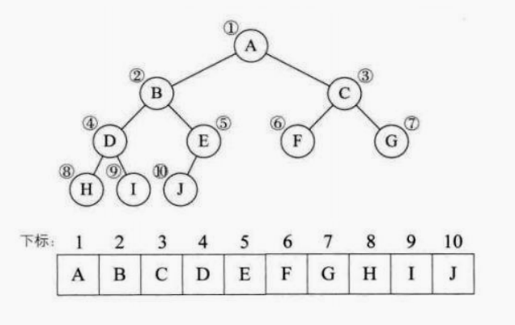
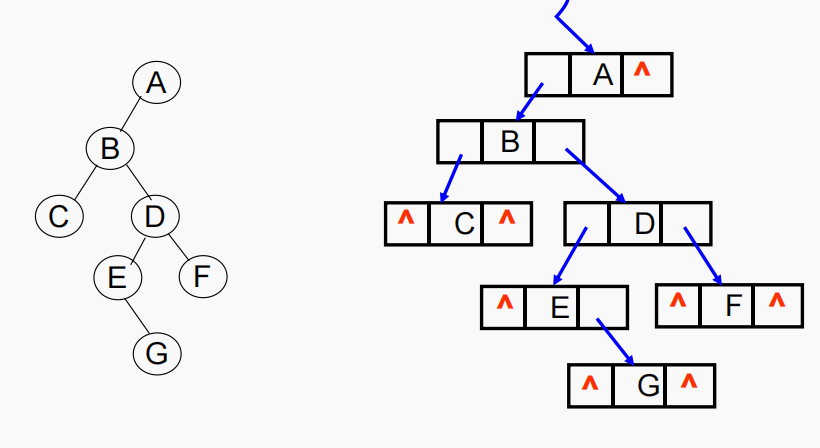
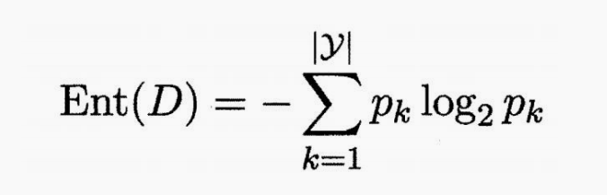
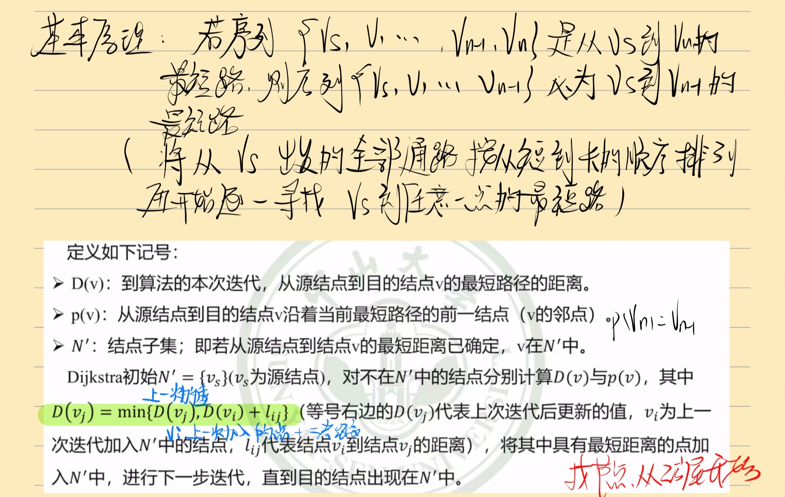

# 一、概述

## 1 数据结构的研究对象

线性表

树

图

## 2 数据结构的研究内容

**研究非数值计算的程序设计问题中计算机的操作对象以及它们之间的关系和操作**


## 3 一些基本概念

### 数据

- 一切能输入到计算机中并能被计算机程序识别和处理的符号集合
- 数值性数据：整数、实数等
- 非数值性数据：图形、图象、声音、文字等

### 数据元素data element

- 数据的基本单位，在计算机程序中通常将其作为一个整体进行考虑和处理，也称结点（node）或记录（record）

### 数据项

- 是构成数据元素的不可分割的最小单位，也被称为字段、域或属性

### 数据对象

- 具有相同性质的数据元素的集合，是数据的一个子集

### 数据结构

- 数据结构是相互之间存在一种或多种特定关系的数据元素的集合

- 通常这些数据元素都不是孤立存在的，而是通过某种关系将所有数据元素联系起来，我们将这种关系称为“结构” 

- 这种关系是抽象的， 即并不涉及数据元素的具体内容。是数据元素及其相互间的关系的数学描述

### 逻辑结构

数据元素间抽象化的相互关系，与数据的存储无关，独立于计算机，它是从具体问题抽象出来的数学模型
>集合（数据元素除了同属于一个集合外，无其他关系）
>
>线性结构（一一对应）
>
>树形结构（一对多）
>
>图形结构（多对多）


### 存储结构

- 顺序存储
	用一组连续的存储单元一次存储数据元素，数据元素之间的逻辑关系由元素的存储位置来表示
- 链式存储
	用一组任意的存储单元存储数据，数据元素之间的逻辑关系用==指针==来表示
- 索引存储
	用节点的索引号来确定节点存储地址，优点是检索速度快，缺点是索引表占用较多的存储空间
- 哈希存储
	存储位置与关键码之间建立对应关系


### 数据运算

>哪怕是逻辑结构和存储结构都相同，但运算不同则数据结构也不同，比如栈和队列

常见运算：插入 删除 修改 查找 排序


### 数据类型

类型是指一组值的集合，而数据类型则是指一组值的集合及定义在这组值上的一组操作的总称

#### number

Python中的数字数据类型用于存储数值，如整型、浮点型和复数型，定义在其上的操作有加、减、乘和除等

#### string

字符串是Python中最为常用的数据类型之一，通常使用单引号或双引号来创建。定义在其上的操作有字符串连接（“+”）、重复输出字符串（“*”）、通过索引获取字符串中的字符（“[]”）、截取字符串中的一部分（“[:]”）、若包含指定字符则返回True（“in”）、若不包含指定字符则返回True（“not in”）、原始字符串（“r/R”）和格式字符串（“%”）等

#### list

列表是Python中最常用的数据类型之一，通常使用方括号来创建。定义在其上的操作有访问列表中的值、更新列表和删除列表元素等，同时与字符串类似，列表也包括连接、重复和截取等操作

#### tuple

Python中元组与列表类似，但元组使用小括号创建，并且其中的元

素不能修改。定义在元组上的操作有访问元组、修改和删除元组，同时元组也包括连接、重复和截取等操作

#### set

集合是由一组无序且不重复的元素组成的序列，常使用{}或者set()函数来创建。定义在其上的操作有进行成员关系测试和删除重复元素等

#### 字典

Python中字典形如{key1:value1,key2: value2,…}，其中key1和key2部分被称为键（必须是唯一的），value1和value2被称为值。定义在字典上的操作有修改和删除等

#### 抽象数据类型

**(ADTs: Abstract Data Types)**

由用户定义，用来表示应用问题的数据模型，由基本的数据类型组成，并包括一组相关的操作

ADT = （D，S，P）
>D 数据对象
>
>S D上的关系集
>
>P D上的操作集

## 4 算法与算法分析

### 算法的特性

1. 输入 
	0或多个输入
2. 输出
	一或多个输出
3. 确定性
	每一步定义都是确切无歧义的
4. 有穷性
	算法应该在执行有穷步结束
5. 有效性


### 算法的评价

- 正确性
	>程序对于一切合法的输入数据，都能够得出满足要求的结果

- 可读性
	>注释+变量命名

- 健壮性
	>当输入的数据不合法或运行环境改变时，算法能恰当地做出反应或进行处理，而不是产生莫名其妙的输出结果

- 高效性（时间代价，空间代价）
	>时间复杂度，空间复杂度

### 算法效率的度量

1. 事后统计
2. 事前分析估计
	大O表示法

| 表达式       | 名称         | 举例                           | 说明                         |
| ------------ | ------------ | ------------------------------ | ---------------------------- |
| O(1)         | 常数时间     | 访问数组中某个元素 `arr[i]`    | 无论多少数据，时间不变       |
| O($log⁡{n}$)  | 对数时间     | 二分查找                       | 每次减半，效率惊人           |
| O(n)         | 线性时间     | 遍历数组                       | 每个元素只访问一次           |
| O(n$log{n}$) | 线性对数时间 | 快速排序、归并排序             | 常见的高效排序算法           |
| O($n^2$)     | 二次时间     | 冒泡排序、选择排序             | 两层嵌套循环，常见于暴力解法 |
| O($n^3$)     | 三次时间     | Floyd最短路径算法              | 三层循环，计算更慢           |
| O($2^n$)     | 指数时间     | 子集枚举、旅行商问题（暴力法） | 随着 n 增长飞快爆炸          |
| O(n!)        | 阶乘时间     | 全排列                         | 排列组合的地狱级复杂度       |

# 二、 数组和链表

## 1 数组

- 有序的元素序列，组成数组的各个变量称为数组的分量，也称为数组的元素
- 编号从0开始

## 2 链表

- 与数组的主要区别：链表中的元素可以存储在内存的任何地方，由于每个元素都存储了下一个元素的地址，从而将一系列随机的内存地址串在一起
- data+next
- 单链表，每一个节点只包含一个指针域的链表否则称为多练表
- 为操作方便，总是在链表的第一个节点之前附设一个表头节点(head)指向第一个节点。表头节点的值域可以不存储任何信息

### 链表的几种形式

#### 单向链表


#### 单向循环链表


最后一个节点的链接域不再为none而是指向头节点

#### 双向链表


### 链表中常用的指针操作


## 3 数组与链表对比

### 查找元素

数组更便捷，按照索引查即可，而在链表中需要从头开始

### 插入元素

链表更简单，只需要修改前驱指向的地址，而使用数组需要将后面所有元素后移

### 删除元素

链表更简单，只需要将需要删除节点的前驱节点指向下一个节点即可

### 二者的优缺点

|      | 数组                                           | 链表                                         |
| ---- | ---------------------------------------------- | -------------------------------------------- |
| 优点 | 内存占用小，数组内部可以随机访问               | 动态添加删除没大小可变，内存分散，可扩展性好 |
| 缺点 | 增加困难需要移动后续所有元素，预留内存造成浪费 | 不具备随机访问性，链表的指针会占据更多内存   |

### 数组的实现

```python
#定义一个数组
list = [1,2,3,"fff",None]
#索引查找
item1 = list[1]
#插入实现
def insert_list(list,item,pos):
    key = len(list)-1
    #判断数组是否满，满则无法添加
    if list[key] is None:
        while key < pos:
            list[key],list[key-1] = list[key-1],list[key]
            key-=1
        list[pos] = item
    else:
        return'数组满了加不了'
    return list
#删除实现
def delete_list(list,pos):
    list[pos] = None
    key = pos+1
    item= list[key]
    while item is not None:
        list[key],list[key-1]=list[key-1],list[key]
        key+=q
    return list
        
```

## 4 二分查找

### 查找的基本概念

1. 查找表
	>相同类型的数据元素组成的集合，每个元素通常由若干数据项构成

2. 关键字
	>数据元素中某个或几个数据项的值，它可以标识一个数据元素。若关键字能唯一标识一个数据元素，则关键字称为主关键字；将能标识若干个数据元素的关键字称为次关键字

3. 查找
	>根据给定的Key值，在查找表中确定一个关键字等于给定值的记录或数据元素。若是查找表中存在满足条件的记录，查找成功，返回所查找的记录信息或记录在查找表中的位置，若是查找表中不存在满足条件的记录，查找失败

4. 静态查找
	>在查找时只对数据进行查询或检索，查找表称为静态查找表

5. 动态查找
	>在实施查找的同时，插入查找表中不存在的记录，或从查找表删除已存在的某个记录，查找表称为动态查找表

6. 顺序表的查找
	>将给定的k值与查找表中记录的关键字逐个进行比较，找到要查找的记录

7. 散列表的查找
	>根据给定的k 值直接访问查找表，从而找到要查找的记录

### 顺序查找

从一段开始依次比较

平均查找长度 $(1+n)/2$,查找不成功时需要N+1次比较

### 二分查找

从中间开始，进入左半边或者右半边，重复进行，适用于有序数组

代码实现：

```Python
def binary_search(list,item):
    #查找范围，分上下界
    low = 0
    high = list[len(list)-1]#第一次查找的上下界是整个数组
    while low<=high:
        mid = (low+high)//2#向下取整
        guess = list[mid]
        if guess = item:
            return mid#直接在中间找到了
        elif guess>item:
            high = mid - 1#猜大了，把上界放小
        else:
            low = mid + 1
    return None#上下界相等还是没找到返回空
```

| 目标元素存在情况 | 最好情况 | 最坏情况 | 普通情况 |
| ---------------- | -------- | -------- | -------- |
| 存在             | 1        | n        | n/2      |
| 不存在           | n        | n        | n        |

对于有序列表顺序查找，有

| 目标元素存在情况 | 最好 | 最坏 | 一般 |
| ---------------- | ---- | ---- | ---- |
| 存在             | 1    | n    | n/2  |
| 不存在           | 1    | n    | n/2  |

可以发现只有在不存在目标元素时，有序排列元素才会提高搜索效率

### 顺序查找比较二分查找

顺序：线性时间

二分：对数时间

虽然二分查找在消耗的时间上优于顺序查找，但也要考虑到**对数据项排序**的开销；

-  如果一次排序后可以进行多次查找，那么二分查找是好的选择

-  如果搜索的数组经常变动，而查找次数相对较少，那无序数组搭配顺序查找或许是更好的选择

-  在算法选择问题上，往往要考虑到实际应用的情况

# 三、大O表示法

**大O表示法**用来描述**算法的时间或空间复杂度的上界**，即：

> **当输入规模 n趋近于无穷时，算法执行所需的最大操作次数（或空间）增长得有多快？**

它**忽略常数项和低阶项**，只保留最高阶的增长趋势，用来比较算法效率

| 表达式       | 名称         | 举例                           | 说明                                   |
| ------------ | ------------ | ------------------------------ | -------------------------------------- |
| O(1)         | 常数时间     | 访问数组中某个元素 `arr[i]`    | 无论多少数据，时间不变                 |
| O($log⁡{n}$)  | 对数时间     | 二分查找                       | 每次减半，效率惊人                     |
| O(n)         | 线性时间     | 遍历数组                       | 每个元素只访问一次                     |
| O(n$log{n}$) | 线性对数时间 | 快速排序、归并排序             | 常见的高效排序算法                     |
| O($n^2$)     | 二次时间     | 冒泡排序、选择排序             | 两层嵌套循环，常见于暴力解法           |
| O($n^3$)     | 三次时间     | Floyd最短路径算法              | 三层循环，计算更慢                     |
| O($2^n$)     | 指数时间     | 子集枚举、旅行商问题（暴力法） | 随着 n 增长飞快爆炸                    |
| O(n!)        | 阶乘时间     | 全排列                         | 排列组合的地狱级复杂度，比如旅行商问题 |

# 四、排序

## 1 简介

- 有些算法很直观朴素，描述简单，但通常效率较低
- 有些算法更深刻地反映了排序问题的某些本质，因此效率较高，但通常也更复杂一些
- 对于小型集合，采用复杂的排序算法可能得不偿失;对于大型集合，需要尽可能充分地利用各种改善措施

### 经典排序算法分类

1. 比较类排序
	通过比较来决定元素间的相对次序，由于其时间复杂度不能突破O($nlogn$)，因此也称为非线性时间比较类排序

	>1. 交换排序
	>	1. 冒泡排序
	>	2. 快速排序
	>2. 插入排序
	>	1. 简单插入排序
	>	2. 希尔排序
	>3. 选择排序
	>	1. 简单选择排序
	>	2. 堆排序
	>4. 归并排序
	>	1. 二路归并排序
	>	2. 多路归并排序

2. 非比较类排序

	不通过比较来决定元素间的相对次序，它可以突破基于比较排序的时间下界，以线性时间运行，因此也称为线性时间非比较类排序
	>- 计数排序
	>- 桶排序
	>- 基数排序

### 稳定排序与非稳定排序

在待排序的文件中，如果存在多个排序码相同的记录，经过排序后，相同排序码记录的相对次序如果保持不变，则称这种排序方法是稳定的，否则是不稳定的

### 评价排序算法

- 执行算法所需的时间，比较次数，移动次数
- 执行算法所需要的附加空间
- 算法本身的复杂程度


## 2 选择排序

>工作原理：首先在未排序序列中找到最小（大）元素，存放到排序序列的起始位置，然后，再从剩余未排序元素中继续寻找最小（大）元素，然后放到已排序序列的末尾。以此类推，直到所有元素均排序完毕

```Python
#找最小
def find_min(arr):
    min_val = arr[0]
    min_index = 0
    for i in range(1, len(arr)):
        if arr[i] < min_val:
            min_val = arr[i]
            min_index = i
    return min_index

#排序函数
def selection_sort(arr):
    sorted_arr = []
    while arr :
        sorted_arr.append(find_min(arr))
        arr.pop(find_min(arr))
    return sorted_arr
```

## 3 冒泡排序

> 名字由来是因为越小的元素会经由交换慢慢“浮”到数列的顶端（升序或降序排列），就如同如同碳酸饮料中二氧化碳的气泡最终会上浮到顶端一样，故名“冒泡排序”

工作原理：

- 比较相邻元素，前者大则交换，这样将最大元素放到最后(最前)
- 对没有排好的元素重复比较

```python
def bubble_sort(arr):
    n = len(arr)
    for i in range(n):
        for j in range(0,n-i-1):#
            if arr[j]>arr[j+1]:
                arr[j],arr[j+1]=arr[j+1],arr[j]
    return arr
        
```

### 时间复杂度

最坏情况：初始反序，要进行n-1次大循环，每次大循环要比较n-i次，复杂度是 $O(n^2)$

### 冒泡比较选择

冒泡排序当相邻两个元素大小一致时，这一步操作就不需要交换位置，因此冒泡排序是一种严格的稳定排序算法，它不改变序列中相同元素之间的相对位置关系

## 4 插入排序

时间复杂度$O(n^2)$

原理：维持一个已经排好序的子列表，位置在列表的前方，逐渐扩大这个有序的子列表到全表

- 第一趟，子列表仅有第一个数据项，把第二个数据项插入到合适位置
- 后续，每次进行比较，插入到合适位置
- n-1趟扩展到全表，排序完成


最差情况：每次插入都要和前面每一项比对

最好情况：每次只需要比对一次，总次数O(n)

```python
def insert_sort(arr):
    for i in range(1,lem(arr)):
        key = arr[i]#当前要插入的元素
        j = i-1#左侧已经排好序的元素
        if arr[j]>key and j>=0:#如果左侧大（限制条件，左侧不能空）
            arr[j+1] = arr[j]#左侧大的拿到右边
            j-=1#继续向左比较
        arr[j+1] = key#跳出循环后找到合适位置，插入
    return arr
```

## 5 希尔排序

>又称递减增量排序算法，是插入排序的更高效的改进版本，是非稳定排序算法希尔排序是基于插入排序的以下两点性质而提出改进方法的：
>
>-  插入排序在对几乎已经排好序的数据操作时，效率高，即可以达到线性排序的效率；
>- 但插入排序一般来说是低效的，因为插入排序每次只能将数据移动一位

- 基本思想：先把整个待排序的记录序列分割成几个子序列，分别进行直接插入排序，待整个序列中的记录“基本有序”，再对全体进行直接插入排序

- 关键：如何切分列表

```Python
def shell_sort(arr):
    n =len(arr)
    gap = n//2
    while gap>0:
        for i in range(gap,n):
            current = arr[i]
            j= i
            #插入排序，但是每次跳gap步
            while j>=gap add arr[j-gap]>gap:
                arr[j] = arr[j-gap]
                j-=gap
            arr[j] = current#跳出循环找到合适位置
        gap //=2
    return arr
```

当然，gap序列的选择很多元

## 6 归并排序

>是建立在归并操作上的一种有效的排序算法。该算法是采用分治法的一个非常典型的应用。将已有序的子序列合并，得到完全有序的序列；即先使每个子序列有序，再使子序列段间有序。若将两个有序表合并成一个有序表，称为2-路归并

一种递归思想

- 把长度为n的序列切分为两个n/2的子序列
- 子序列采用归并排序
- 排序好的子序列合并


```python
def merge_sort(arr):
    #基本情况
    if len(arr)<=1:
        return arr
    #分成两半,每一半都要归并排序
    mid = len // 2
    left = merge_sort(arr[:mid])
    right =merge_sort(arr[mid:])
    return merge(left,right)#合并左右两边

#合并函数实现
def merge(left,right):
    i = j = 0
    result = []
    while i < len(left) and j < len(right):
        if left[i] <= right[j]:
            result.aappend(left[i])
            i += 1#哪怕是相同大小，也会先放左边，保证了稳定性
        else:
            result.append(right[j])
            j += 1#小的先进去，大的后进去
    result.extend(left[i:])#两边如果有没用完的一起粘上
    result.extend(right[j:])
    return result
```

## 7 快速排序

### D&C工作原理

1. 找出简单的基线条件
2. 确定如何缩小问题的规模，使其符合基线条件


### 快速排序算法

例如对一个数组排序：

> 基线条件是数组为空或者只有一个元素
>
> 如果有两个元素，比较大小交换位置即可
>
> 三个元素？选出一个基准值，找出比它大或者小的元素（这个操作叫做分区）
>
> 如果子数组有序，那么 左侧+基准+右侧就可以合并得到有序数组，那么子数组怎么排？用快速排序呗（递归）
>
> >退出递归：数组为空或者只有一个元素
> >
> >每一步操作：在数组中选一个基准值，对左侧，右侧进行快排，合并


```python
def q_sort(arr):
    if len(arr)<2:
        return arr
    else:
        pivot = arr[0]
        #左侧数组
        less = [i for i in arr[1:] if i <= pivot]
        #右侧数组
        more = [i for i in arr[1:] if i > pivot]
        return q_sort(less)+pivot+q_sort(more)
```

这时候选取的基准值有一个缺点：如果数组基本有序，那么我现在的效率很差，如果我随机选取基准值，那么几乎不会受到有序的影响

还能怎样改进？采取一种折中的方法，每次选取三个数，一般是选取最左端、最右端和中间的数，然后将三个数排序，选取中间的那个数作为基准值，在数组几乎有序的情况下，也能解决固定基准值的问题

时间复杂度：

最差 O($n^2$)

最好 $O(nlogn)$


## 8 应用分析


- 若n较小(如n≤50)，可采用插入或选择排序；
- 若文件初始状态基本有序(指正序)，则应选用插入、冒泡或快速排序为宜；
- 若n较大，则应采用时间复杂度为O($nlog{n}$)的排序方法：堆排序、归并排序或快速排序
- 若要求排序稳定，则可选用归并排序。但前面介绍的从单个记录起进行两两归并的排序算法并不值得提倡，通常可以将它和插入排序结合在一起使用。先利用插入排序求得较长的有序子序列，然后再两两归并之。因为插入排序是稳定的，所以改进后的归并排序仍是稳定的

### 例一：合并不严格单增序列

- 给你两个按**非递减顺序排列**的整数数组 nums1 和 nums2，另有两个整数m 和 n ，分别表示 nums1 和 nums2 中的元素数目。请你合并 nums2 到 nums1 中，使合并后的数组同样按**非递减顺序**排列,注意：最终，合并后数组不应由函数返回，而是存储在数组 nums1 中。为了应对这种情况，nums1 的初始长度为 m + n，其中前 m 个元素表示应合并的元素，后 n 个元素为 0 ，应忽略nums2 的长度为 n

本人写法:

```python
#整体逻辑是归并排序里面的归并操作
def merge_nums(nums1,nums2,m,n):
    i = j = 0
    result = []
    while i<m and j<n:
        if nums1[i]<=nums2[j]:
            result.append(nums1[i])
            i+=1
        else:
            result.append(nums2[j])
            j+=1
    result.extend(nums1[i:m])#避免把0加进来
    result.extend(nums2[j:])
    nums1[:m+n] = result
    
```

参考写法：

```Python
def merge_nums(nums1, nums2, m, n):
    i = m - 1  # 指向 nums1 有效部分的最后一个元素
    j = n - 1  # 指向 nums2 的最后一个元素
    k = m + n - 1  # 指向 nums1 最末尾的位置

    while i >= 0 and j >= 0:
        if nums1[i] > nums2[j]:
            nums1[k] = nums1[i]
            i -= 1
        else:
            nums1[k] = nums2[j]
            j -= 1
        k -= 1

    # 如果 nums2 还有剩余，复制进去（nums1 剩余部分本来就在位置上）
    while j >= 0:
        nums1[k] = nums2[j]
        k -= 1
        j -= 1
```

### 例二：发饼干

- 假设你是一位很棒的家长，想要给你的孩子们一些小饼干。但是，每个孩子最多只能给一块饼干。对每个孩子 i，都有一个胃口值 g[i]，这是能让孩子们满足胃口的饼干的最小尺寸；并且每块饼干 j，都有一个尺寸 s[j] 。如果 s[j] >= g[i]，我们可以将这个饼干 j 分配给孩子 i ，这个孩子会得到满足。你的目标是尽可能满足越多数量的孩子，并输出这个最大数值

```Python
g.sort()#原地修改列表，没有返回值（None）
s.sort()
count = 0
i = j = 0
while i < len(g) and j < len(s):
    if g[i] <= s[j]:
        count +=1
        i+=1
        j+=1
    else:
        j+=1
print(count)
```

### 作业一：

希尔排序和归并排序算法复杂度分析

1. 以某简单线性表为例，分析算法复杂度；
2. 实现希尔/归并排序在不同大小线性表（N）时，记录程序的运行时间；并分别画出与另外至少一种排序算法的时间曲线图

>希尔排序：最好时间复杂度 $O(nlog{n})$ ,最坏时间复杂度 约$O(n^2)$ ,特点：原地排序，不稳定，适合中等规模数据

>归并排序：时间复杂度$O(nlog{n})$ (最好、最坏、平均)，特点：稳定，适合大数据集

>插入排序：最好情况$O(n)$，最坏情况$O(n^2)$,适合小规模数据，或者与其他算法混合使用

>小数据量（N <= 400）时，插入排序性能还可以，甚至能追上归并。
>
>随着 N 增大：
>
>- **归并排序**的增长最平稳，适合大规模排序。
>- **希尔排序**在中等规模表现不错，尤其比插入排序优秀。
>- **插入排序**增长最陡，性能最差


```python
import time
import random
import matplotlib.pyplot as plt

# ---------- 排序算法实现 ----------

def shell_sort(arr):
    n = len(arr)
    gap = n // 2
    while gap > 0:
        for i in range(gap, n):
            temp = arr[i]
            j = i
            while j >= gap and arr[j - gap] > temp:
                arr[j] = arr[j - gap]
                j -= gap
            arr[j] = temp
        gap //= 2
    return arr

def merge_sort(arr):
    if len(arr) <= 1:
        return arr
    mid = len(arr) // 2
    left = merge_sort(arr[:mid])
    right = merge_sort(arr[mid:])
    return merge(left, right)

def merge(left, right):
    result = []
    i = j = 0
    while i < len(left) and j < len(right):
        if left[i] <= right[j]:
            result.append(left[i])
            i += 1
        else:
            result.append(right[j])
            j += 1
    result.extend(left[i:])
    result.extend(right[j:])
    return result

def insertion_sort(arr):
    for i in range(1, len(arr)):
        key = arr[i]
        j = i - 1
        while j >= 0 and arr[j] > key:
            arr[j + 1] = arr[j]
            j -= 1
        arr[j + 1] = key
    return arr

# ---------- 计时函数 ----------

def measure_time(sort_func, data):
    start = time.time()
    sort_func(data.copy())
    return time.time() - start

# ---------- 运行测试并记录结果 ----------

sizes = [100, 200, 400, 800, 1600, 3200]
shell_times = []
merge_times = []
insert_times = []

for size in sizes:
    test_data = [random.randint(0, 10000) for _ in range(size)]
    shell_times.append(measure_time(shell_sort, test_data))
    merge_times.append(measure_time(merge_sort, test_data))
    insert_times.append(measure_time(insertion_sort, test_data))

# ---------- 画图 ----------

plt.figure(figsize=(10, 6))
plt.plot(sizes, shell_times, marker='o', label='Shell Sort')
plt.plot(sizes, merge_times, marker='s', label='Merge Sort')
plt.plot(sizes, insert_times, marker='^', label='Insertion Sort')
plt.xlabel("Input Size (N)")
plt.ylabel("Execution Time (seconds)")
plt.title("Sorting Algorithms Time Complexity Comparison")
plt.legend()
plt.grid(True)
plt.tight_layout()
plt.show()

```


# 五、递归

> 调用自身的编程方法称为递归

思想内涵：递归问题可以分解为几个规模较小，但是形式与原问题相同的子问题，这些子问题用相同的解题思路解决

- 递：分解为小问题
- 归：有明确的临界点，到达之后问题解决，也就是必须要有==明确的结束条件==否则无限递归

## 1 递归函数组成

基线条件，指函数不再调用自己，避免无限循环

递归条件，指函数调用自己

简单例子：

```python
def countdown(i):
    print(i)
    if i <= 0:
        return
    else:
        countdown(i-1)
```

怎么写一个递归程序：

1. 明确递归终止条件
2. 给出递归终止时的处理办法
3. 提取重复的逻辑，缩小问题规模

## 2 栈

- 栈：是限制在表的一端进行插入和删除操作的线性表，后进先出，先进后出线性表
- 栈顶：允许进行插入、删除操作的一段，又称为表尾，用栈顶指针（top）来指示栈顶元素
- 栈底：固定端，又称表头
- 空栈：当表中没有元素

### 顺序栈

- 栈的顺序存储结构称为顺序栈，类似于线性表，用一维数组来存储栈，栈底固定不变，栈顶随着进栈出栈操作变化
- 用 top=-1表示栈的初始状态
- **结点进栈：**首先执行top加1，使top指向新的栈顶位置，然后将数据元素保存到栈顶(top所指的当前位置)。
- **结点出栈：**首先把top指向的栈顶元素取出，然后执行top减1，使top指向新的栈顶位置

### 链栈

- 栈的**链式存储**结构称为链栈，是运算受限的单链表。其插入和删除操作只能在表头位置上进行。因此，链栈没有必要像单链表那样附加头结点，栈顶指针top就是链表的头指针

### 栈的应用

1. 括号匹配问题
	>从左至右扫描一个字符串(或表达式)，则每个右括号将与最近遇到的那个左括号相匹配。则可以在从左至右扫描过程中把所遇到的左括号存放到堆栈中。每当遇到一个右括号时，就将它与栈顶的左括号(如果存在)相匹配，同时从栈顶删除该左括号

	>设置一个栈，当读到左括号时，左括号进栈。当读到右括号时，则从栈中弹出一个元素，与读到的左括号进行匹配，若匹配成功，继续读入；否则匹配失败，返回FLASE

### 调用栈

栈在计算机内部使用称为调用栈

例子：


### 递归调用栈

例如：递归阶乘

```python
def fact(x):
    if x==1:
        return 1
    else:
        return x * fact(x-1)
```


- 使用栈虽然很方便，但是也要付出代价：存储详尽的信息可能占用大量的内存。每个函数调用都要占用一定的内存，如果栈很高，就意味着计算机存储了大量函数调用的信息。
-  在这种情况下，有两种选择：

> ① 重新编写代码，转而使用循环
>
> ② 使用尾递归

**总结**

- 递归指的是调用自己的函数。
- 每个递归函数都有两个条件：基线条件和递归条件。
- 栈有两种操作：压入和弹出。
- 所有函数调用都进入调用栈。
- 调用栈可能很长，这将占用大量的内存。

## 3 应用实例-反转链表

问题：给你单链表的头节点 head ，请你反转链表，并返回反转后的链表

解决：

```python
class ListNode:
    def __init__(self, val=0, next=None):
        self.val = val
        self.next = next

def reverseList(head):
    if head is None or head.next is None:
        return head  # 递归出口：空链表或只剩一个节点
    
    new_head = reverseList(head.next)  # 递归反转后续节点

    head.next.next = head  # 反转指针：后一个节点指向当前节点
    head.next = None       # 当前节点的 next 设为 None，断链防环

    return new_head        # 返回反转后的新头结点

```

关键点：

假如我们现在站在第一个节点 `1`，我们要干嘛？

我们说：“我先别管自己，让我的弟弟们（2 开始）自己玩去，等他们排好了队回来，我再插进去就行！”

于是我们递归调用：

```python
new_head = reverseList(head.next)
```

之后只考虑`2 → 3` 怎么反转

## 4 实例其二 两数相加

给你两个非空的链表，表示两个非负的整数。它们每位数字都是按照逆序的方式存储的，并且每个节点只能存储一位数字。请你将两个数相加，并以相同形式返回一个表示和的链表。你可以假设除了数字 0 之外，这两个数都不会以 0 开头

>也就是说，每个链表代表一个数字，链表的开头就是数字的个位，对于这题的递归处理有下列逻辑：
>
>1. 退出递归：链表终止（两个表都满足）并且最后两位相加之后没有进位（有进位的话不能停）
>2. 重复的操作：提取相同位置的数字，加上上一次的进位，相加，对下一位这样处理


```Python
class ListNode:
    def __init__(self,val=0,next=None):
        self.val = val
        self.next = next
def add_num(l1,l2):
    #递归终止的条件
    def helper(n1,n2,carry):
        if not n1 and not n2 and carry ==0:
            return None
    #如果链表存在，那么拿出来的值就不是0
        val1 = n1.val if n1 else 0
        val2 = n2.val if n2 else 0
    #每一步求和
        total = carry + val1 + val2
    #更新进位
        carry = total // 10
    #当前位置的值，也就是去掉进位之后
        node = total % 10
    #之后每一个位置重复处理
        node.next = helper(n1.next if n1 else None,n2.next if n2 else None,carry)
        return node
    return helper(l1,l2,0)#初始进位0

```

## 5 实例其三 汉诺塔问题

有三个立柱A、B、C。A柱上穿有大小不等的圆盘N个，较大的圆盘在下，较小的圆盘在上。要求把A柱上的圆盘全部移到C柱上，保持大盘在下、小盘在上的规律（可借助B柱）。每次移动只能把一个柱子最上面的圆盘移到另一个柱子的最上面。大盘不能放小盘上请输出移动过程

>问题分析：假如有A,B,C三个柱子，我要移动n个盘，可以先把n-1个盘子移动到B（别管具体怎么移动，假设我可以实现），再把第n个盘子移动到C，最后把B上的n-1个盘子移动到c即可

```python
def move(n,source,mid,target):
    #退出递归：移动到最后一个盘子
    if n == 1:
        print(f"将盘子1从{source}移动到{target}")
    else:
        #第一步，把n-1个盘子移动到中间
        move(n-1,source,target,mid)
        #第二步，把第n个盘子移动到目标
        print(f"把盘子{n}从{source}移动到{target}")
        #第三步，把n-1个盘子从中间移动到目标
        move(n-1,mid,source,target)
```

时间复杂度：$O(2^n)$

---

# 六、散列表

## 1 散列函数

>散列函数（Hash Function）是一种将**任意长度的输入**，转换为**固定长度的输出值**的函数
>
>你可以把它想象成一个“黑盒子”： 输入一个东西 → 输出一个编号（称为 **哈希值** 或 **散列码**）

>散列表，又称哈希表，是利用关键字与地址的直接映射关系产生的列表。哈希表的最大优势在于，在理想情况下，一个关键字对应一个存储位置，而我们就可以由key值找到其在哈希表中的位置

**理想的散列函数应该将key均匀地映射到散列表的不同位置**

## 2 散列表的构造方法

### 直接地址法

- 是以关键字key本身或关键字的某个线性函数值为散列地址的方法
- $H（key）=key+b，其中，b为常数$
- 直接地址法计算简单，且不会产生冲突。直接地址法适用于关键字分布基本连续的情况，若是关键字分布不连续，空位较多，造成空间浪费

### 除留余数法

- 是利用它关键字key除以p所得的余数作为散列地址的方法
- 选好p使得每一个关键字通过该函数转换后等概率地映射到散列空间的任一地址假定散列表表长为m，取一个==不大于表长但最接近或等于表长的质数p==
- H（key）=key %（p）

在Python中，字典就是一个散列表

## 3 散列表的应用案例

- 避免重复
- 将散列表用作缓存
- 模拟映射关系

## 4 冲突

给多个key分配位置相同

解决方案：

- 链地址法
	>同一个位置用链表存冲突元素

- 线性探查法
	>如果一个元素 `key` 发生冲突，尝试下一个位置（+1）再冲突就继续往后（+1）……直到找到空位为止

	`h(key), (h(key)+1) % m, (h(key)+2) % m, ..., (h(key)+i) % m, ...`

	存在的问题：可能使第*i*个散列地址的同义词存入第*i*+1个散列地址，这样本应存入第*i*+1个散列地址的元素变成了第*i*+2个散列地址的同义词。因此可能出现很多元素在相邻的散列地址上堆积起来，大大降低了查找效率（cluster）

- 二次探测法
	>不是一个个往后跳，按照 平方数的间隔进行探测，来缓解主集群的问题

	`h(key), (h(key)+1²)%m, (h(key)-1²)%m，(h(key)+2²)%m, ..., (h(key)+i²)%m`

	也就是加减平方


## 5 性能


- 在平均情况下，散列表执行各种操作的时间都为O(1)。O(1)为常量时间
- 常量时间，并不意味着马上，而是说不管散列表多大，所需的时间都相同。

在平均情况，散列表的查找和数组一样快，插入和删除与链表一样快，但需要避免冲突

---

# 七、树

## 1 概述

### 树的直观属性

- 层次性
- 一个节点的所有子节点与连一个节点的所有子节点无关

### 基本术语

- **节点**：节点是树的基础部分。它可以有自己的名字，我们称作“键”。节点也可以带有附加信息，我们称作“有效载荷”。一个节点包括一个数据元素和若干指向其子树分支
- **边**：边是树的另一个基础部分。两个节点通过一条边相连，表示它们之间存在关系。除了根节点以外，其他每个节点都仅有一条入边，出边则可能有多条
- **子树**：树是一个有限集合，子树则是该集合的子集。就像套娃一样，一棵树下面还包含着其子树
- **根节点**：根节点是树中唯一没有入边的节点
- **父节点**：一个节点是其所有子节点的父节点
-  **子节点**：一个节点通过出边与子节点相连
-  **兄弟节点**：具有同一父节点的节点互称为兄弟节点
- **叶子节点**：就是末尾的节点，叶子节点没有子节点，比如meta和title都是叶子节点
- **度**：一个节点拥有的子树数
- **路径**：路径是由边连接有序节点列表。比如html→head→meta
- **有序树**：结点各子树从左至右有序，不能互换（左为第一）
- **无序树**：结点各子树可互换位置
- **森林**：指m棵不相交的树的集合(例如删除html后的子树个数）
- **层数**：节点n的层数是从根节点到n的唯一路径长度
- **高度**：树的高度是其中节点层数的最大值

### 树的定义

树（Tree）是*n*（*n*≥0）个节点的有限集，它或为空树（*n* = 0）；或为非空树，对于非空树*T*：

1. 有且仅有一个称之为根的节点；
2. 除根节点以外的其余节点可分为*m*（*m*＞0）个互不相交的有限集*T*1 , *T*2 , …, Tm, 其中每一个集合本身又是一棵树，并且称为根的子树
3. 从根节点到其他每个节点都有且仅有一条路径

树的递归定义：一棵树要么为空，要么由一个根节点和零棵或多棵子树构成，子树本身也是一棵树。每棵子树的根节点通过一条边连到父树的根节点

## 2 二叉树

是指树中节点的度不大于2的有序树

>所有树都能转化为唯一对应的二叉树
>
>转换方法：对于原树中任意一个节点：
>
>- 它的第一个子节点变为它的“左孩子”
>- 它的兄弟节点（同一层的其他子节点）按顺序变为右兄弟

### 二叉树的定义

基本特点：

- 节点的度小于等于2
- 有序树（子树有序，不能颠倒）

二叉树具有五种基本形式：

1. 空二叉树
2. 只有一个根节点
3. 根节点只有一个左子树
4. 根节点只有一个右子树
5. 根节点既有左子树又有右子树

### 二叉树的性质

1. 在第i层至多有$2^{i-1}$个节点，至少1个

2. 深度为k的二叉树至多有$2^k-1$个节点

3. 对于任何一个二叉树，若2度节点有n~2~个，则叶子数为n~2~+1

4. 具有n个节点的完全二叉树的深度必然为[log~2~n]+1
	>$2^{k-1}≤n＜2^k$

### 特殊形态的二叉树

满二叉树

> 深度为k，节点有$2^k-1$个
>
> 特点：每层都是满的

完全二叉树
>只有最后一层叶子不满，且都在左边

### 二叉树的存储结构

#### 顺序存储

指使用顺序表存储二叉树，只适用于完全二叉树（普通的二叉树加一些0节点就可以补成完全二叉树）



但是其实不适合，因为不满的情况下会有大量的浪费

顺序存储的特点：

- 节点的关系蕴含在存储位置中
- 浪费空间，更适用于满二叉树和完全二叉树

#### 链式存储

只需从根节点开始，把每个节点及其左右使用链表存储即可



每个node包含 左子 自身数据 右子


### 二叉搜索树

又称二叉查找树

有以下特性：

- 如果左子树非空，则左子树上所有节点的数值都小于根节点
- 如果右子树非空，则右子树上所有节点的数值都大于根节点的数值
- 左右子树又各是一课二叉搜索树

#### 二叉搜索树基本操作

1. 查找指定数值
	>从根节点开始查找，如果大于根节点，则在根节点的右子树中查找；如果小于根节点，则在根节点的左子树中查找；如果等于根节点，则查找成功，算法结束

2. 插入节点
	>- 在二叉树中插入新节点，若二叉树为空，则将新节点作为根节点
	>-  若二叉树不为空，如果新节点的权值小于等于根节点的权值，在左子树中插入新节点；如果新节点的权值大于根节点的权值，在右子树中插入新节点

3. 删除节点
	>- 如果根节点为空，说明这是一棵空树，可以直接结束算法
	>
	>- 如果根节点不为空，创建两个指针，一个是`target`，一个是`targetParent`，`targetParent`指向`target`所指向节点的双亲节点。从树根开始逐层向下查找待删除的数值为key 的节点
	>
	>-  如果没有找到待删除的节点，算法结束，如果找到，要分三种情况讨论已找到的待删除的节点
	>	>1. node是子节点
	>	>	直接删除
	>	>2. node只有一个子节点
	>	>	直接用这个唯一的子节点替代它
	>	>3. node有两个子节点
	>	>	找到 node 的中序后继（或前驱）节点，替换 node 的值，然后删除后继（或前驱）节点
	>	>	中序后继：右子树中最小的节点

## 3 树的应用

### 解析树

构建方法：

- 把表达式字符串拆分成标记列表，需要考虑左括号、右括号、运算符和操作数

- 遇到一个左括号表示需要创建一棵新树，遇到一个右括号表示到达该表达式的终点

定义规则：

1. 如果当前标记是(，就为当前节点添加一个左子节点，并下沉至该子节点

2. 如果当前标记在列表['+' , '-' , '/' , '*']中，就将当前节点的值设为当前标记对应的运算符；为当前节点添加一个右子节点，并下沉至该子节点

3. 如果当前标记是数字，就将当前节点的值设为这个数并返回至父节点

4. 如果当前标记是)，就跳到当前节点的父节点

### 决策树

决策树学习的目的是产生一棵泛化能力强的决策树，基本流程遵循分而治之的策略

简单来说，信息增益最大的特征应该放在最上方

决策树的生成是一个递归过程.在决策树基本算法中，有三种情形会导致递归返回:

1. 当前结点包含的样本全属于同一类别，无需划分
2. 当前属性集为空，或是所有样本在所有属性上取值相同，无法划分

3. 当前结点包含的样本集合为空，不能划分

“信息熵” 是度量样本集合纯度最常用的一种指标。假定当前样本集合D中第k类样本所占的比例为p~k~，则D的信息熵定义为



假定离散特征a有V个可能的取值，若使用a来对样本集进行划分，则会产生V个分支结点?其中第v个分支结点包含了D中所有在属性a上取值为$a^v$的样本，记为$D^v$


## 4 二叉树的遍历

### 定义与用途

指按照某条搜索路线遍访每个节点而且不重复（又称周游）

是树结构插入、删除、修改、查找和排序运算的前提

### 分类

#### 深度优先遍历

根据根节点在前、中、后分为前序遍历、中序遍历、后序遍历

这三个很1z啊，不用赘述

#### 广度优先遍历

层序遍历

层序遍历中，若树为空，则空操作返回，否则从树的第一层，也就是根结点开始访问，从上而下逐层遍历，在同一层中，按从左到右的顺序对结点逐个访问

时间效率 O(n)

## 5 哈夫曼树

给定N个权值作为N个叶子结点，构造一棵二叉树，若该树的带权路径长度达到最小，称这样的二叉树为最优二叉树，也称为哈夫曼树

### 相关概念

**1.** **路径：**从树中一个结点到另一个结点之间的分支序列构成两个节点间的路径

**2.** **结点的权：**给树中结点赋予一个数值，该数值称为结点的权

**3.** **带权路径长度：**结点到树根间的路径长度与结点的权的乘积，称为该结点的带权路径长度

**4.** **树的带权路径长度：**树中所有叶子结点的带权路径长度之和，通常记为WPL

### 哈夫曼树的构建

- 基本思想：使权大的结点靠近根
- 操作要点：对权值的合并、删除与替换，总是合并当前值最小的两个

为了使得到的哈夫曼树的结构尽量唯一，通常规定生成的哈夫曼树中每个结点的左子树根结点的权**小于等于**右子树根结点的权

### 哈夫曼编码

为了设计长短不等的编码，以便减少电文的总长，还必须考虑编码的唯一性即在建立不等长编码时必须使任何一个字符的编码都不是另一个字符的前缀，这种编码称为前缀编码

>很显然，作为叶子，不可能是其他叶子的来时路，也就不可能是前缀

---

# 八、图

## 1 概述

简单说，一个**图**是由**点（节点/顶点，vertex）**和**边（edge）**组成的结构。我们可以用 G=(V,E)表示一个图，V 是点的集合（有穷且非空），E 是边的集合。

| 分类依据 | 图的类型             | 解释                           |
| -------- | -------------------- | ------------------------------ |
| 方向性   | 有向图（Directed）   | 边有方向，例如 A ➝ B           |
|          | 无向图（Undirected） | 边无方向，例如 A — B           |
| 权重     | 带权图（Weighted）   | 每条边有个数值，比如距离或成本 |
|          | 无权图（Unweighted） | 每条边只有连接关系，没有数值   |

完全图

>任意两点都有一条边相连
>
>无向：$C_n^2$
>
>有向：$A_n^2$


相关术语

- 顶点的度
	与该顶点相关联的边的数目，记作TD(v)
	在有向图中, 顶点的度等于该顶点的入度与出度之和
	顶点 v 的入度是以 v 为终点的有向边的条数, 记作 ID(v)
	顶点 v 的出度是以 v 为始点的有向边的条数, 记作OD(v)
	（一棵有向树：仅有一个点入度为0，其余入度为1）
- 路径：接续的边构成的顶点序列
- 路径长度：路径上边或弧的数目/权值之和
- 回路(环)：第一个顶点和最后一个顶点相同的路径
- 简单路径：除路径起点和终点可以相同外，其余顶点均不相同的路径
- 简单回路(简单环)：除路径起点和终点相同外，其余顶点均不相同的路径
- 连通图：在图中任意两个点之间都有路径
- 连通分量：无向图的极大连通子图称为G的连通分量
	（在极大连通子图中任意加一个G中的点，G不再连通）
- 生成树：包含无向图G 所有顶点的极小连通子图
- 生成森林：对非连通图，由各个连通分量的生成树的集合

## 2 图的实现

图的存储方式中，“**邻接表（Adjacency List）**”是最常用的一种。而在代码实现里，**散列表（Hash Table）**正是邻接表的“天然载体”！Python 里用的就是 `dict`

例如：

一个图

```lua
0 --- 1
|     |
2 --- 3
```

表示

```python
graph = {
    0: [1, 2],
    1: [0, 3],
    2: [0, 3],
    3: [1, 2]
}
```

假如是有向图，就保留发出去的边

```python
graph = {
    0: [1, 2],   # 0 ➝ 1, 0 ➝ 2
    1: [3],      # 1 ➝ 3
    2: [],
    3: []
}
```

假如还有权重

```python
graph = {
    0: [(1, 4), (2, 1)],#(1,4)表示从0到1，权重是4
    1: [(3, 5)],
    2: [(1, 2), (3, 8)],
    3: []
}
```

## 3 图的遍历

- 遍历定义：从已给的连通图中某一顶点出发，沿着一些边访遍图中所有的顶点，且使每个顶点仅被访问一次，就叫做图的遍历，它是图的基本运算
- 遍历实质：找每个顶点的邻接点的过程
-  图的特点：图中可能存在回路，且图的任一顶点都可能与其它顶点相通，在访问完某个顶点之后可能会沿着某些边又回到了曾经访问过的顶点

### 广度优先搜索BFS

> 广度优先搜索（BFS）是一种**层层推进**的图遍历方式，从起点开始，**先访问所有近邻，再访问近邻的近邻**，以此类推

解决两类问题

1. AB之间有无路径
2. A到B的最短路径


只有按照顺序查找，才能实现找到最短路径的目的

使用队列（先进先出）

>工作原理：
>
>1. 创建一个队列，把需要检查的节点放进去
>2. 弹出节点
>3. 如果找到，大功告成
>4. 如果没找到，把节点的邻居放进去
>5. 返回第二步
>6. 最终队列为空，则说明没有目的路径存在

```python
from collections import deque#double end queue
def search(neme):
    search_queue = deque()
    search_queue += graph[name]
    searched = []#用于记录检查过的
#把1号节点的邻居加入队列
def is_target(name):
    return name[-1] =='m'#判断是否是目的节点
while search_queue:
    node = search_queue.popleft()
    if not node in searched:
        if is_target(node):
            print node + "is target"
            return True
        else:
            search_queue += graph[node]#没找到，把这个节点的邻居加进去
            searched.append(node)#标记为已经检查过
    return False
```

需要注意的是，一个节点可能被加入多次，为了避免无限循环，需要把已经检查过的节点标记


运行时间：

沿着每条边 O(E) 检查每个人O(V)

总 O(V+E)


总结

- 广度优先搜索指出是否有从A到B的路径。若存在将找出最短路径
- 面临类似于寻找最短路径的问题时，可尝试使用图来建立模型，再使用广度优先搜索来解决问题
- 有向图中的边为箭头，箭头的方向指定了关系的方向，无向图中的边不带箭头，其中的关系是双向的
- 队列是先进先出（FIFO）的。栈是后进先出（LIFO）的
- 需要按加入顺序检查搜索列表中的人，否则找到的就不是最短路径，因此搜索列表必须是队列
- 对于检查过的人，务必不要再去检查，否则可能导致无限循环

### 深度优先搜索DFS

> 深度优先搜索Depth First Search(DFS)属于图算法的一种，其过程简要来说是对每一个可能的分支路径深入到不能再深入为止，而且每个节点只能访问一次，一般采用堆数据结构辅助实现DFS算法

基本思想：模仿树的先序遍历

伪代码：

```java
DFS(node):
    标记 node 已访问
    对于 node 的每个邻居：
        如果邻居没访问过，DFS(邻居)
```

如果任务A依赖于任务B，在列表中任务A就必须在任务B后面。这被称为拓扑排序，使用它可根据图创建一个有序列表

## 4 迪克斯特拉算法

### 前置概念

- 狄克斯特拉算法解决的问题定义为：在加权有向图中，从某顶点出发，沿图的边到达另一顶点所经过的路径中，各边上权值之和最小的一条路经——最短路径

- 不带权重的最短路径可以通过BFS得到

- 步骤
	>1. 找出直接相邻的节点。把距离写出来，至于前往其他节点，你还不知道需要多长时间，因此你假设为无穷大
	>2. 第二步：计算经邻节点前往其各个邻居所需的时间，并更新开销
	>3. 重复



注意：不能将这个算法用于包含负权边的图

当把一个点选入集合S时，就意味着已经找到了从A到这个点的最短路径，比如第二步，把C点选入集合S，这时已经找到A到C的最短路径了，但是如果图中存在负权边，就不能保证

### 代码实现

思路

1. 需要三个散列表
	>- 存储图
	>- 开销
	>- 父节点

2. 找出开销最低的节点，例如B

3. 找到这个B节点的开销和邻居

4. 遍历邻居

5. 比较经过B到达邻居的开销new_cost和最开始的cost

6. 如果new_cost更小，更新cost和parent

7. 更新完B所有邻居的开销后，把B标记为已经处理过

8. 找出接下来要处理的节点


```python
node = find_lowest_cost_node(costs)
while node is not None:
    cost = costs[node]
    neighbors = graph[node]
    for n in neighbors.keys():
        new_cost = cost + neighbors[n]
        if costs[n] > new_cost:
            costs[n] = new_cost
            parents[n] = node
    processed.append(node)
    node = find_lowest_cost_node(costs)
    
    
def find_lowest_cost_node(costs):
    lowest_cost = float("inf")
    lowest_cost_node = None
    for node in costs:
        cost = costs[node]
        if cost <lowest_cost and node not in processed:
            lowest_cost = cost
            lowest_cost_node = node
    return lowest_cost_node
```

### 优化——最小堆

#### 堆的基本概念

堆是一种特殊的完全二叉树

- 最小堆：每个节点≤它的孩子
- 最大堆：每个节点≥它的孩子

怎么用数组存完全二叉树：

对数组中下标为 `i` 的元素：

- 父亲节点：`parent(i) = (i - 1) // 2`
- 左孩子：`left(i) = 2 * i + 1`
- 右孩子：`right(i) = 2 * i + 2`

#### 利用最小堆

使用 **最小堆（priority queue）**，直接把“当前能到达的点”按距离排好序，随时取最小值，只需要 **O(log n)** 时间

```python
import heapq
def dijkstra(graph,start):
    #初始化最短距离表
    dist = {node:float('inf') for node in graph}
    dist[start] = 0
    #使用最小堆存储距离，节点
    heap = [(0,start)]
    while heap:
        current_dist, u = heapq.heappop(heap)#弹出并返回最小的元素（距离和节点）
        #如果弹出的不是当前最短路径，就跳过（已经更新过）
        if current_dist > dist[u]:
            continue
        for v,weight in graph[u]:
            if dist[v] > dist[u] + weight:
                dist[v] = dist[u] + weight
                heapq.heappush(heap,(dist[v],v))#插入到最小堆中，同时保持最小堆的性质
    return dist
```

### 练习题-最短路径

给定一个无向图G(不同size，结点或边)和源点v，利用狄克斯特拉算法，求v到G中某个顶点u的最短路径。限定各边上的权值(cost)大于或等于0

- 输入无向图G，给定任意顶点v和u的ID
- 输出:v到u的最短路径中包含的顶点序列，以及最短路径的值

```python
graph = {1:[(,)],2:[()]...}#每个顶点的ID和(它邻接的点,权重）
def dijkstra(graph,start,end):
    D = {node:float('inf') for i in graph}#距离表
    P = {node:Nonde for node in graph}#前驱表
    N = set()#已经访问过的点
    D[start] = 0 #到自己的距离为0
    while len(N)<len(graph):#保证访问完所有点
        min_node = None#刚刚访问时候还不知道哪一个最小
        min_dist = float('inf')#不知道哪一个最小先初始化为0
        for node in graph:
            if node not in N and D[node] < min_dist:#找出最小距离
                min_dist = D[node]
                min_node = node#找到了这一轮的最小节点和距离
            if node is None:
                break#剩下节点不可达
        N.add(min_node)#把最小节点加入已经访问的N
        #找到这一轮的最小节点之后需要找到其邻居的D和P
        for neighbor,weight in graph[node]:
            if neighbor not in N:
                if D[min_node]+weight<D[neighbor]:#这样理解这一步逻辑：如果D[neighbor]是无穷大则直接更新（比如从start开始，start的邻居直接得到，如果不是（也就是说之前更新过），那么比较大小即可）
                    D[neighbor] = D[min_node]+weight
                    P[neighbor] = min_node#前置节点更新
    #写出完整的路径
    path = []
    current = end
    while current is not None:
        path.append(current)
        current = P[current]
    path.reverse()
    #不可以到达的情况
    if D[end] == float('inf'):
        return [],float('inf')
    return path,D[end]
```


# 九、贪心算法

## 1 基本概念

> 不从整体最优考虑，做出当前看来是最好的选择，不是对所有问题都能得到整体最优解

一般步骤

- 建立数学模型来描述问题，明确什么是最优解
- 把求解的问题分成若干个子问题
- 把每个子问题求解，得到子问题的局部最优解
- 把子问题的解局部最优解合成原来解问题的一个解

## 2 举例

### 教室调度问题

有一些课程的上课时间有冲突，没法都上，怎样选出尽可能多但是不冲突的课程？

- 选出结束最早的课，就是要在这间教室上的第一堂课
- 接下来，必须选择第一堂课结束后才开始的课。同样，你选择结束最早的课，这将是要在这间教室上的第二堂课

我们发现这个算法很容易、很显而易见，这正是贪婪算法的优点——简单易行！

- 贪婪算法很简单：每步都采取最优的做法。在这个示例中，你每次都选择结束最早的课，即每步都选择局部最优解，最终得到的就是全局最优解。
- 对于这个调度问题，上述简单算法找到的就是最优解！
- 当然，贪婪算法并非在任何情况下都行之有效，但它易于实现

### 背包问题

- 什么是最优解：在重量限制范围内，价值最大就最优
- 定义子问题：有很多种定义方法，可以选择最直接的方式来定义：认为每次都尽量选择当前价值最高的物品，这就是局部最优解（或者价值密度最高）
- 把局部最优解合并为全局最优解

- 显然，贪心算法对于分数背包肯定能得到最优解，我们计算每个物品的单位重量的价值，然后将他们降序排序，接着开始拿物品，只要装得下全部的该类物品那么就可以全装进去，如果不能全部装下就装部分进去直到背包装满为止
- 而对于此问题来说，显然0-1背包肯定装不满。即使偶然可以，但是也不能满足所有0-1背包问题。0-1背包还可以分为两种： 一 种 是每类物品数量都是有限的。一种是数量无限，也就是你想要的多少有多少，这两种都不能使用贪心策略。在此问题下是典型的第一种整数背包问题

#### 例一：家具问题

你在一家家具公司工作，需要将家具发往全国各地，为此你需要将箱子装上卡车。每个箱子的尺寸各不相同，你需要尽可能利用每辆卡车的空间，为此你将如何选择要装上卡车的箱子呢？请设计一种贪婪算法。使用这种算法能得到最优解吗

>问题分析：
>
>如果考虑三维尺寸长宽高和旋转那么问题会非常复杂，现在简化为只需要考虑体积
>
>简化版本问题：
>>- 每个箱子有一个体积 `v_i`；
>>- 每辆卡车有一个固定体积容量 `V`；
>>- 每辆卡车可以装多个箱子，但不能超过容量 `V`；
>>- 目标是：**用尽可能少的卡车装下所有箱子**
>
>步骤：
>
>1. 把箱子体积从大到小排序
>
>	
>
>2. 在装箱时，对于当前箱子，要选择：
>
>	- 所有**可以装下它的卡车中**，**剩余空间最少的那一辆**；
>	- 如果没有车能装下它，则新开一辆卡车
>
>复杂度：
>
>排序 $O(nlogn)$
>
>遍历插入 $O(n^2)$
>
>不能保证总是最优解


```python
def BFD(boxes,truck_capicity):
    boxes.sort(reverse=True)#把盒子降序排列
    truck = []
    for box in boxes:
        best_index = -1
        min_soace_left = float('inf')
        
        for i in range(len(trucks)):
            space_left = truck_capicity - trucks[i]
            if box <=space_left and space_left - box < min_space_left:
                best_index = i
                min_space_left = space_left - box
        if best_index !=-1:
            trucks[best_indedx] +=box
        else:
            trucks.append(box)#新车
    return len(trucks)
    
```


#### 例二：旅行

你要去欧洲旅行，总行程为7天。对于每个旅游胜地，你都给它分配一个价值——表示你有多想去那里看看，并估算出需要多长时间。你如何将这次旅行的价值最大化？请设计一种贪婪算法。使用这种算法能得到最优解吗？

>就是0-1背包的变式
>
>不一定最优，因为不能取部分景点


#### 例三：集合覆盖问题

假设你办了个广播节目，要让全美50个州的听众都收听得到。为此，你需要决定在哪些广播台播出。在每个广播台播出都需要支付费用，因此你力图在尽可能少的广播台播出。现有广播台名单如下（名单包含广播台名字和其所覆盖的州）
>暴力的方法：
>
>1. 列出所有可能集合 子集有 $2^n$个
>2. 在这些子集中，选出全覆盖的最小集合
>
>时间复杂度 $O(2^n)$,太麻烦了
>
>贪心算法：
>
>- 选出这样一个广播台，即它覆盖了最多的未覆盖州，即便这个广播台覆盖了一些已覆盖的州，也没有关系
>- 重复第一步，直到覆盖了所有的州

```python
states_needed = set([])#传入需要被覆盖的州
#用散列表表示广播台
stations = {}
stations["1"] = set([])#重复这般，把每个广播站表示
final_stations = set()#最终用一个集合存储最终选择的广播台
while states_need:
    best_station = none
    states_covered = set()#目前已经覆盖的州
    for station,states_for_stations in stations.item():
        covered = states_needed & states_for_station
        if len(covered) > len(states_covered):
            best_station = station
            states_covered = covered
final_stations.add(best_station)
states_needed -=states_covered
```

#### 例四：活动选择

设有 n 个活动，这些活动要占用同一片场地，而场地在某时刻只能供一个活动使用。每一个活动都有一个开始时间 Si 和结束时间 Fi （题目中时间以整数表示）表示活动在 [Si, fi) 区间占用场地（注意：左开右闭） 问：安排哪些活动能够使该场地举办的活动的个数最多

>贪心结论：最先结束的活动一定是最优解的一部分

```python
activities = [(,)]#一个元组表示一个互动，开始时间，结束时间
activities.sort(key=lambda x:x[1])#用结束时间来排序
def activity_selection(a):
    res = [a[0]]#先把最早一个放进去
    for i in range(1,len(a)):
        if a[i][0]>=res[-1][1]:#如果活动的开始时间晚于已经办的活动的结束时间
            res.append[a[i]]
    return res
res = activity_selection(activities)
```

快速排序不是贪心，广度优先搜索不是，`Dijkstra`是

## 3 NP完全问题

> NP完全问题是**目前没有已知多项式时间算法**解决的问题，
>  但一旦给出一个解，**可以在多项式时间内验证其正确性**

### 概述

| 概念        | 定义                                 | 特点                       |
| ----------- | ------------------------------------ | -------------------------- |
| **P**       | 多项式时间可解的问题                 | 计算快                     |
| **NP**      | 解可以在多项式时间内验证的问题       | 验证快，解可能很难         |
| **NP完全**  | 最难的NP问题，任何NP问题都能规约成它 | 一旦有解，全世界问题都能解 |
| **P vs NP** | 是否所有验证容易的问题也能快速求解？ | 悬而未决                   |

NP 完全问题

- 元素较少时算法的运行速度非常快，但随着元素数目的增加，速度会变得非常慢。
- 涉及“所有组合”的问题通常是NP完全问题
- 不能采用分治法的思想将大问题分解成小问题，必须考虑各种可能情况，这很可能是NP完全问题
- 如果问题涉及“序列”或“集合” ，并难以解决，很可能就是NP完全问题
- 如果问题可转换为旅行商问题或集合覆盖问题，那就肯定是NP完全问题

面临NP完全问题时，最佳的做法是使用近似算法，比如贪心

### 练习

1. 有个邮递员负责给20个家庭送信，需要找出经过这20个家庭的最短路径。请问这是一个NP完全问题吗？
	>不是，因为路径可以重复（旅行商问题中不能）

2. 在一堆人中找出最大的朋友圈（即其中任何两个人都相识）是NP完全问题吗？
	>是，最大团问题，在一个图中找出最大规模的完全子图

3. 你要制作美国地图，需要用不同的颜色标出相邻的州。为此，你需要确定最少需要使用多少种颜色，才能确保任何两个相邻州的颜色都不同。请问这是NP完全问题吗？
	>是，k-图着色问题
