 

# 一、概述

## 1.1 计算机网络在信息时代的作用


## 1.2 因特网概述

### 1.2.1 🌟网络、互联网和因特网

- 网络（network）是由若干节点(node)和连接这些节点的链路（link）组成

- 多个网络可以由路由器链接，形成更大的网络——互联网
	**networks of networks**

- Internet 是世界上做大的互连网络
	>internet 通用名词，泛指由多个计算机网络连接而成的网络，网络之间的通信协议可以是任意的
	>
	>Internet 专有名词 采用TCP/IP协议族 

### 1.2.2 互联网发展的三个阶段

- **从单个网络ARPANET向互联网发展**
	1969 第一个分组交换网 ARPANET
	70年代中期 研究多种网络之间的互连
	1983 **TCP/IP协议**成为ARPANET的标准协议（互联网诞生的时间）
	
- **逐步建成三级结构的因特网**

	1985 NSFNET

- **逐步形成多层次ISP结构的因特网**
	1994 www


ISP（Internet Service Provider）

基于ISP的三层结构的因特网


### 1.2.3 因特网的标准化工作


### 1.2.4 因特网的组成

工作方式分：

- 边缘部分edge
	有所有连接在因特网上的**主机**组成，这部分是**用户直接使用**的，用来进行**通信（传送数据视频或音频）**和**资源共享**
- 核心部分core
	由**大量网络**和连接这些网络的**路由器**组成，这部分是**为边缘部分提供服务**的（提供连通性和交换）

逻辑结构分：

- resource subnet ：to be responsible for the entire network data processing, that is, to the network users with a variety of network resources and network services, mainly including the Host and the terminal
- communication subnet: consist of communication control processor, communication lines, and other communications equipment, its task is network data transmission


edge part:

- target : Transfer data between the end systems (Hosts)

- research questions and applications:
	- TCP services (TCP transmission control protocol) 传输控制协议
		 Reliable data transmission, flow control,congestion control (HTTP, FTP, Telnet, SMTP)
	- UDP services  (UDP user data packet protocol) 用户数据报协议
		Unreliable data transmission, no flow control,no congestion control (DNS, Streaming media, IP phone)


core part:

- basic questions: How data transmitted through the router connected network.
- two solutions:
	- circuit switching
	- packet switching

## 1.3 三种交换方式

The switching is to dynamically allocate resources for transmission lines in a way  

### 1.3.1 电路交换（circuit switching）

- 电话交换机接通电话线的方式称为电路交换
- 从通信资源的分配角度来看，switching就是按照魔种方式动态地分配传输线路的资源
- 三个步骤：
	- establish connection建立连接（分配通信资源）
	- communication通话（一直占用通信资源）
	- release connection释放连接（归还通信资源）

### 1.3.2 🌟分组交换（packet switching）

packet = header + data segment

**发送方**：构造分组，发送分组 the long message is divided into short,fixed-length data segment then add the headers in order to form packets 

**路由器**：缓存分组，转发分组

**接收方**：接受分组，还原报文

### 1.3.3 报文交换

略

### 1.3.4 三者对比

|      | 电路交换                                                     | 分组交换                                                     | 报文交换                                                     |
| ---- | ------------------------------------------------------------ | ------------------------------------------------------------ | ------------------------------------------------------------ |
| 优点 | 通信时延小<br />有序传输<br />没有冲突<br />适用范围广<br />实时性强<br />控制简单 | 无需建立连接<br />线路利用率高(channel utilization ⬆️)<br />简化了存储管理<br />加速传输<br />减少出错概率和重发数据量 | 无需建立连接<br />动态分配线路<br />提高线路可靠性<br />提高线路利用率<br />提供多目标服务 |
| 缺点 | 建立连接时间长线路独占<br />使用效率低<br />灵活性差<br />难以规格化 | 引起了转发时延<br />需要传输额外的数据量<br />一些其他的问题 | 引起了转发时延<br />需要较大存储空间<br />需要传输额外的信息量 |


## 1.4 计算机网络的定义和分类

### 1.4.1 定义

- 精确定义未统一
- 早期定义：**一些互相连接的、自治的计算机的集合**
	- 互连：是指计算机之间可以通过有线或者无线的方式进行数据通信
	- 自治：独立的计算机，有自己的硬件和软件，可以单独运行使用
	- 集合：至少两台计算机
- 较好的定义：**计算机网络主要是一些通用的、可编程的硬件互联而成的，这些硬件并非专门用来实现某一特定目的（例如传输数据）。这些可编程的硬件能够用来传送不同类型的数据，并能支持广泛的和日益增长的应用**
- Definition 1 - Computer network is the information system that uses the communication lines (networking equipment) to connect the geographically dispersed computer systems and realizes the information resources sharing according to some protocol for data communication
- Definition 2 – is an interconnection of computers and computing equipment using either wires or radio waves and can share data and computing resources
  - 硬件不局限于计算机，包括手机
  - 并非专门用来传送数据，而是支持多种应用

### 1.4.2 分类

按照交换技术分：

- 电路交换网络

- 报文交换网络

- 分组交换网络

按照使用者分类：

- 公用网
- 专用网

按传输介质分类：

- 有线网
- 无线网

按照覆盖范围分类：

- Internet (world largest WAN)( 10000km)

- 广域网：WAN (wide area network)( 100-1000km)
- 城域网：MAN (metropolitan area network)(10km)
- 局域网：LAN (local area network )（某个单位，比如校园网，企业网,10-1000m）
- 个域网：PAN （personal area network）（范围1m左右,比如蓝牙）

按拓扑结构分类：

- bus总线型网络（一条线穿起全部设备）
- star星型网络（计算机连接到中央设备比如交换机）
- ring环型网络（所有计算机连接成一个环）
- 网状型网络


by information exchange objects:

- Internet - is the world's only international interconnection network based on TCP / IP, the national and regional public data network. 
- Intranet - The protocol set as the basis of enterprises, enterprise dedicated network .It is through the TCP/IP
	(Firewall) to implement the separation and through the proxy server (Server Proxy), encryption and other measures to ensure the internal information communication and access security. In this sense, Intranet is a kind of application of Internet technology in special network.
- Extranet - is to expand the scope of the Intranet's connectivity to the outside of the company's business contacts with partners, suppliers, customers, and consultants.


## 1.5 计算机网络的性能指标

性能指标用于度量计算机网络的性能

常用指标：

1. 速率
2. 带宽
3. 吞吐量
4. 时延
5. 时延带宽积
6. 往返时间
7. 利用率
8. 丢包率

### 1.5.1 速率 Bit rate

比特：

- 计算机中数据量的单位，一个bit就是二进制数字中的一个1或0

- 8 bit = 1 Byte

- KB = 2^10 B

- MB = 2^10 KB = 2^20 B

- GB = 2^10 MB = 2^30 B

- TB = 2^10 GB = 2^40 B
	>买的固态硬盘为何厂家标注的与实际容量不一样？
	>厂家采用 1000 倍 ，而计算机实际是 1024 倍

	

速率：

连接在计算机网络上的主机在数字通道上传送比特的速率，又称**比特率**或**数据率**

常用单位：

- bit/s(b/s,bps)
- kb/s = 10^3 b/s(bps)
- Mb/s = 10^6 b/s 
- Gb/s = 10^9 bps

>注意二者进制不同


### 1.5.2 带宽 Bandwidth

在模拟信号系统中的意义：

- 信号所包含的各种不同频率成分所占据的频率范围
- 单位 Hz(kHz,MHz,GHz)


在计算机网络中的意义：

- 用来表示网络的通信线路所能传送数据的能力，带宽指的是网络链路在单位时间里所能传输的最大的数据量
- 单位 bps


### 1.5.3 吞吐量Throughput

- 表示单位时间通过某个网络（或信道、接口）的数据量
- 经常用于对现实中的网络的一种测量，以便于知道到底多少数据量能够通过网络
- 吞吐量受**网络的带宽和额定速率**的限制


### 1.5.4 🌟时延Delay

- **发送时延**
	分组长度(b)/发送速率(bps)
	简化模型中，常常用带宽表示发送速率
	
	>发送速率：
	>网卡的发送速率，信道带宽，接口速率三者最小值，尽量匹配三者
	
- **传播时延propagation delay**
	信道长度(m)/电磁波传播速率(m/s)

	>自由空间：3*10^8 m/s
	>
	>铜线：2.3*10^8 m/s
	>
	>光纤：2*10^8 m/s

- **处理时延**
	一般不便于计算


另一种分类：

1. processing delay 
	- check bit error
	- decide output link
2. queuing delay
	- waiting for output link to transmit
	- depending on the level of congestion in router
3. sending delay
	- frame length/sending rate
4. propagation delay
	- channel length/ speed(一般取2*10^8 m/s)

### 1.5.5 时延带宽积time delay bandwidth product

传播时延  * 带宽

BDP是指一个数据包从发送端出发到接收端这段时间内，链路上最多能在途的数据量


### 1.5.6 往返时间RTT

RTT（round-trip-time）一个数据包从发送方出发，到达接受方并收到应答，总共花费的时间，包括：

- 发送方到接收方的传播时延
- 接收方回到发送方的相应时延


### 1.5.7 🌟利用率Utilization rate

信道利用率channel utilization rate：表示信道有百分之几的时间是被利用的 

网络利用率network utilization rate：全网络的信道利用率的加权平均

- 信道的利用率增加时，该信道引起的时延也会迅速增加，所以**信道利用率并非越高越好**

- D = D~0~/1-U
	D:网络当前时延
	D~0~:网络空闲时的时延
	U:利用率

	>U达到50%，时延加倍，尽量不超过这个程度

### 1.5.8 丢包率

- 就是分组丢包率，是指在一定的时间范围内，传输过程中因各种原因导致的 丢失的数据包的比率
- 分为：
	- 接口丢包率
	- 链路丢包率
	- 路径丢包率
	- ……
- 主要有两种情况：
	- 传输过程中出现误码，被节点丢弃
	- 到达一台队列已满的分组交换机被丢弃，通信量较大时出现**网络拥塞**
	- 因此丢包率可以反应网络的拥塞情况
		轻度1~4%


## 1.6 🌟计算机网络体系结构

### 1.6.1 常见的计算机网络体系结构

#### 🌟OSI体系结构

>从上到下依次是：
>
>7.应用层        解决通过应用进程之间的交互来实现特定网络应用的问题
>
>6.表示层       解决通信双方交换信息的表示问题（包括数据字符集的转换、数据格式化、文本压缩、数据加密                  解密等）
>
>5.会话层       进程之间回话问题
>
>4.运输层       提供端到端的服务
>
>3.网络层       解决分组在多个网络之间传输（路由）的问题
>
>2.数据链路层  解决分组在一个链路上传输的问题
>
>1.物理层         解决各种信号来传输比特0 1 的问题

**事实上的国际标准**

#### TCP/IP体系结构（去掉上面会话层和表示层）

>从上到下依次是：
>
>4.应用层       **HTTP …SMTP DNS…RTP**
>
>3.运输层       **TCP UDP协议**
>
>2.网际层      **核心协议IP协议**  提供无连接不可靠的数据报服务
>
>1.网络接口层（包含上面1-3）


#### 原理体系结构：

>5.应用层
>
>4.运输层
>
>3.网络层
>
>2.数据链路层
>
>1.物理层


### 1.6.2 计算机网络结构分层的必要性

物理层考虑问题：

- 采用怎样的传输媒体（介质）
- 使用怎样的信号表示比特0和1
- 采用怎样的物理接口


数据链路层考虑问题：

- 如何标识网络中的各个主机（主机编址问题，比如MAC地址）
- 如何从信号所表示的一连串比特流中区分出地址和数据（分组的封装格式问题）
- 协调各主机争用总线


网络层考虑问题：

- 如何标识各网络以及网络中的各主机（网络和主机共同编址的问题，例如IP地址）
- 路由器如何转发分组，如何进行路由选择


运输层考虑问题：

- 如何解决进程之间基于网络的通信问题
- 出现传输错误，如何解决


通过应用进程间的交互来完成特定的网络应用

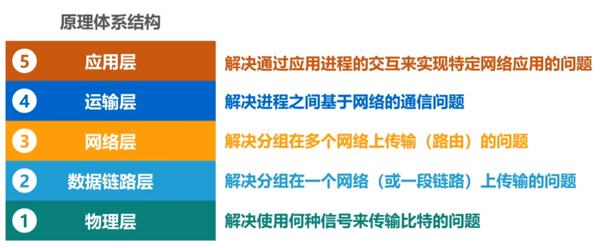


### 1.6.3 计算机网络体系结构分层思想举例


### 1.6.4 计算机网络体系结构中的一些术语

#### 实体

任何可发送或接受信息的**硬件**或**软件进程**

#### 对等实体

收发双方**相同层次的实体**


#### 协议

控制两个对等实体进行逻辑通信（假设）的规则的集合

协议的三要素：

- 语法
	>定义所交换的信息的格式(哪些字段何种顺序)

- 语义
	>定义双方所要完成的操作

- 同步
	>定义收发双方的时序关系


#### 服务

- 在协议的控制下，两个对等实体间的逻辑通信使得本层能够向上一层提供服务

- 要实现本层协议，还要使用下一层的服务

- （每一层享受下一层的服务，遵守本层协议，并向上一层提供服务）

- 也就是说，协议是“水平的”，服务是“垂直的”
- 实体看得见相邻下层所提供的服务，但并不知道实现该服务的具体协议，i.t.下面的协议对上面的实体是“透明的”


#### 服务访问点

在同一系统中相邻两层的实体交换信息的逻辑接口，用于区分不同的服务类型

- 数据链路层的服务访问点为帧的“类型”字段
- 网络层的服务访问点为IP数据报首中的“协议字段”
- 运输层的服务访问点为“端口号”

 #### 协议数据单元PDU

对等层次之间传送的数据包成为该层的协议数据单元
>物理层           比特流
>
>数据链路层    帧frame
>
>网络层           分组或IP数据报
>
>运输层           TCP报文段或UDP用户数据报
>
>应用层           报文


#### 服务数据单元SDU

同一系统内，层与层之间交换的数据包

多个SDU可以合成一个PDU，一个PDU可以拆成几个SDU


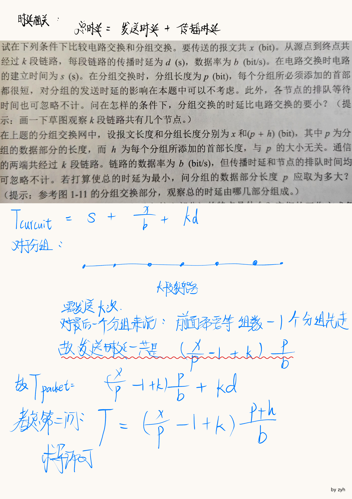

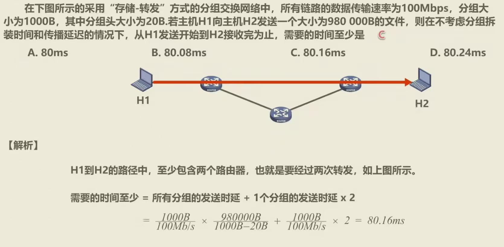


---

# 二、物理层

## 2.1 物理层的基本概念

考虑的是如何才能在连接各种计算机的传输媒体上传输数据比特流

传输媒体：

- 导引型传输媒体
	- 双绞线
	- 同轴电缆
- 非导引型传输媒体
	- 微波通信（2-40GHz）

物理层协议的主要任务：

- 机械特性

	> 指明接口所用接线器的==形状==和==尺寸==，==引脚数目==和==排列==、固定和锁定装置

- 电气特性
	>指明在接口电缆的各条线上出现的==电压的范围==

- 功能特性
	>指明某条线上出现的某一电平的==电压有何意义==

- 过程特性
	>指明对于不同功能的各种==可能事件的出现顺序==

## 2.2 物理层下面的传输媒体

### 2.2.1 导引型传输媒体

#### 同轴电缆

>基带同轴电缆（50Ω）数字传输，过去用于局域网
>
>宽带同轴电缆（75Ω）模拟传输，目前主要用于有线电视

#### 🌟双绞线

>绞合的作用:
>
>> 抵御部分来自外界的电磁波干扰
>> 减少相邻导线的电磁干扰

| 类别       | 带宽范围        | 特点                                                     | 典型应用                          |
| ---------- | --------------- | -------------------------------------------------------- | --------------------------------- |
| **Cat 3**  | 最多 10 Mbps    | 早期标准，已淘汰，抗干扰能力弱                           | 电话线路，早期以太网 (10BASE-T)   |
| **Cat 5**  | 最多 100 Mbps   | 非屏蔽（UTP），比Cat 3更好，但已逐渐被淘汰               | 快速以太网 (100BASE-TX)           |
| 超5类      | 最多 1 Gbps     | 增强型Cat 5，减少串扰，成本低，主流使用                  | 千兆以太网 (1000BASE-T)，家庭网络 |
| **Cat 6**  | 最多 1–10 Gbps  | 更厚的导线，增强抗干扰能力，适用于高速传输               | 企业网络，高清视频传输            |
| **Cat 6a** | 最多 10 Gbps    | 屏蔽/非屏蔽均有，频率可达500 MHz，传输更稳定             | 数据中心，高密度部署              |
| **Cat 7**  | 最多 10 Gbps    | 全屏蔽（STP），抗干扰最强，成本高                        | 专业布线、高安全性环境            |
| **Cat 8**  | 最多 25–40 Gbps | 面向数据中心，传输频率高达2000 MHz，距离受限（30米以内） | 服务器互连，数据中心专用          |

#### 🌟光纤

> 纤芯直径
>
> >多模光纤：50微米 62.5微米
> >单模光纤：9微米
>
> 工作波长
> >0.85微米（衰减较大）
> >
> >1.30微米（衰减较小）
> >
> >1.55微米（衰减较小）
>
> 优点
> >- 通信容量大（25000-30000GHz的带宽）
> >- 传输损耗小，远距离传输时更加经济
> >- 抗雷电和电磁干扰性能好（在大电流脉冲干扰的环境下尤为重要）
> >- 无串音干扰，保密性好，不易被窃听
> >- 体积小重量轻
>
> 缺点
> >- 割接需要专门的设备
> >- 光电接口较贵

多模光纤：

光源 →   ||   光信号进入光纤

```javascript
        ________光纤包层（Cladding）________
       /                                     \
      /                                       \
     |      ↑                         ↑        | ← 光线不断被反射
     |     / \                       / \       |
     |    /   \ ← 全反射原理          /   \      |
     |   /     \                   /     \     |
     |  /       \                 /       \    |
     | /         \               /         \   |
     |/___________\_____________/___________\__| ← 光纤核心（Core）
```

- 光从一端进入，沿核心不断“弹跳”（全反射）前进，最终传输到另一端

- 由于光的色散问题，光在多模光纤中传输一定距离后必然产生信号失真（脉冲展宽）

- 因此多模光纤只适合近距离传输（建筑物内）
- 发送光源：发光二极管
	接收检测：光电二极管

---


单模光纤：

> 光一直向前传播而不发生全反射
> 没有模式色散
>
> 适合长距离传输且衰减小，但制造成本高，对光源要求高
>
> 发送光源：激光发生器
> 接收检测：激光检波器

#### 电力线


### 2.2.2 非导引型传输媒体

#### 无线电波

#### 🌟微波

- 地面微波接力通信
- 卫星通信

#### 红外线

- 点对点无线传输
- 直线传输，中间不能有障碍物，传输距离短
- 传输速率低（4-16Mb/s）


## 2.3 传输方式


### 2.3.1 🌟**并行传输（Parallel Transmission）**

- 一次传多个比特（通常是8个或更多）。
- 就像你有8条车道，每条车道同时传一位。
- 用于：短距离传输，如**电脑内部、CPU 到内存的总线**

✅ 优点：传输快
 ❌ 缺点：距离不能太远，容易“走偏”（信号干扰，不同步）

------

### 2.3.2🌟**串行传输（Serial Transmission）**

- 一次传一个比特，按照顺序排队传。
- 就像单车道高速公路，虽然慢，但跑得远。

✅ 优点：适合长距离、简单、抗干扰强
 ❌ 缺点：速度略慢（不过现代技术已经弥补了这个缺点）

---

### 2.3.3 🌟同步传输

- 保证双方时钟同步的方法
	- 外同步：收发双方之间添加一条单独的时钟信号线
	- 内同步：发送端将时钟同步信号编码到发送数据中一起传输（如曼彻斯特编码）


---

### 2.3.4 🌟异步传输

- 字节之间异步，时间间隔不固定
- 但是字节中的每个比特任要同步（各比特的持续时间相同）


---

### 2.3.5 单工、半双工、全双工

单行通信：只有一个传输方向（收音机）

半双工：可以双向传递，但不能同时进行（对讲机）

全双工：双向同时传递 （手机）

>后面二者都需要两条信道


---

## 2.4 编码与调制

>**编码**是把“话”变成“电”，**调制**是把“电”变成“广播”

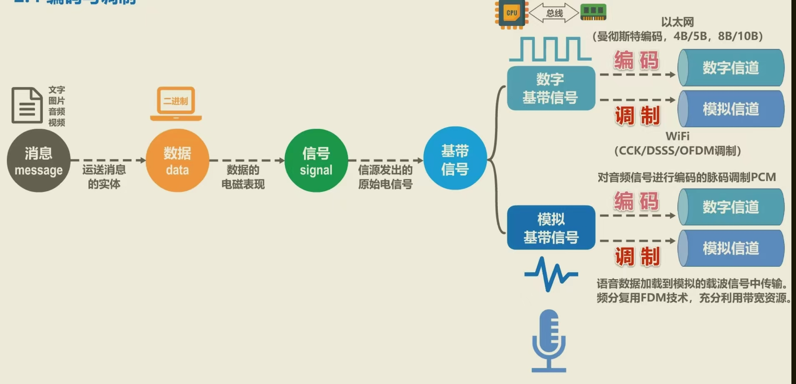


### 🌟码元

在使用时间域的波形表示数字信号时，**代表不同离散数值的基本波形**，是一个在信道上传输的最小单位的信号形式

- **比特** 是信息的最小单位（0 或 1）
- **码元** 是物理上发出去的“一个动作”，比如一次电平变化、一次波形；
- **一个码元可以携带一个或多个比特**

> 码元是你“发了一次信号”，比特是“信号里藏了几个秘密”

---

### 常用编码

NRZ不归零编码存在同步问题，需要额外传输时钟信号

对于RZ归零编码（自同步，编码效率低）：

- 接收方只需要在信号归零后进行采样即可，不需要单独的时钟信号
- 实际上，归零编码相当于把时钟信号用“归零”的方式编码在数据之中，这称为“**自同步**”信号

#### 曼彻斯特编码（传统以太网）

码元中间时刻的跳变既表示时钟，又表示数据

| 原始比特 | 曼彻斯特编码              |
| -------- | ------------------------- |
| 0        | 高电平 → 低电平（下降沿） |
| 1        | 低电平 → 高电平（上升沿） |


### 基本调制方法

所谓调制：
数字信号转为模拟信号，在模拟信道中传输
模拟信号转换为另一种模拟信号，在模拟信道中传输

#### 调幅（AM）幅移键控 ASK

- ✅ 优点：实现简单

- ❌ 缺点：对噪声非常敏感（振幅容易被干扰）

#### 调频（FM）频移键控 FSK

- ✅ 优点：抗干扰能力比ASK强

- ❌ 缺点：带宽占用大，频率切换难

#### 调相（PM）相移键控 PSK

- ✅ 优点：抗噪声强，效率高

- ❌ 缺点：实现相对复杂（接收端要能准确判相）


#### 混合调制（多元制）

注意：
频率与相位相关（频率是相位随时间的变化率），一次只能调一个

相位和振幅可以同时调制

例如 正交振幅调制 QAM

#### QAM-16

- 12种相位

- 每种相位有1和2两种振幅可选

- 码元与4个比特的对应关系采用格雷码（任意两个相邻码元仅有1个比特不同）

	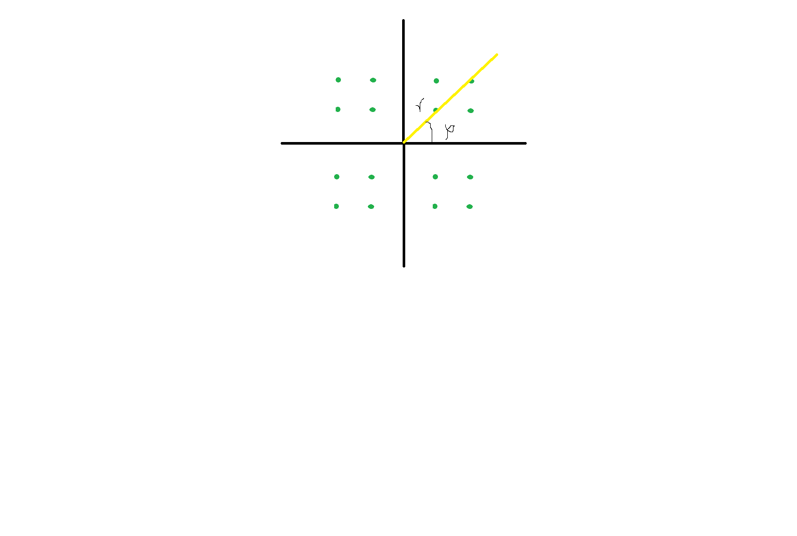

因为是16个信号点，所以每个点代表4个比特（2^4）

| 比特组合 | 信号点位置（I, Q） |
| -------- | ------------------ |
| 0000     | (-3, -3)           |
| 0001     | (-3, -1)           |
| 0010     | (-3, 1)            |
| 0011     | (-3, 3)            |
| 0100     | (-1, -3)           |
| 0101     | (-1, -1)           |
| 0110     | (-1, 1)            |
| 0111     | (-1, 3)            |
| 1000     | (1, -3)            |
| 1001     | (1, -1)            |
| 1010     | (1, 1)             |
| 1011     | (1, 3)             |
| 1100     | (3, -3)            |
| 1101     | (3, -1)            |
| 1110     | (3, 1)             |
| 1111     | (3, 3)             |

---

## 2.5 信道的极限容量

信号失真的因素：

1. 码元传输速率
2. 信号传输距离
3. 噪声干扰
4. 传输媒体质量

### 🌟奈氏准则

在假定的理想条件下，**为了避免码间串扰，码元传输速率是有上限的**

理想低通信信道的最高码元传输速率 = 2W Baud

理想带通信信道的最高码元传输速率 = W Baud

W:信道带宽（单位Hz）

Baud:码元/秒

>码元传输速率又称为**波特率**、**调制速率**、波形速率或符号速率，与比特率有一定关系
>
>为了提高比特率，则需设法使得每一个码元携带更多比特的信息量

**实际信道所能传输的速率，明显低于奈氏准则给出的上限数值**

并非提高调制方法使得码元携带更多比特就可以无限制提高信息的传输速率，因为极限传输速率还受限于实际的信号在信道传输时的信噪比

### 🌟香农公式

带宽受限且有高斯白噪声干扰的信道的极限信息传输速率
$$
C = W✖️ \log_2\left(1 + \frac{S}{N}\right)
$$

其中：
- \( C \)：信道的极限信息传输速率（bps）
- \( W )：带宽（Hz）
- \( S \)：信道内所传信号的平均功率
- \( N \)：噪声功率
- S/N:信噪比（SNR），使用分贝作为度量单位
- ==信噪比 = $10✖️\lg_\left( \frac{S}{N}\right)$ （dB）==

不难看出：

1. 信道带宽或通信中，信噪比越大，极限传输速率越高
2. 实际上比公式的极限速率还低不少，因为还有其他损伤比如各种脉冲干扰、衰减和失真等

---


# 三、数据链路层

## 3.1 数据链路层概述

- ==链路== 一个结点到相邻结点的一段物理线路，中间没有其他的交换结点
- ==数据链路（data link）== 是指把实现通信协议的硬件和软件加到链路上构成了数据链路
- 数据链路层以==帧==为单位传输和处理数据


数据链路层的三个重要问题

1. 封装成帧

2. 差错检测

3. 可靠传输
	>尽管误码是不能完全避免的，但若能实现发送方发送什么接收方收到什么，就称为可靠传输

- 使用点对点信道的数据链路层

- 使用广播信道的数据链路层（共享式局域网）
	>共享式以太网的媒体接入控制协议CSMA/CD
	>802.11局域网的媒体接入控制协议CSMA/CA

- 数据链路层的互联设备
	>网桥 交换机
	>集线器（物理层互联设备）与交换机的区别


### 网络适配器

网络适配器的作用：

- 数据格式转换：实现计算机与网络之间的数据格式转换，包括==并行传输与串行传输之间的转换==

- 数据缓存：由于网络和计算机的数据传输速率不同，网卡内置存储器用于缓存数据，协调速度差异

- 协议处理：网卡实现如以太网协议等链路层功能，负责帧的封装、解析和差错检测

- 独立收发数据：网卡可自主接收和发送数据帧，不占用CPU资源；收到正确帧后通过中断通知计算机

- 驱动支持：需在操作系统中安装设备驱动程序，以便操作系统控制网卡进行数据收发

---

## 3.2 封装成帧

**是指数据链路层给上层交付的协议数据单元添加帧头和帧尾使之成为帧**

- 帧头和帧尾含有重要的控制信息
- 帧头和帧尾的作用之一是==帧定界==


#### **透明传输**

**透明传输**的目标是：

> *即使数据中包含了协议控制字符（比如标志位），也不会干扰帧的解析*

是指**数据链路层对上层交付的传输数据没有任何限制**，好像数据链路层不存在

- 面向字节的物理链路使用字节填充（字符填充）的方法实现透明传输
	>转义字符，确保不会误判开头结尾

- 面向比特的物理链路，使用比特填充的方法实现透明传输

	>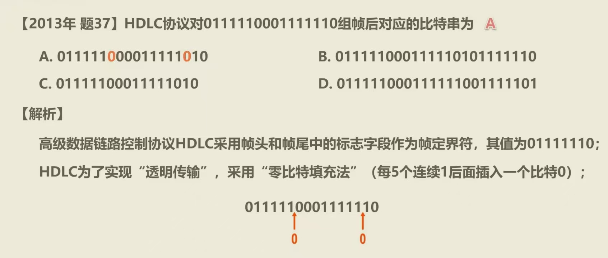

- 为了提高帧的传输效率，应当使*帧的数据部分的长度尽可能大（远大于帧头帧尾）*
	考虑到差错控制等多种因素，每一种数据链路层协议都规定了帧的数据部分的长度上限，也就是 ==最大传送单元（Maximum Transfer Unit）==

	

	

	---

## 3.3 差错检测

- **比特差错**：传输过程中比特1和0误变
- 在一段时间内，传输错误的比特数占总比特数的比率叫做 误码率（Bit Error Rate）
- 使用==差错检测码==来检测传输过程中是都出现了比特差错，是数据链路层需要解决的重要问题之一


### 奇偶校验

- 在待发送的数据后面添加一位奇偶校验位，使整个数据（包含所添加的校验位在内）中比特1的个数为奇数或偶数（奇校验或偶校验）
	>如果出现偶数个位发生误码，不能检查出误码（漏检）


### 循环冗余校验（Cyclic Redundancy Check）

>有很好的检错能力（漏检率很低），虽然计算复杂，但非常易于用硬件实现，因此被广泛应用于数据链路层

- 收发双方约定好一个==生成多项式==G(x)
- 发送方基于待发送的数据和生成多项式计算出差错检验码（==冗余码==），将其添加到带传输的数据后面一起传输
- 接收方通过生成多项式来计算收到的数据是否产生了误码

具体内容：
>### 🧮 CRC计算过程步骤
>
>1. **定义参数：**
>	- 原始数据 `M`（k 位）
>	- 生成多项式 `P`（n+1 位）
>	- 补 `n` 个 0 到 `M` 后面，构成新的被除数 `D = M * 2ⁿ`
>2. **执行模2除法：**
>	- 用 `P` 去除 `D`（异或运算代替减法）
>	- 得到的余数 `R`（n 位）即为冗余校验码
>3. **生成待传输码：**
>	- 将 `R` 拼接到 `M` 后面，构成最终发送数据 `M || R`（共 `k + n` 位）
>
>------
>
>### 🔧 模2除法简要说明
>
>- 与普通除法类似，但运算全用 **XOR 异或**（无借位）
>- 每次取与 `P` 等长的一段数据进行异或
>- 若首位为0则跳过异或，仅左移
>- 最后剩下的就是余数 `R`
>
>------
>
>### 📘 示例：
>
>给定：
>
>- `M = 101001`
>- `P = 1101` （n=3）
>
>步骤：
>
>1. `D = 101001000`
>2. 用 1101 去除 `D`，每次按位异或
>3. 得到余数 `R = 001`==余数的位数等于n==
>4. 最终发送数据为：`101001001`


---

## 3.4 可靠传输

### 3.4.1 可靠传输的基本概念

产生误码过后操作：

- 根据数据链路层向上层提供的服务类型
	- **不可靠传输服务：仅仅丢弃有误码的帧**
	- **可靠传输服务：想办法实现发送端发送什么，接收端就收到什么**
- 一般情况下，有线链路的误码率比较低，为了减小开销，不要求数据链路层向上提供可靠传输服务，。即便出现误码，可靠传输的问题由其上层处理
- 无线链路误码率高，要求数据链路层提供可靠传输


传输差错除了比特差错外，还有**分组丢失**、**分组失序**以及**分组重复**，一般不出现在数据链路层

**可靠传输服务不限于数据链路层**，其余各层均可选择实现可靠传输

- 应用层
- 运输层
	TCP 向上层提供面向连接的可靠传输服务
	UDP向其上层提供无连接、不可靠传输服务
- 网际层
	IP向其上层提供无连接、不可靠传输服务
- 网络接口层
	802.11无线局域网要求数据链路层实现可靠传输
	以太网不要求数据链路层实现可靠传输

---

### 3.4.2 可靠传输的实现机制  停止=等待协议SW

####  基本思想

> **每发送一个分组（数据包）就必须等待其确认（ACK）后才能发送下一个分组,若有误码返回NAK，重传数据分组**

#### 机制

- 发送方发送一个数据包后停止，等待接收方确认
- **超时重传**：如果在超时时间内未收到确认，重传该数据包，重传时间一般为从发送方到接收方的平均时间
- 自动请求重传ARQ（automatic repeat quest）
- 接收方每次只接收一个数据包，并回复一个 ACK

#### 特点

- 简单易实现，但**效率低**
- 信道利用率低，尤其在**高带宽×高延迟**环境下（即 BDP 大）
- 为了避免分组重复，必须给每个分组带上序号，用一个比特就够（因为会等待）

#### 信道利用率


$
U=\frac{T_{D}}{T_{D}+RTT+T_{A}}
$


$T_{D} $是发送时延，一般忽略$T_{A}$

RTT是==往返时间==

- 可以看出，当RTT远大于发送时延时（比如使用卫星链路），信道利用率非常低
- 为了克服S-W协议信道利用率很低的缺点，就产生了另外两种协议


---

### 3.4.3 回退N帧协议GBN（go-to-back-N）

> 发送方可以连续发送多个分组（窗口内），但如果某个分组丢失或出错，接收方只接受按序的分组，之后的全部丢弃，发送方重传“丢失分组及其后的所有分组”
>
> 当信道线路质量不高时，其信道利用率并不比S-W协议高

接收方累计确认：

收到多个数据分组后，对按顺序到达的最后一个数据分组发送确认，$ACK_{n}$表示序号为n及以前的所有数据分组都已经正确接收

接收方的接收窗口尺寸是$W_{R}=1$


- 假设使用 m 位编号，则最多能表示 2m2^m2m 个不同编号。
- 为防止编号混淆（比如新发送的 pkt3 被误认为是上一次的 pkt3），要求：

窗口大小≤$2^m$−1（m是构成分组序号的比特数量），若更大则无法分辨新旧数据分组


####  发送方

- 维护一个**发送窗口**，窗口大小为 NNN
- 可以**连续发送窗口内未确认的帧**
- 收到 ACK 后，窗口向前滑动
- 如果某个帧超时未确认，**从该帧起重传整个窗口内的所有帧（包括后面的）**

#### 接收方

- 只接受**按序到达的帧**（frame iii）
- 如果收到的帧不是期望的编号（如跳号），**丢弃该帧，不缓存乱序帧**，并重发上一个确认号（ACK for last in-order frame）

---

### 3.4.5 选择重传协议SR

为了进一步提高性能，可设法只重传出现误码的数据分组，因此$W_{R}$应该大于1，以便于接收方先收下失序到达但无误码并且序号落在接收窗口内的那些数据分组，等到所缺分组收齐后一起送交上层

####  为什么需要选择重传协议？

在前面的 GBN（Go-Back-N）协议中，如果某个帧出错或丢失，**后面的所有帧都要回退重传**，造成带宽浪费。

> **SR 的目标**是：只重传出错的帧，别的好帧就不动！接收方会逐一确认

------

####  选择重传协议的核心机制

SR 协议使用两个**滑动窗口**：

| 角色   | 窗口类型 | 功能                                     |
| ------ | -------- | ---------------------------------------- |
| 发送方 | 发送窗口 | 允许连续发送多个帧（但要等待确认）       |
| 接收方 | 接收窗口 | 允许接受**不按顺序**到达的帧，并缓存它们 |


------

####  关键特性一览

| 特性         | 说明                         |
| ------------ | ---------------------------- |
| ✅ 可乱序接收 | 接收方可缓存乱序到达的数据帧 |
| ✅ 选择性确认 | 接收方只对收到的帧发送 ACK   |
| ✅ 选择性重传 | 发送方只重传出错（超时）的帧 |


------

#### 编号空间与窗口大小的关系

为了防止帧序号歧义，发送窗口大小必须 ≤ $2^{m−1}$，其中 m 是帧编号的比特位数

> 这比 GBN 更紧，因为 SR 接收方可能缓存未按顺序到达的帧，必须更严格区分“旧帧”和“新帧”

接受窗口 $W_R$∈（1,$W_T$]

---

## 3.5 点对点协议PPP

- point-to-point protocol 是目前使用最广泛的点对点数据链路层协议
- ppp协议为在点对点链路传输各种协议数据报提供了一个标准方法，由以下三部分构成;
	- 对各种协议数据报的封装方法（封装成帧）
	- 链路控制协议LCP   用于建立配置以及测试数据链路的连接
	- 一套网络控制协议NCPs  其中的每一个协议支持不同的网络层协议


### 帧格式

```yacas
+--------+---------+--------+---------+
| Flag   | Address | Ctrl   | 帧数据 | CRC | Flag
| 0x7E   | 0xFF    | 0x03   | ...     | ... | 0x7E
+--------+---------+--------+---------+

```

| 字段         | 含义                                                         |
| ------------ | ------------------------------------------------------------ |
| **Flag**     | 起始/结束标志（固定为 0x7E）                                 |
| **Address**  | 一般为 0xFF，代表广播地址（点对点其实不重要）                |
| **Control**  | 固定为 0x03，无编号无确认                                    |
| **Protocol** | 指明帧的数据部分送交哪个协议处理<br />0x0021 IP数据报<br />0xc021 LCP分组<br />0x8021 NCP分组 |
| **CRC**      | 循环冗余校验码（FCS，帧检查序列）                            |

实现透明传输方法：

面向字节的异步链路采用插入转义字符的字节填充法：

| 情况                                  | 操作                                               |
| ------------------------------------- | -------------------------------------------------- |
| 数据中出现 `0x7E`（Flag）             | 替换为两个字节：`0x7D` `0x5E`                      |
| 数据中出现 `0x7D`（转义符）           | 替换为两个字节：`0x7D` `0x5D`                      |
| ASCII码控制字符（数值小于0x20的字符） | 在字符前插入一个7D字节，同时把该字符的编码加上0x20 |

比特填充法：

发送方：发现5个连续的比特1，立即填充1个比特0

接收方：发现5个连续的比特1，立即删除后续1个比特0


差错检测：每收到一个帧，就进行CRC检验，正确才保留 .使用PPP的数据链路层向上提供可靠传输服务


工作状态：

1. 链路建立（LCP）
2. 用户认证（PAP 或 CHAP，可选）
3. 网络层协议协商（NCP）
4. 数据传输 & 链路终止


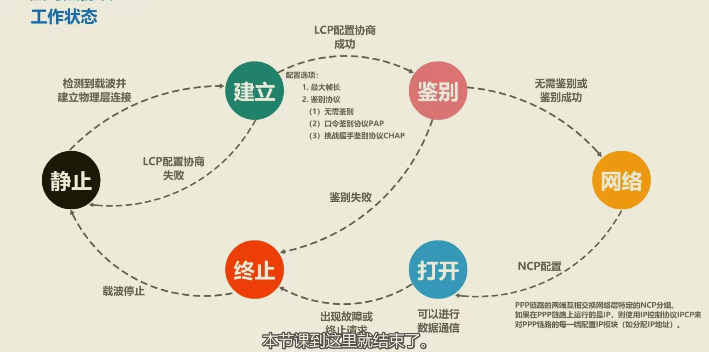

## 3.6 媒体控制

### 3.6.1 媒体接入控制的基本概念

- 共享信道要着重考虑的一个问题就是如何协调多个发送和接收站点对一个共享传输媒体的占用，即==媒体接入控制MAC==*Media Access Control*

媒体介入控制
>静态划分信道（**预先分配好信道，不灵活，对于突发性数据传输信道利用率会非常低，通常在无线网络的物理层使用，而不是在数据链路层使用**）
>
>>频分多址
>>
>>时分多址
>>
>>码分多址
>
>动态接入控制
>
>>受控接入
>>
>>>集中控制（有一个主站以循环方式轮询每个站点有无数据发送，只有轮询到的站点才能发送数据，最大缺点是单点故障问题）
>>>
>>>分散控制（各站点是平等的，形成一个环型网络，令牌沿着环传递，接收到令牌的站点才有权发送数据，发送完后传送令牌到下一个站点）
>>
>>随机接入（所有站点通过竞争，随机的在信道上发送数据，如果恰巧有两个或者更多站点同上发送，则信号发生碰撞，使得这些站点都发送失败；因此，这类协议关键问题是如何避免冲突以及冲突发生后如何恢复通信，共享式以太网就是随机接入）


### 3.6.2 静态划分信道

#### 信道复用

- 复用（multiplexing）：

	就是通过一条物理线路同时传输多路用户的信号

- 分为：

	1. 频分复用FDM
		所有用户同时占用不同的频带资源并行通信
	2. 时分复用TDM
		将时间分为时隙，每对用户只在所分配的时隙里使用线路传输数据
		**所有用户在不同的时间占用同样的频带宽度**
	3. 波分复用WDM
		用在光纤通信中，信号按照光的波长划分
	4. 码分复用CDM
		更常用说法 CDMA（Code Division Multiple Access）
		每个用户在同时使用同样的频带进行通信，采用不同的编码，所以互不干扰
		1. 在CDMA中，每一个比特时间分为m个短的间隔，称为==码片CHIP== 一般取值64或128 
		2. 使用CDMA的每一个站被指派一个唯一的==m bit码片序列==chip sequence
		3. 一个站如果要发送比特1，则发送自己的 m bit chip sequence
		4. 一个站如果要发送比特0，则发送自己的 m bit chip sequence的二进制反码
		5. 码片序列挑选的原则：
			1. 分配给每个站的码片序列不同，实际常采用伪随机码序列
			2. 分配给每个站的码片序列必须相互正交（规格化内积为0）
			3. 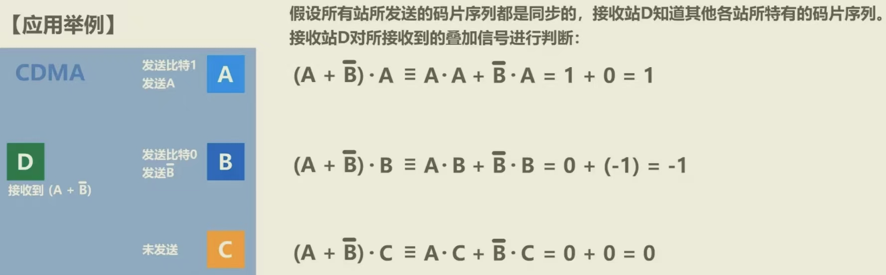


---

### 3.6.3 媒体接入控制-动态介入控制-随机接入-CSMA/CD

早期 CSMA /CD(Carrier Sense Multiple Access/Collision Detection)

载波监听多址接入/碰撞检测
总线局域网使用

#### Multiple Access

- 多个站连接在一条总线上，竞争使用总线


#### Carrier Sense

- 每一个站发送前先检测总线上其他站点是否在发送帧
	- 若检测到总线空闲96比特时间，则发送这个帧
	- 若检测到总线忙，则继续检测并等待总线转为空闲96比特时间，然后发送这个帧


#### Collision Detection

- 每一个正在发送的站边发送边监测碰撞
	- 一旦发现出现碰撞，则立即停止发送，退避一段随机时间后再次发送
- 以太网还采取一种==强化碰撞==的措施，就是当发送帧的站点一旦检测到碰撞，除了立即停止发送帧之外，还要继续发送32或48bit的jamming signal，以便有足够多的碰撞信号使所有站点都能检测出碰撞


#### contention window 争用期（碰撞窗口）

- 以太网端到端往返传播时延2τ称为争用期或碰撞窗口 
- 经过争用期这段时间还没有检测到碰撞，才能肯定这次发送不会发生碰撞
- 在以太网中发送帧的主机越多，端到端往返时延越大，发生碰撞的概率越大，因此，共享式以太网不能连接太多主机，总线也不能太长
	- 10Mb/s以太网把contention window定为512bit发送时间，51.2微妙，因此总线不能超过5120m，考虑信号衰减，不超过2500m


#### 最小帧长

> 边发送边检测，如果帧太短，很快就发送出去，则在后面发生碰撞也不知道，所以需要限制帧不能太小


- 以太网规定最小帧64B，也就是512bit（大小与争用期一样，很显然这样一定能检测到碰撞）
	- 如果发送的数据很小，也需要加入填充字节，让帧长不少于64B
- **确保了主机在帧发送完成前就检测到帧是否发生碰撞**


#### 最大帧长

以太网V2的MAC帧最大1518B


#### 截断二进制指数退避算法

$退避时间 = 基本退避时间2τ ✖️ 随机数r$
其中，r∈{0,1,…,$2^k-1$}

k = min[重传次数，10]（不能无限增长）

- 若连续多次发生碰撞，表明有很多主机参与竞争信道，但使用上述算法可使重传需要推迟的时间随重传次数扩大（==动态退避==），因而可以减小发生碰撞的概率
- **当重传16次依旧不能成功时**，表明同时打算发送帧的主机太多，则丢弃该帧，向高层报告


#### 信道利用率

考虑理想情况：

- 主机发送帧不会碰撞
- 总线空闲则立即有主机发送帧
- 发送帧占用总线时间 $T_0+τ$ ，帧本身发送时间 $T_0$
- 则极限信道利用率 
	$S_{MAX}=\frac{T_0}{T_0+τ}=\frac{1}{1+a}$其中$a=\frac{τ}{T_0}$
- 为提高利用率，a越小越好，也就是端到端的距离受限，帧尽量大些

#### 发送流程图

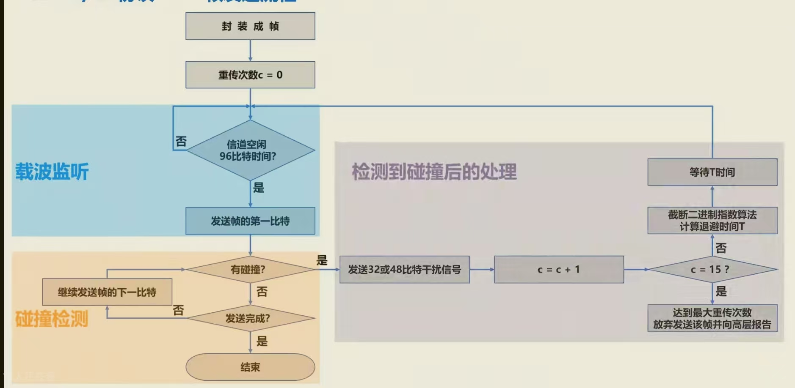

#### 帧接收流程图

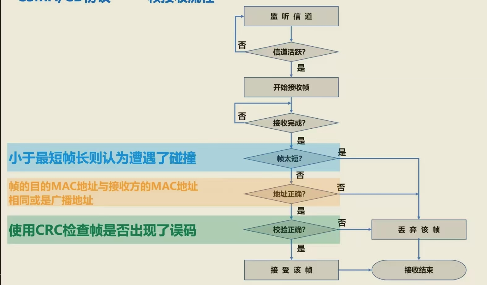

### 3.6.4 媒体介入控制-动态接入控制-随机接入-CSMA/CA

无线局域网使用

- 在无线局域网中，依然可以使用CSMA，也就是发送前对传输媒体进行载波监听

- 但是无法使用CD，原因：

	- 无线信道的传输条件特殊，信号强度的动态范围很大，无线网卡接收到的信号强度往往会远小于发送信号的强度（可能百万倍相差），所以在无线网卡上使用CD对硬件的要求很高
	- 无线电波传播具有特殊性（隐蔽站问题比如AB互通，BC互通，AC不通，AC同时给B发送，二者之间无法检测碰撞），所以进行碰撞检测的意义不大

- **802.11无线局域网使用CSMA/CA，在CSMA的基础上增加collision avoidance**

- 但由于不可能避免所有碰撞，并且无线信道误码率较高，802.11标准还使用了==数据链路层确认机制（停止-等待协议）==来保证数据被正确接收

- 802.11的MAC层标准定义了两种不同的媒体接入控制方式：

	- ==分布式协调功能 distributed coordinationfunction DCF==
		在DCF下，没有中心站点，每个站点使用CSMA/CA协议通过争用信道来获得发送权，这是802.11定义的默认方式
	- ==point coordination function点协调功能PCF==
		采用集中控制的接入算法（一般在Access Point实现集中控制），可选方式，实际较少使用

	

#### 帧间间隔

- 802.11标准规定，所有站点必须持续检测到信道空闲一段时间才能发送帧，这段时间称为帧间间隔IFS
- IFS的长短取决于站点要发送到帧的类型
	- 高优先级帧等待时间短，有限发送权
	- 低优先级帧等待时间长，推迟发送，减少发生碰撞的可能
- 常用的帧间间隔
	- ==短帧间间隔SIFS==28μs，最短的帧间间隔，用来分隔开属于一次对话的各帧。
		一个站点应该能在这段时间从发送方式切换到接收方式
		使用SIFS的帧类型有ACK帧、CTS帧、由过长的MAC帧分片后的数据帧、以及所有回答AccessPoint探寻的帧和在PCF方式接入点AP发送出的任何帧
	- ==DCF帧间间隔DIFS128μs==，它比SIFS长的多，在DCF方式中用来发送数据帧和管理帧


#### CSMA/CA的退避算法

- 在执行退避算法时，站点为退避计时器设置一个随机的退避时间：
	- 退避计时器的时间减小到0时，开始发送数据
	- 当退避计时器的时间还没有减小到0时，信道又转为忙状态，这时冻结数值，等再次空闲再经过DIFS后，继续启动退避计时器
- 第i次逼退，逼退时间在时隙编号{0,1,…,$2^{2+i}-1$}随机选一个，再✖️基本退避时间（一个时隙的长度）就可以得到随机的退避时间，这样是为了减少不同站点选择相同退避时间的概率
	当时隙编号达到255（第6次退避）就不再增加

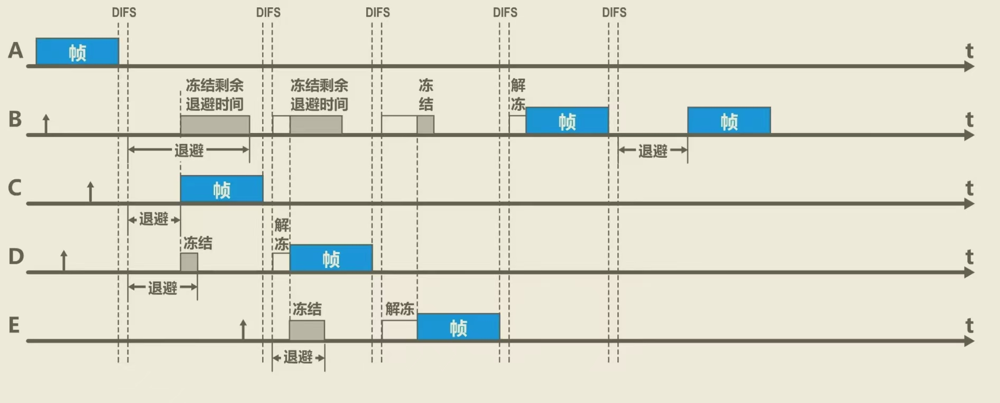


#### CSMA/CA协议的信道预约（RTS/CTS）和虚拟载波监听(VCS)

- 为了尽可能减少碰撞的概率和降低碰撞的影响，802.11标准允许要发送数据的站点对信道进行预约
	- 源站在发送数据帧之前先发送一个短的控制帧，RTS(request to send)，包括源地址、目的地址（包括相应的确认帧）所需的持续时间
	- 若目的站正确收到RTS，并且媒体空闲，就发送一个相应控制帧，==允许发送CTS(clear to send)==，也包括这次通信的持续时间（从RTS中复制）
	- 源站收到CTS帧后，再持续一段SIFS，就可以发送帧
	- 若目的站正确收到了来自源站的数据帧，等待SIFS后，向源站发送确认帧ACK
- 除了源站和目的站，其余站收到CTS或者数据帧后就推迟接入到无线局域网中，这样来确保源站和目的站的通信不会受干扰
- 如果RTS发生碰撞，源站就不会收到CTS，需要执行退避算法重传RTS
- 由于RTS和CTS都很短，发生碰撞的概率、碰撞产生的开销很小。
	但对于一般的数据帧，其发送时延往往大于传播时延（局域网），碰撞概率很大浪费时间多，因此预约是值得的
- 802.11标准规定了3种情况供用户选择：
	- 使用RTS和CTS帧
	- 不使用RTS和CTS
	- 只有当数据长度超过特定数值才使用
- 除了RTS和CTS，数据帧也会携带通信需要持续的时间，这成为802.11的虚拟载波监听VCS机制
- 站点只要监听到RTS CTS 数据帧中任何一个，就能得知通信持续时间，而不需要真正听到信道上的信号，因此VCS能减少隐蔽站带来的碰撞问题

---

## 3.7 MAC地址、IP地址以及ARP协议

### 3.7.1 MAC地址

- 多个主机连接在同一个广播信道上，要想实现两个主机之间的通信，则每个主机必须要有一个唯一的标识，即一个数据链路层地址
- MAC地址一般被固化在网卡的电可擦只读存储器EEPROM中，因此MAC地址也被称为==硬件地址==
- 有时也被称为==物理地址==（并非物理层）
- 一般情况下，用户主机有有线局域网适配器和无线局域网适配器，每个适配器都有唯一的MAC地址，而交换机、路由器有更多的网络接口所以有更多的MAC地址，**严格来说，MAC地址是对网络上各接口的唯一标识而非对网络上设备的唯一标识**


#### IEEE 802局域网的MAC地址格式

- 前三字节：组织唯一标识符 OUI
	>由IEEE的注册管理机构分配

- 后三字节：网络接口标识符 
	>由获得OUI的厂商自行分配


第一字节b1位
>0:全球管理
>
>1:本地管理

b0位
>0:单播地址(一对一通信)
>
>1:多播地址（一对多的通信，接收组由多个设备组成）

快速判断多播方法：该位16进制数不能整除2，为多播 


#### IEEE 802局域网的MAC地址发送顺序

- 字节发送顺序：第一字节–>第六字节
- 字节内的比特发送顺序：b0–>b7


#### 随机MAC地址

---

### 3.7.2 IP地址

IP地址是Internet上的主机和路由器所使用的地址，用于标识两部分信息：

- 网络编号：标识因特网上数以百万计的网络
- 主机编号：标识同一网络上不同主机（或路由器各接口）


- MAC地址不具备区分不同网络的功能，而IP地址有这个功能
- 如果不接入Internet,可以只使用MAC地址，否则MAC地址和IP地址都需要使用

从网络体系看IP地址和MAC地址：

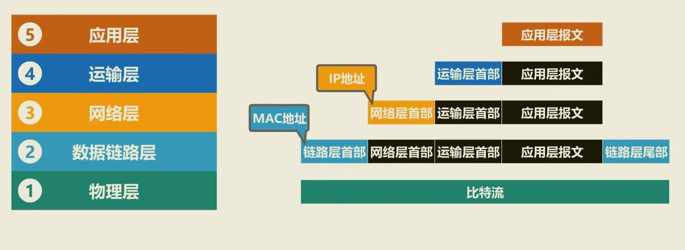


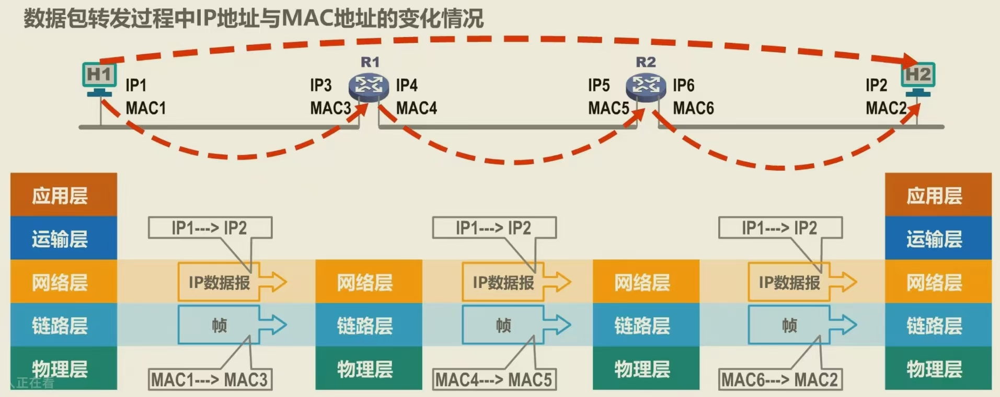

由上图可以看出：

- 数据包转发过程中，**源IP地址和目的IP地址保持不变**
- 源MAC地址和目的MAC地址逐个链路（或逐个网络）改变


### 3.7.3 ARP协议（address resolution protocol）

> ARP 协议的作用是：通过 IP 地址查找对应的 MAC 地址

步骤：

1. 主机一ARP请求广播（广播需要的目的主机）

2. 主机二ARP相应单播（目的主机回应，单播给请求方）

3. 主机一更新ARP缓存表（记住主机二的MAC地址）
	>每个主机会维护一张ARP表格，有时间限制，避免每次都重新广播，提高效率
	>缓存表中的记录都有类型，分为
	>
	>>1. 动态：自动获取，生命周期默认为2分钟
	>>2. 静态：手工配置，不同操作系统下的生命周期不同


注意：

- ARP协议是逐段链路进行的，不能跨网络
- 由于ARP没有认证机制，所以存在ARP欺骗或攻击问题

---

## 3.8 集线器和交换机的区别

- 使用双绞线和集线器HUB的星型以太网
	>- 使用集线器的以太网在逻辑上依然是一个总线网，各站点共享总线资源，使用 CSMA/CD协议
	>- 集线器之工作在物理层，每个接口仅仅简单的转发比特，不进行碰撞检测
	>- 集线器有少量的容错能力和网络管理功能

- 使用HUB在物理层扩展以太网
	>HUB连接HUB
	>
	>A 给 B 发数据，C 也能收到（虽然不是给它的）；如果 B 和 C 同时发，会“撞车”

- 以太网交换机
	>SWITCH，A 给 B 发，只有 B 收到；C 完全不知道这件事，大家各走各路，互不干扰

	- 以太网交换机通常有多个接口，每个接口都可以直接与一台主机或另一个以太网交换机相连，一般都工作在全双工方式
	- 以太网交换机有并行性，能同时连通多对接口，使多对主机能同时通信，无碰撞（不使用CSMA/CD协议）
	- 以太网交换机一般有多种速率的接口
	- SWITCH工作在数据链路层（也包括物理层），收到帧后，在帧交换表中查找帧的目的MAC地址所对应的接口号，然后通过该接口转发帧
	- 是一种即插即用设备，内部的帧交换表是通过自学习算法自动地建立起来的
	- 帧的两种转发方式：
		- 存储转发
		- 直通交换：采用基于硬件的交叉矩阵（交换时延很小，不检查是否有差错）

| 项目         | 集线器 Hub               | 交换机 Switch                  |
| ------------ | ------------------------ | ------------------------------ |
| 工作层次     | 物理层（第1层）          | 数据链路层（第2层）            |
| 数据转发方式 | 广播（谁都能听见）       | 定向转发（只发给目标）         |
| MAC地址表    | ❌ 无（不记地址）         | ✅ 有（学习+存储MAC地址）       |
| 性能         | 差，容易冲突（共享带宽） | 好，每端口独享带宽，支持全双工 |
| 是否智能     | 低（就是个电线分流器）   | 高（可学习MAC，判断转发路径）  |
| 典型应用场景 | 老式小型局域网           | 几乎所有现代以太网             |

- 使用交换机可以扩大广播域，==隔离碰撞域==
- 集线器扩大广播域同时扩大碰撞域

---

## 3.9 以太网交换机自学习和转发帧的流程

以太网交换机是一种**工作在数据链路层（第二层）**的网络设备，其核心功能包括：**自学习 MAC 地址表**与基于 MAC 地址的帧转发。其主要目的是实现高效、定向的数据帧转发，减少广播，提高局域网通信效率。

------

### 一、MAC地址表与自学习机制

交换机内部维护一张**MAC地址转发表**（MAC Address Table），用于记录各设备的 MAC 地址与其所连接的交换机端口之间的对应关系。

#### 地址学习过程

当交换机接收到一帧数据时，首先会检查该帧的**源 MAC 地址**和**接收端口**：

- 若该源 MAC 地址尚未在 MAC 表中记录，交换机会将该地址与接收端口绑定，并加入 MAC 表；
- 若该地址已存在于表中但绑定端口不同，则交换机会**更新绑定端口**；
- 此过程称为 **地址学习（MAC Learning）**。

##### 示例

若主机 A（MAC_A）通过端口1向交换机发送数据帧，交换机将记录：

```nginx
MAC_A → 端口1
```

------

### 二、基于目的地址的帧转发

完成地址学习后，交换机根据数据帧的**目的 MAC 地址**进行查表与转发。

#### （一）查表转发逻辑

1. **查找目的 MAC 地址是否存在于 MAC 表中**；
2. 若找到匹配项：
	- 将该数据帧**仅转发至对应端口**（**定向转发**）；
3. 若未找到匹配项：
	- 执行**泛洪操作（Flooding）**，即将帧广播至除接收端口外的所有端口；
	- 通常发生在网络初始阶段或目标主机尚未向交换机发送过数据。

------

### 三、MAC地址表的老化机制

为了保证 MAC 表的实时性与准确性，交换机通常对表项设置老化定时器：

- 若某个地址在一段时间（如300秒）内未再次出现，系统将自动清除该记录；
- 该机制有助于应对主机迁移或网络结构变更

------

### 四、广播与泛洪的区别

- **广播帧（Broadcast Frame）**：目标地址为 `FF:FF:FF:FF:FF:FF`，代表网络内所有主机；
- **泛洪（Flooding）**：是交换机对未知目的地址的应急处理方式，即将帧发送至除接收端口外的所有端口，但不改变帧的目标地址；
- 泛洪操作在某些情况下可能导致广播风暴，因此交换机地址学习能力至关重要。

---

## 3.10 以太网交换机的生成树协议STP

- 如何提高以太网的可靠性？
	>**冗余链路**
	>
	>但是会带来负面效应——形成网络环路
	>
	>网络环路会带来以下问题：
	>
	>1. 广播风暴
	>	大量消耗网络资源，是的网络无法正常转发其他数据帧
	>2. 主机收到重复的广播帧
	>3. 交换机的帧交换表震荡（漂移）
	>	由于重复收到，错误记录会反复震荡

- 而使用生成树协议（Spanning Tree Protocol）可以再增加冗余链路的同时避免网络环路带来的问题
	>- 不管交换机采用怎样的物理连接，交换机都能自动计算并构建一个逻辑上没有环路的网络，其逻辑拓扑结构必须是树形的（==没有逻辑环路==）
	>- 最终生成的树形逻辑拓扑要确保联通整个网络
	>- 当首次连接交换机或者网络拓扑发生变化时，交换机都会进行生成树的重新计算

## 3.11 VLAN

### 3.11.1 虚拟局域网VLAN概述

巨大的广播域会有很多弊端：

1. 广播风暴
2. 难以管理和维护
3. 潜在的安全问题


分割广播域的方法：

1. router
	>成本高

2. VLAN（virtual local area network）
	>一种将局域网内的设备划分成与物理位置无关的逻辑组的技术，这些逻辑组有某些共同的需求

### 3.11.2 VLAN的实现机制

#### IEEE 802.1Q帧

- 对以太网的MAC帧进行了拓展，==插入了四个字节的VLAN标记==

- VLAN标记的最后十二比特称为==VLAN标识符VID==，它唯一的表示了以太网帧属于哪一个VLAN
	>- VID取值范围：0-$2^{12}-1$
	>	有效取值范围1-4094
	>
	>- 802.1Q帧是由switch来处理，而不是用户主机来处理
	>
	>- 当交换机收到普通的以太网帧时，会插入四字节的VLAN标记转换为802.1Q帧，简称“打标签”
	>- 当交换机转发802.1Q帧时，可能会删除VLAN标记转变为普通以太网帧，简称“去标签”


#### 交换机的端口类型

- Access
	>- 一般用于连接用户计算机
	>- **只能属于一个VLAN**
	>- 端口的PVID值与端口所属VLAN的ID相同，默认为1
	>- 接收处理方法：一般只接受没有打标签的普通MAC帧，根据接收帧的PVID给帧“打标签”，字段中的VID取值与端口的PVID相同
	>- 发送处理方法：若帧中的VID和端口的PVID相等，则“去标签”并转发该帧，否则不转发

- Trunk
	>- 一般用于switch之间或者switch和router之间的互连
	>- 可以属于多个VLAN
	>- 用户可以设置Trunk端口的PVID值，默认值为1
	>- 发送处理方法：对于VID等于PVID的帧，去标签再转发
	>	VID不等于PVID的帧直接转发
	>- 接收处理方法：接收没有打标签的帧，根据接受帧的端口的PVID给帧打标签，字段中的VID取值与端口的PVID一致
	>	接收已打标签的帧

- Hybrid
	>相当于Access+Trunk
	>
	>- 发送方法：查看帧的VID是否再端口的“去标签”列表中
	>	- 在，则“去标签”转发
	>	- 不在，直接转发
	>- 接收方法
	>	- 接收已经打了标签的帧
	>	- 接收没有打标签的帧，打上自己的标签

## 3.12 计算题

- 3-24 假定站点A和B在同一个10 Mbit/s以太网网段上。这两个站点之间的传播时延为225比特时间。现假定A开始发送一帧，并且在A发送结束之前B也发送一帧。如果A发送的是以太网所容许的最短的帧，那么A在检测到和B发生碰撞之前能否把自己的数据发送完毕？换言之，如果A在发送完毕之前并没有检测到碰撞，那么能否肯定A所发送的帧不会和B发送的帧发生碰撞？（提示：在计算时应当考虑到每一个以太网帧在发送到信道上时，在MAC帧前面还要增加若干字节的前同步码和帧定界符。

- 3-25 上题中的站点A和B在t=0时同时发送了数据帧。当t=225比特时间时，A和 B同时检测到发生了碰撞，并且在-225+48=273 比特时间时完成了干扰信号的传输。A和B在CSMA/CD算法中选择不同的r值退避。假定A和B选择的随机数分别是r=0和rB=1。试问A和B各在什么时间开始重传其数据帧?A重传的数据帧在什么时间到达B?A重传的数据会不会和B重传的数据再次发生碰撞?B会不会在预定的重传时间停止发送数据?

---

# 四、网络层

## 4.1 概述

- 网络层的主要任务是==实现网络互连==，进而实现==数据包在各网络之间的传输==
- 需要解决问题：
	- 网络层向运输层提供怎样的服务（可靠传输or不可靠传输）
	- 网络层寻址问题
	- 路由选择问题
- Internet 是用户最多的互联网，使用TCP/IP协议栈
- 由于TCP/IP协议栈的网络层使用网际协议IP，它是整个协议栈的核心协议，因此在TCP/IP协议栈中网络层常称为网际层

## 4.2 网络层提供的两种服务

### 4.2.1 面向连接的虚电路服务

- ==可靠通信应该由网络来保证==
- 必须建立网络层的连接–虚电路VC（virtual circuit）
- 通信双方沿着已建立的虚电路发送分组
- 目的主机的地址仅需在连接建立阶段使用，之后每个分组的首部只需要携带一条虚电路的编号
- 这种通信方式如果再使用可靠传输的网络协议，就可使所发送的分组最终正确到达接收方（无差错按序到达、不丢不重复）
- 通信结束后，需要释放之前建立的虚电路

应用举例

- **ATM（异步传输模式）网络**
- **X.25**、**帧中继（Frame Relay）**
- **MPLS（多协议标签交换）** —— 实际上也是虚电路思路的一种现代扩展

### 4.2.2 无连接的数据报服务

- 可靠通信应该由用户主机来保证
- 不需要建立网络层连接
- 每个分组可以走不同的路径
- 每个分组的首部必须携带目的主机的完整地址
- 这种通信方式所携带的分组可能误码、丢失、重复和失序
- 由于网络本身不提供端到端的可靠传输服务，这就使得网络中的路由器可以比较简单，价格低廉（与电信网络的switch相比）

| 比较项目                 | 无连接的数据报服务（Datagram Service） | 面向连接的虚电路服务（Virtual Circuit Service） |
| ------------------------ | -------------------------------------- | ----------------------------------------------- |
| **是否建立连接**         | 否，直接发送                           | 是，需先建立虚电路                              |
| **分组处理方式**         | 每个分组独立处理                       | 分组按连接状态处理，路径固定                    |
| **每包是否独立路由**     | 是，逐跳查找路由                       | 否，路由提前建立，每跳查虚电路号                |
| **是否按顺序到达**       | 否，顺序不保证                         | 是，天然有序                                    |
| **是否保证可靠性**       | 否，需上层协议如TCP保证                | 基本保证顺序与有序交付，可更易实现可靠性        |
| **中间路由器是否保状态** | 否，无需保存连接信息                   | 是，保存虚电路表，维护连接状态                  |
| **适用协议或实例**       | IP 协议、UDP                           | ATM、帧中继、MPLS、X.25 等                      |
| **资源开销**             | 小（轻量级）                           | 大（需维护状态）                                |
| **灵活性**               | 高，适合动态、复杂的网络               | 低，连接一旦建立路径固定                        |
| **适用场景类比**         | 寄明信片，每张独立，有可能丢/乱序      | 打电话，先拨号，建立连接后对话有序              |

## 4.3 IPv4地址

### 4.3.1 Ipv4地址概述

- IPv4地址就是给Intenet上的每一台主机（或router）的每一个接口分配一个在全世界范围唯一的32bit的标识符
	>- IPv4地址长度：**32位（二进制）**
	>
	>- 通常用 **点分十进制** 表示，如：`192.168.1.1`
	>	>每8个bit一组，对应转换成十进制数
	>
	>- 每个IPv4地址可唯一标识一个接口

### 4.3.2 分类编址的Ipv4地址

|      | 网络号                     | 主机号 |
| ---- | -------------------------- | ------ |
| A    | 8位（开头0）               | 24位   |
| B    | 16（开头10）               | 16     |
| C    | 24（开头110）              | 8      |
| D    | 多播地址（开头1110）       |        |
| E    | 保留为以后使用（开头1111） |        |

注意

- 只有ABC类地址可以分配给网络中的主机或路由器的各个接口
- 主机号为==“全0”的地址是网络地址==，不能分配给主机或路由器的各接口
- 主机号为==“全1”的地址是广播地址==。不能分配给主机或路由器的各接口


A

>最小网络号0，保留不指派
>
>第一个可以指派的网络号1，网络地址1.0.0.0
>
>最大网络号127，作为本地环回测试地址，不指派
>>最小的本地环回测试地址 127.0.0.1
>>
>>最大的本地环回测试地址 127.255.255.254（全0全1有特殊用途）
>
>最后一个可以指派的网络号126，网络地址 126.0.0.0
>
>可指派的网络数量 126($2^{8-1}$去掉0和127)
>
>每个网络中可以指派的网络数量 $2^{24}$-2=16777214


B
>最小网络号128.0，网络地址128.0.0.0
>
>最大网络号 191.255，网络地址191.255.0.0
>
>可指派的网络数量 $2^{16-2}$=16384
>
>每个网络可以分配的IP地址 $2^{16}-2$=16384


C
>最小网络号 192.0.0 网络地址192.0.0.0
>
>最大网络号233.255.255 网络地址 233.255.255.0
>
>可指派的网络数量 $2^{24-3}$= 2097152
>
>每个网络可以分配的IP地址 $2^{8}$-2 = 254

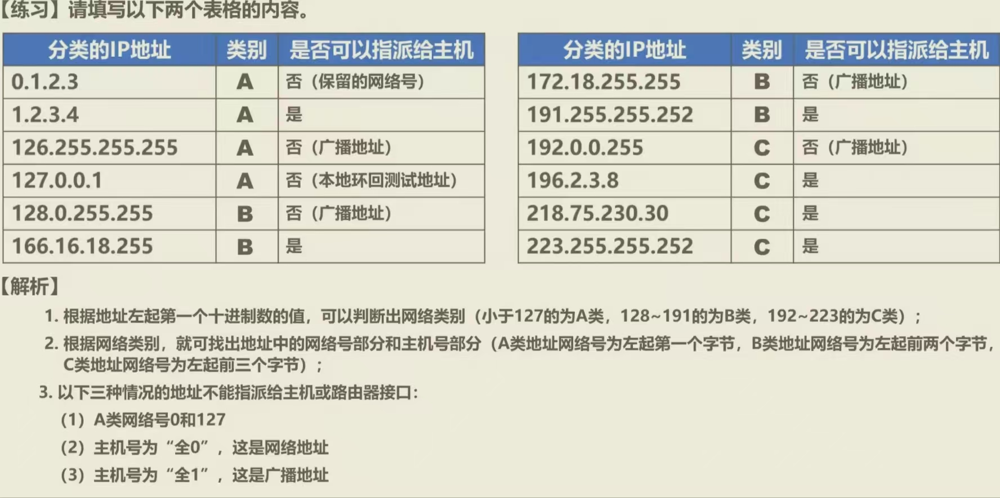

注意

- 地址 0.0.0.0 是一个特殊的Ipv4地址，只能作为源地址使用，表示“在本网络上的本主机”
- 255.255.255.255 是一个特殊的Ipv4地址，只能作为目的地址使用，表示“只在本网络上进行广播”（各路由器不转发）

### 4.3.3 划分子网的Ipv4地址

- 32bit的子网掩码可以表明分类IP地址的主机号部分被借用了几个作为子网号
	- subnet mask使用连续的bit1来对应网络号和子网号
	- subnet mask使用连续的bit0来对应主机号
	- 把划分子网的Ipv4地址与其对应的子网掩码进行逻辑与运算之后可以得到Ipv4地址所在子网的网络地址

#### CIDR表示法

> CIDR（无类域间路由）使用斜杠后加数字的方式表示子网掩码长度。

例如：

- `192.168.1.0/24` → 子网掩码为 `255.255.255.0`（网络号 24 位）
- `10.0.0.0/8` → 子网掩码为 `255.0.0.0`（网络号 8 位）


#### 如何划分子网


 步骤如下：

- **确定原网络地址和子网掩码**
- **决定划分几个子网（借几位主机位）**
- **计算每个子网的大小、网络地址、广播地址、可用地址范围**

#### 默认子网掩码

是指在没有划分子网的情况下使用的子网掩码

A 255.0.0.0

B 255.255.0.0

C 255.255.255.0

### 4.3.4 无分类的Ipv4地址

#### CIDR

随着互联网发展，**地址资源紧张**，以前那种死板的A/B/C类太浪费了：

- A类一个网络 = 1600万个主机？根本用不完
- C类一个网络 = 256个主机？太少了

于是，1993年引入了**CIDR（Classless Inter-Domain Routing）**机制——也就是“无类别域间路由选择”，解决了地址浪费与路由表膨胀的问题

- CIDR消除了传统的A,B,C类地址以及划分子网的概念
- 可以更加有效分配Ipv4的地址空间，并且可以在新的Ipv6使用之前允许因特网的规模持续增长

`172.16.0.0/20`

- 前20位是网络号，后12位是主机号，最多支持 2^12 = 4096 个主机。

- 它跨了好几个原本的C类

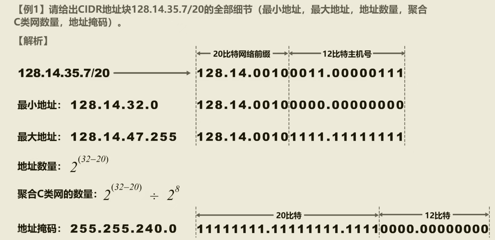

#### 路由聚合（构造超网）


比如下面这 4 个网络：

```lua
192.168.0.0/24
192.168.1.0/24
192.168.2.0/24
192.168.3.0/24
```

→ 都可以合并成：

```kotlin
192.168.0.0/22
```

也就是找共同前缀

- 不难看出，网络前缀越长，地址块越小，路由越具体
- 若路由器转发分组时发现有多条路由可以选，则选择网络前缀最长的那条，这称为==最长前缀匹配==，因为这样的路由更具体

### 4.3.5 IPv4地址的应用规划

#### 定长的子网掩码FLSM

fixed length subnet mask

- 使用同一个子网掩码来划分子网
- 每一个子网分配的IP地址数量相同，造成IP地址的浪费

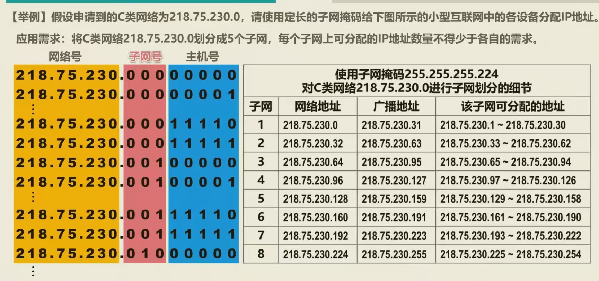


#### 不定长的子网掩码VLSM

variable length subnet mask

- 使用不定长的子网掩码来划分子网
- 每个子网所分配的IP地址数量可以不同，尽可能减少对IP地址的浪费

---

## 4.4 IP数据报的发送和转发过程

包含：

- 主机发送IP数据
- router转发IP数据

假设你访问一个网站，目标 IP 是 `203.0.113.1`

源主机发送步骤：

1. 应用层生成数据（如 HTTP 请求）
2. 传输层封装为 TCP 报文段（加端口号）
3. 网络层封装为 IP 数据报：
	- 源IP：自己机器的IP，比如 `192.168.1.100`
	- 目的IP：`203.0.113.1`
4. 检查目标IP是不是本地网络：
	- 是 → 查 ARP 得到目标 MAC 地址
	- 否 → 查 **默认网关 IP** 的 MAC 地址（下一跳），传输给默认网关，由默认网关帮忙转发
5. 链路层封装成以太网帧（加 MAC 地址），发送出去


路由器转发（==路由器隔离广播域==）

每经过一个路由器，都会做这些：

1. **解封链路层帧** → 得到 IP 数据报，==检查IP数据报是否出错==，若出错则丢弃该IP数据报并通知源主机
2. **查看目标IP** → 查路由表，确定下一跳
3. **TTL 减 1**：
	- 若 TTL = 0 → 丢弃，返回 ICMP 超时报文（用于 traceroute）
4. **重新封装为帧**，更新 **目标 MAC 地址** 为下一跳的 MAC，发出去

每一跳都只管“下一跳”，**不变的只有目标IP**，其余都可能变

---

## 4.5 静态路由配置及其可能产生的路由环路问题

- 静态路由配置是指用户或网络管理员使用路由器相关的命令给路由器人工配置路由表
	- 这种人工配置方式简单、开销小，但是不能及时适应网络状态（流量、拓扑等）的变化
	- 一般只在小规模网络中采用
- 使用静态路由配置可能出现以下原因导致的路由环路的错误
	- 配置错误
	- 聚合了不存在的网络
	- 网络故障
- 路由条目的类型
	- 直连网络
	- 静态路由（人工配置）
	- 动态路由（路由选择协议）
- 特殊的静态路由条目
	- 默认路由（目的网络为0.0.0.0 地址掩码为0.0.0.0）
	- 特定主机路由（目的网络为特定主机的IP地址，地址掩码为255.255.255.255）
	- 黑洞路由（下一跳为null0）


## 4.6 路由选择协议

### 4.6.1 路由选择协议概述

#### 静态路由选择

- 由**人工配置**的网络路由、默认路由、特定主机路由、黑洞路由等都属于静态路由
- 这种人工配置方式简单、开销小，但是**不能及时适应网络状态（流量、拓扑等）的变化**
- 一般只在**小规模网络**中采用

#### 动态路由选择

- 路由器通过路由选择协议自动获取路由信息
- 比较复杂、开销比较大，**能较好适应网络状态的变化**
- 适用于**大规模网络**


#### 因特网采用的路由选择协议的主要特点

- 自适应
	动态路由选择，能较好的适应网络状态的变化
- 分布式
	路由器之间交换路由信息
- 分层次
	将整个因特网划分为许多较小的自治系统AS（autonomous system）


因特网采用分层次的路由选择协议

- 不同AS之间 域间路由选择  外部网关协议EGP
- 同一个AS内 域内路由选择  内部网关协议IGP

#### 常见的路由选择协议

- 内部网关协议IGP
	>- 路由信息协议 RIP
	>	在因特网上最早使用
	>- 内部网关路由协议 IGRP
	>	与RIP都是基于**距离向量**
	>- 增强型内部网关路由协议 EIGRP
	>- 开放式最短路径优先 OSPF
	>	在各种网络上广泛使用
	>- 中间系统到中间系统 IS-IS
	>	与OSPF都是基于**链路状态**

- 外部网关协议EGP
	>边界网关协议 BGP


#### 路由器的基本结构

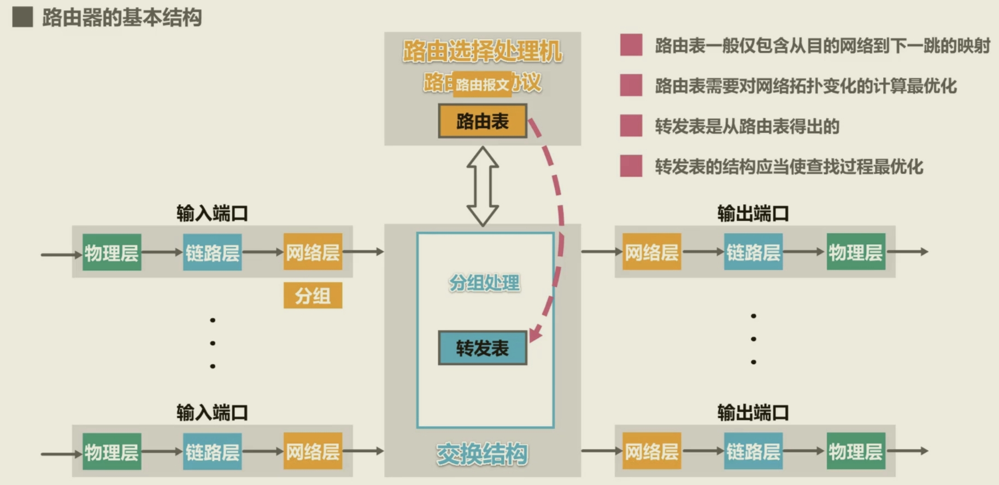

### 4.6.2 路由信息协议RIP的基本工作原理

- RIP是最先得到广泛使用的协议之一
- RIP要求AS内的每一个router都要维护从它自己到AS内其他每一个网络的距离记录，称为**距离向量（Distance-Vector）**
- RIP使用**跳数（hop count）**来**衡量到达目的网络的距离**
	- router到直连网络的距离定义为1
	- router到非直连网络的距离定义为所经过的router数量+1
	- 允许一台路径最多只能包含15个router，距离等于**16时不可达**，可见RIP只适用于小型网络

- RIP认为好的路由就是DV短的路由，也就是经过router少
- 当到达同一目的网络有多个距离相等的路由时，可以进行**等价负载均衡**（也就是将通信量均衡的分不到多条等价的路由上）


- RIP要点
	- 和谁交换信息
		仅和相邻router交换
	- 交换什么信息
		自己的路由表
	- 何时交换信息
		周期性交换（比如每30s）


RIP的基本工作流程

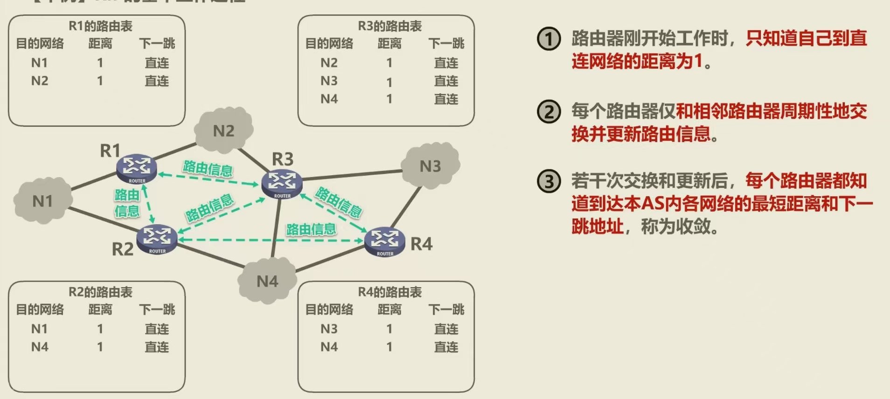


RIP更新的规则

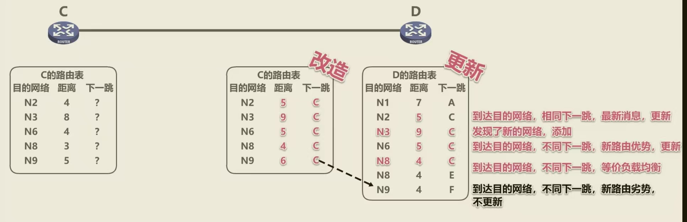

RIP存在的问题

- 慢收敛
	如果一条路径失效了，需要下一次 30 秒更新才能传播出去，更新过程慢
- 路由环路
	典型例子：网络宕掉，某个路由器还没学到，就把原来的路径继续传下去，形成“你说能通我信了你，结果我也说能通”的循环

坏消息传的慢例题

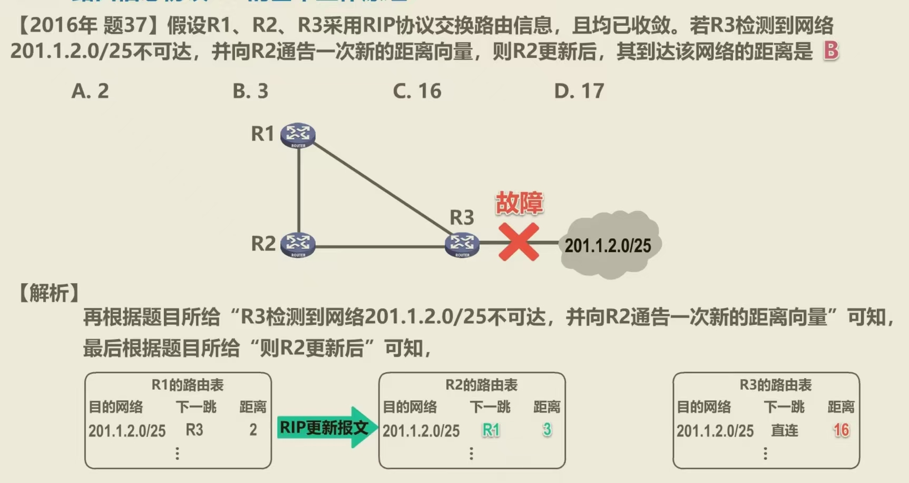

### 4.6.3 开放最短路径优先OSPF的基本工作原理

>open shortest path first ，是为克服RIP的缺点在1989开发出来的
>
>- 开放：其是公开发表的
>- 最短路径优先：使用了最短路径算法SPF（沟槽的`Dijkstra`还在追）

- OSPF是**基于链路状态**的，而不是基于距离向量的
- 采用SPF算法计算路由，保证了不会产生环路
- 不限制网络规模，更新效率高，收敛速度快
- 链路状态是指路由器都和那些路由器相邻，以及相应链路的cost（就是图里面的weight）
	- cost表示费用、距离、时延、带宽等等，都是由网络管理人员来决定


形象理解工作原理

你是路由器R1，刚接入网络，OSPF 会这么做：

1. “你好，我是谁，有没有邻居” —— 发送 Hello；

2. “哦，有邻居！我就选 DR 吧” —— 选举 DR/BDR；
	>designated router
	>
	>backup designated router
	>
	>- 所有的非DR/BDR只与DR/BDR建立邻居关系
	>	这样邻居关系数量 $2(n-2)+1$
	>- 非BR/BDR之间通过DR/BDR交换信息

3. “我连了 A、B、C，成本是多少” —— 发 LSA；

4. “让我看看大家都连了谁” —— 建 LSDB；

5. “我从我出发到每个地方的最短路径是……” —— SPF 算法；

6. “得嘞，这就是我更新的路由表”


- 通过交互hello分组，建立和维护邻居关系
	- hello分组封装在IP数据报中，发往组播地址244.0.0.5
	- 发送周期为10s
	- 40s未收到来自邻居路由器的hello分组，则认为该邻居路由器不可达


- 使用OSPF的每个路由器都会产生链路状态通告LSA，包含以下内容
	- 直连网络的链路状态信息
	- 邻居路由器的链路状态信息
- LSA被封装在链路状态更新分组LSU中，采用泛洪法发送
- 每一个路由器都有链路状态数据库LSDB，用于存储LSA
- 通过各路由器泛洪发送封装有自己LSA的LSU分组，各路由器的LSDB最终将达到一致
- 基于LSDB进行SPF计算，构建各自到达其他路由器的最短路径，也就是构建各自的路由表


- OSPF有以下分组

	- hello分组，发现和维护邻居路由器的可达性
	- 数据库描述分组，向邻居路由器给出自己的链路状态数据库中所有的链路状态项目的摘要信息
	- 链路状态请求分组，向邻居路由器请求发送某些链路状态项目的详细信息
	- 链路状态更新分组，使用这种分组将链路状态泛洪发送
	- 链路状态确认分组，对链路状态更新分组的确认分组

	

- 为了使OSSPF能够用于规模很大的网络，OSPF把一个AS再划分为若干个更小的范围，称为area


### 4.6.4 边界网关协议BGP的基本工作原理

#### 定义

> BGP，全称是 **Border Gateway Protocol（边界网关协议）**，是**互联网的核心路由协议**。

- 属于 **路径向量协议（Path Vector Protocol）**；
- 是一种 **外部网关协议（EGP）**，用于**自治系统（AS）之间**的路由交换；
- 当前版本是 BGP-4，支持 **CIDR** 和 **路由聚合**

#### 相关术语

eBGP 不同AS之间

iBGP 同一个AS内部

| 概念              | 含义                                                         |
| ----------------- | ------------------------------------------------------------ |
| AS（自治系统）    | 自治系统是一组使用同一内部策略、对外统一对等的网络系统（如某个ISP、某个高校） |
| ASN（自治系统号） | 每个 AS 都有全球唯一编号，像身份证                           |
| eBGP（外部BGP）   | 不同 AS 之间的 BGP 路由器交换路由                            |
| iBGP（内部BGP）   | 同一个 AS 内部的 BGP 路由器交换路由                          |
| Path Vector       | 每条路由包含路径上所有经过的 AS（路径记录）                  |
| 路径属性          | 每条路由都有附带属性，如 AS_PATH、NEXT_HOP、LOCAL_PREF、MED 等，用于决策路由优劣 |

#### BGP与前面几个区别

- 在不同AS之间，度量路由的cost可能不一样（带宽、距离费用等），因此，对于路由之间的路由选择不能使用cost
- AS之间的路由选择必须考虑相关策略（政治、经济、安全等）
- BGP用于选择一条比较好的路由，并非找出一条最佳路由

#### 工作过程

- 在配置BGP时，每个AS的管理员要至少选择一个router作为该AS的“BGP发言人”
- 不同AS的BGP发言人要交换路由信息，首先必须建立TCP连接，端口号为179
	- 在此TCP连接上交换BGP报文以建立BGP会话
	- 利用BGP会话交换路由信息（比如增加新的路由，撤销过时的路由，以及报告出错的情况等）
	- 使用TCP连接交换路由信息的两个BGP发言人，彼此称为对方的neighbor or peer
- BGP发言人除了运行BGP外，还必须运行自己所在AS所使用的内部网关协议IGP比如（OSPF RIP）
- BGP发言人交换网络可达性的信息（要到达某个网络所要经过的一系列自治系统）
- 当BGP发言人互相交换了网络可达性的信息后，各BGP发言人就根据所采用的策略从收到的路由信息中找出到达各AS的较好的路由，也就是构造出树形结构，不存在回路的AS连通图


#### 包含的报文类型

- OPEN报文
	用来与相邻的另一个BGP发言人建立联系，使通信初始化
- UPDATE报文
	用来通告某一路由的信息，以及列出要撤销的多条路由
- KEEPALIVE报文
	用来周期性地证实neighbor的连通性
- NOTIFICATION报文
	用来发送检测到的差错

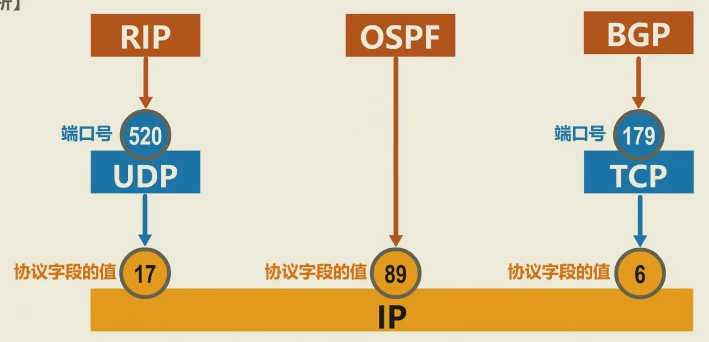

---

## 4.7 IPv4数据报的首部格式

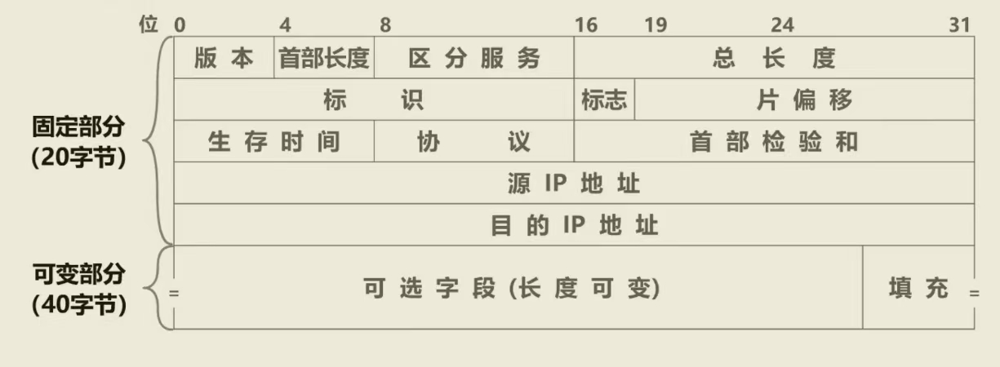

| 字段                      | 长度     | 作用                                                         |
| ------------------------- | -------- | ------------------------------------------------------------ |
| **Version**               | 4位      | IP 协议版本，IPv4 为 `0100`                                  |
| **IHL（Header Length）**  | 4位      | 首部长度，单位是 4 字节，最小值为 5（即 20 字节）最大15（60字节，20固定+40可变） |
| **Type of Service (ToS)** | 8位      | 区分服务：用于区分优先级、低延迟/高吞吐等，一般不使用        |
| **Total Length**          | 16位     | 数据报总长度（首部 + 数据），最大为 65535 字节               |
| **Identification**        | 16位     | 唯一标识一个数据报，用于分片重组，子片的与母片的一样         |
| **Flags**                 | 3位      | 分片标志：DF（1表示不允许分片0表示允许分片）、MF（1表示后面还有分片0表示后面没了） |
| **Fragment Offset**       | 13位     | 表示当前分片在原始数据报中的偏移位置（单位8字节）            |
| **Time to Live (TTL)**    | 8位      | 生存时间，==防止数据包在网络中无限循环==，以跳数为单位，router转发IP数据报时，将该字段的值减1，若不为0则转发反之丢弃 |
| **Protocol**              | 8位      | 指定数据部分是何种协议数据单元（对应关系见下）               |
| **Header Checksum**       | 16位     | 校验 IPv4 首部是否出错（注意：只校验首部，不校验数据）比CRC校验码简单，称为因特网校验和，数据报每经过一个router都要重新计算 |
| **Source Address**        | 32位     | 源IP地址                                                     |
| **Destination Address**   | 32位     | 目的IP地址                                                   |
| **Options（可选）**       | 可变长   | 一些特殊功能（如记录路由、严格源路由），同时也使得首部长度可变，很少用 |
| **Padding（可选）**       | 补齐字节 | 使首部长度为4字节整数倍，全0填充                             |

对IP数据报分片

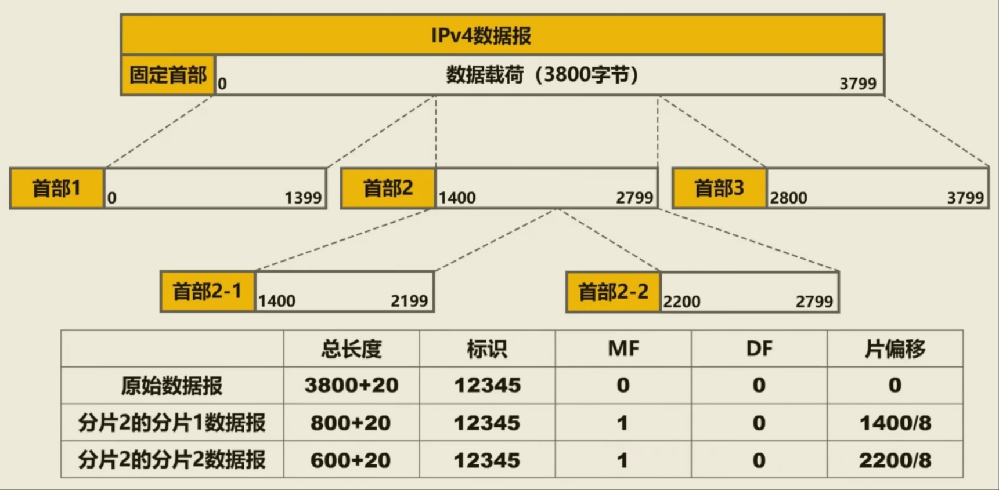

protocol

| 协议名称 | 协议字段值 |
| -------- | ---------- |
| ICMP     | 1          |
| IGMP     | 2          |
| TCP      | 6          |
| UDP      | 17         |
| IPv6     | 41         |
| OSPF     | 89         |

切片例子

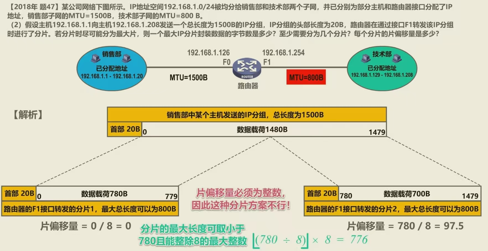

怎么计算首部检验和

**Checksum = ~ (H1 + H2 + ... + Hn)**
 （其中 H1~Hn 是 IP 头部按 16 位切割的各段，加法为带进位加法）

`十六进制： 0 1 2 3 4 5 6 7 8 9 A  B  C  D  E  F`
`十进制：   0 1 2 3 4 5 6 7 8 9 10 11 12 13 14 15`


对于分派前缀的问题

 步骤 1：**确定总地址范围**

`30.138.118.0/23` 表示的是：

- **起始地址**：30.138.118.0

- **掩码**：23 位，即 `255.255.254.0`，也就是块大小为：

	232−23=29=512 个地址2^{32-23} = 2^9 = 512 \text{ 个地址}232−23=29=512 个地址

- 所以可用地址范围是：

	- **起始地址**：30.138.118.0
	- **结束地址**：30.138.119.255

------

步骤 2：**整理每个 LAN 的主机数，并排序（从大到小）**

| LAN编号 | 主机数量                  |
| ------- | ------------------------- |
| LAN3    | 150                       |
| LAN2    | 91                        |
| LAN5    | 15                        |
| LAN4    | 3                         |
| LAN1    | ?（图片中未标明，需补充） |

------

 步骤 3：**为每个 LAN 分配足够大的地址块**

因为每个子网必须留出 **2 个地址**（网络地址和广播地址），所以**最小子网大小 = 主机数 + 2**，再向上取 2 的幂得到地址块大小。

例如：

- 150 主机 ⇒ 需要 152 地址 ⇒ `2^8 = 256` ⇒ 使用 `/24`
- 91 主机 ⇒ 需要 93 地址 ⇒ `2^7 = 128` ⇒ 使用 `/25`
- 15 主机 ⇒ 需要 17 地址 ⇒ `2^5 = 32` ⇒ 使用 `/27`
- 3 主机 ⇒ 需要 5 地址 ⇒ `2^3 = 8` ⇒ 使用 `/29`

步骤 4：**从起始地址起，按地址对齐方式依次分配**

每种子网掩码下，地址要**对齐到该块的起始位置**（即块大小的整数倍起始）。

- `/24`：块大小 256 ⇒ 起始地址必须是 `...xxx.0`
- `/25`：块大小 128 ⇒ 必须是 `...xxx.0` 或 `...xxx.128`
- `/27`：块大小 32 ⇒ 必须是 `...xxx.0`、`...xxx.32`、`...xxx.64` 等
- `/29`：块大小 8 ⇒ 对齐 `...xxx.0`、`...xxx.8`、`...xxx.16` ...

## 4.8 网际控制报文协议ICMP

>Internet Control Message Protocol
>
>主机或路由器使用ICMP来发送差错报告报文和询问报文
>
>ICMP报文被封装在IP数据报中发送


### 4.8.1 分类

- 终点不可达
	>- router或host不能交付数据报时发送；具体还可以分目的主机、端口、协议不可达等13种

- 源点抑制
	>当router或host由于拥塞而丢弃数据报时，向源点发送，使得源点清楚应当放慢发送数据报的速度

- 时间超过
	>router把TTL减到0之后，除了丢弃数据报之外，还向源点发送时间超过报文
	>
	>另外，当终点在预先规定的时间内没有收到一个数据报的所有数据报片时，丢弃已经收到的报片。发送时间超过报文

- 参数问题
	>当router或host收到IP数据报后，根据首部中的header checksum发现传输过程中出现误码，就丢弃该数据报，向源点发送参数问题报文

- 重定向（改变路由）
	>router把改变路由报文发送给主机，让主机知道下次应该将数据报发给其他的router


### 4.8.2 不应该发送ICMP报文的情况

- 对ICMP报文不再发送ICMP报文（报错信息出错了之后不套娃）
- 对一个分片的数据报片的所有后续数据报片都不发送
- 对具有多播地址的数据报都不发送ICMP差错报文
- 对具有特殊地址（127.0.0.0（本地环回测试地址）或0.0.0.0）的数据报不发送 


### 4.8.3 常见的ICMP询问报文

- **回送请求和回答**
	ICMP回送请求报文是由主机或router向一个特定的目的主机发出的询问
	收到此报文的主机必须给源主机发送ICMP回送回答报文
	用来**测试目的站是否可达**以及了解其有关状态
- **时间戳请求和回答**
	是请求某个主机或者router回答当前的日期和时间
	其中有一个32bit的字段，其中写入的整数代表从1900.1.1起到现在多少秒
	用来进行**时钟同步**和**测量时间**


### 4.8.4 应用例子

#### 分组网间探测PING

>Packet InterNet Groper

- 用来测试主机或router之间的连通性
- 应用层直接使用网际层的ICMP（没有通过运输层的TCP或UDP）
- 使用的ICMP回送请求和回答报文

#### 跟踪路由traceroute

- 用来测试IP数据报从源主机到目的主机要经过哪些router
- Windows版本
	- tracert命令
	- 应用层直接使用网际层ICMP
	- 使用了ICMP回送请求和回答报文以及差错报告报文


---

## 4.9 虚拟专用网VPN和网络地址转换NAT

### 4.9.1 VPN

定义
>是一种在公用网络（如 Internet）上构建**加密的、专属的、逻辑上的私有网络**技术

作用
>让远程用户像在公司/校园/局域网里一样安全访问内网资源


| 技术                      | 说明                                         |
| ------------------------- | -------------------------------------------- |
| **隧道技术（Tunneling）** | 把私有数据打包成公共网络可识别的数据包       |
| **加密技术**              | 保护数据不被窃听（IPsec、OpenVPN、SSL等）    |
| **身份验证**              | 验证用户合法性（用户名密码、证书、双因素等） |

- 同一机构不同部门的内部网络所构成的VPN又称为内联网VPN
- 有时一个机构的VPN需要某些外部机构参加，这样的VPN就称为外联网VPN


### 4.9.2 NAT

network address translation

NAT 是一种**在路由器/防火墙上进行的 IP 地址转换机制**，主要解决：

- **IPv4 地址不够用**；
- 内网设备不能直接访问公网的问题


> 让多个内网主机共享一个公网 IP 出去上网，出门带“马甲”，回家靠“记忆”

实际用途

- 家用路由器能让全家设备共享一个公网 IP
- 防止公网直接访问内网，提升一定安全性
- **绕过 IPv4 地址短缺问题**（NAT 的最大功劳）

存在一个问题：如果NATrouter具有N个全球IP地址，那么至多只能有N个内网主机能同时和因特网上的主机通信


外网主机不可以首先发起通信，内网主机不能直接充当因特网服务器

---

# 五、运输层

## 5.1 概述

- 此前实现了主机到主机的通信
- 但实际上，计网中通信的真正实体是位于通信两段主机的进程
- 如何为运行在不同主机上的应用进程提供直接的通信服务是运输层的任务，运输层协议又称为==端到端协议==
- 运输层直接为应用进程间的逻辑通信提供服务
- 根据应用需求的不同，分为**面向连接的TCP**和**无连接的UDP**


## 5.2 运输层端口号、复用和分用的概念

>如果 IP 地址是你家地址，端口号就是你家每个房间的门牌号。
>
>- 有了 IP 只能送到楼下；
>- 有了端口号才能送到你手上（对应程序）

- 运行在计算机上的进程使用**进程标识符PID**来表示
- 不同OS采用不同格式的PID
- 为了使得不同OS的应用进程能够通信，所以必须要使用**统一的方法对TCP/IP体系的应用进程进行标识**
- TCP/IP体系的运输层使用==端口号==来区分应用层的不同引用进程


### 5.2.1 端口号

- 使用16bit表示，范围0-65535
- 0–1023：**知名端口**（如HTTP: 80, HTTPS: 443, FTP: 21, DNS: 53）
- 1024–49151：**注册端口**（常由用户程序或第三方服务使用）
	为没有熟知端口号的应用程序使用，必须登记防止重复
- 49152–65535：**短暂端口**（操作系统临时分配）


**注意：端口号只有本地意义，只是为了标识计算机应用层中的各个进程，不同主机的相同端口号没有联系**

### 5.2.2 复用

> 多个应用程序（进程）**共享一个运输层协议（如TCP或UDP）**，通过端口号来区分数据。

>例如：你电脑同时打开了：
>
>- 微信网页版（使用443端口）
>- 网页浏览器访问博客（使用80端口）
>- 下载器在运行（用一个自定义端口）
>
>这些不同应用都通过一个 TCP 模块把数据发出去，复用的是同一个 TCP 协议，**但端口号不同**，数据打上“标签”一起送到网络层

### 5.2.3 分用

>运输层根据接收到的数据中的端口号，把数据送到正确的进程

>例如：数据包到达你的计算机；
>
>操作系统发现它的目的端口是 80，就把它交给监听 80 端口的 Web 服务器程序；
>
>如果是端口 443，就交给 HTTPS 服务；
>
>没有进程监听对应端口？——系统返回一个 “端口不可达” 的 ICMP 报文

常用协议所使用的端口号

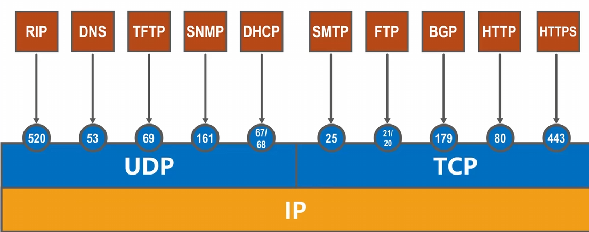

## 5.3 UDP和TCP的对比

UDP User Datagram Protocol

TCP Transmission Control Protocol

| 比较项   | TCP                                                          | UDP                    |
| -------- | ------------------------------------------------------------ | ---------------------- |
| 是否连接 | **面向连接**（需要三次握手）<br />四报文挥手释放连接（逻辑链接） | **无连接**（发送即走） |

- UDP支持单播、多播以及广播
- TCP首先需要三次握手建立连接，仅支持单播

| 比较项   | TCP                                          | UDP                                              |
| -------- | -------------------------------------------- | ------------------------------------------------ |
| 是否可靠 | **可靠传输**（丢包重传、数据校验、顺序保证） | **不可靠传输**（不保证是否送达或顺序）           |
| 数据重排 | 支持，按序到达                               | 不支持，可能乱序                                 |
| 处理     | ==面向字节流==有确认ACK和重传机制            | 既不合并，也不拆分，==面向应用报文==没有丢包处理 |
| 用个比喻 | 顺丰快递 + 查询物流                          | 喷泉洒水器，水流不停喷出去                       |

| 比较项   | TCP                        | UDP                  |
| -------- | -------------------------- | -------------------- |
| 传输单位 | 字节流（stream）           | 数据报（datagram）   |
| 边界处理 | 没有边界，开发者需自己划分 | 有明确的消息边界     |
| 示例     | 拆成一大串数据流           | 一条一条的短信包发送 |

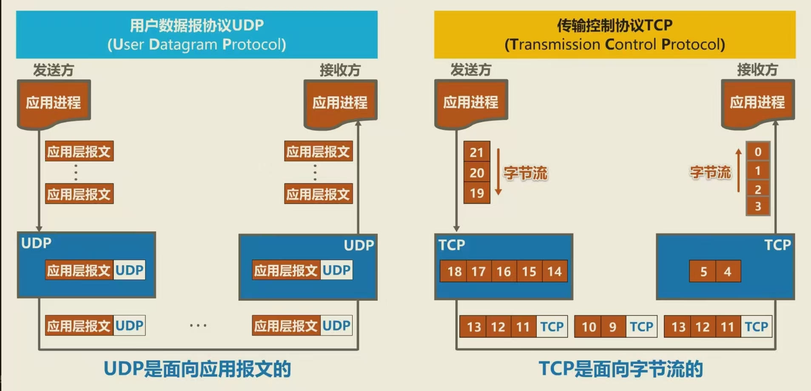

二者首部对比

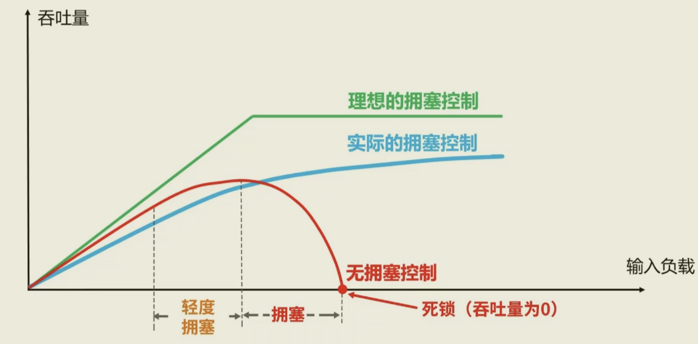

## 5.4 TCP的流量控制

**流量控制**：是 TCP 协议中用于控制数据发送速率的一种机制，确保**发送方发送的数据不会超过接收方的处理能力**

TCP 的流量控制是通过**接收窗口（Receive Window）**来实现的，接收窗口大小由接收方维护，并在每个 TCP 报文中通过首部的 `window` 字段告知发送方

例子：

1. **连接建立时：**
	 接收方告诉发送方：“我现在的窗口大小是 `10KB`”
2. **发送方根据窗口大小控制发送量：**
	 它最多只能发送 `10KB` 的数据，发多了就得等
3. **接收方处理后更新窗口：**
	 假设接收方处理了 4KB 数据，它会告诉发送方：“我现在又空出了 4KB 的窗口”
4. **发送方继续发送新的数据**


针对其中的特殊情况：接收方在等待发送方发送数据，发送方在等待接收方的ack（产生原因是接收方发送的ACK丢失了），为了避免这种死锁，会进行零窗口探测

>TCP发送方收到接收方的零窗口通知后，启动持续计时器，持续计时器超时后，向接收方发送零窗口探测报文

## 5.5 TCP的拥塞控制

**拥塞控制**是 TCP 用来控制**数据发送速率**的机制，目的是：

> 防止 **对网络中某一资源的需求超过了资源所能提供的可用部分，网络性能变坏**所谓网络资源，比如贷款、交换节点的缓存和处理机制等
>
> 如果出现拥塞而不控制，整个网络的**吞吐量将随着负荷的增大而下降**

TCP 发送方会**动态感知网络是否拥塞**，并据此**调整发送窗口**（叫做“拥塞窗口”，`cwnd`）


### 5.5.1 拥塞控制的四大算法

发送方维护一个称为**拥塞窗口cwnd**的状态变量，其值取决于网络的拥塞程度，并且动态变化

- `cwmd`的维护原则：只要网络没有出现拥塞，拥塞窗口就再增大一些；但只要出现拥塞，拥塞窗口就减小
- 判断出现拥塞的依据：没有按时收到应当到达的确认报文（即发生超时重传）
- 发送方将拥塞窗口作为发送窗口 `swnd`,即 `swnd`= `cwnd`
- 维护一个慢开始门限 `ssthresh`状态变量
	- 当 `cwnd`< `ssthresh`时，使用慢开始算法
	- 当 `cwnd`> `ssthresh`时，停止使用慢开始算法而采用拥塞避免算法
	- 相等时，慢开始和拥塞避免算法都可以

#### 慢开始slow-start

- 初始时 `cwnd` 很小（通常是1~2个 MSS）
- 每收到一个 ACK，`cwnd` 增加 **1 个 MSS**
- 每一轮 RTT `cwnd` 变成原来 2 倍，**指数增长**
- 增长到 `ssthresh`时，改用拥塞避免算法

#### 拥塞避免congestion avoidance

- 当 `cwnd` 达到一个阈值（`ssthresh`），进入此阶段
- 不再指数增长，而是**线性增长**（每 RTT 增加 1 MSS）

> - 当重传计时器超时，发送方判断网络很有可能产生了拥塞，于是把 `sshresh`更新为发生拥塞时 `cwnd`的一半
> - 把 `cwnd`减小为1，重新开始慢开始算法

#### 快重传fast retransmit

> 有时候，个别报文段会在网络丢失，但是实际上没有发生拥塞，这将导致发送方超时重传，并且误认为网络发生了拥塞，这将降低传输效率

- 采用快重传可以**尽早让发送方得知发生了个别报文段的丢失**


- 要求接收方不要在等待自己发送数据时捎带确认，要立即发送确认
- 即使收到了失序的报文段也要立即对已经收到的报文段重复确认
- 发送方一旦收到**连续三个重复 ACK**（表示某个包没到）
- 不等超时，立刻重传那个丢失的数据包

#### 快恢复 fast recovery

- 在快重传后，不回到慢开始初始阶段
- 将 `ssthresh` 和 `cwnd` 减半，然后从“拥塞避免”阶段继续增长

例子：

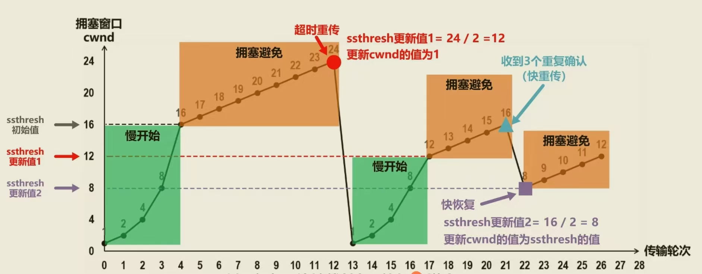

## 5.6 TCP超时重传时间的选择

### 什么是超时重传

在 TCP 中，每当发送方发送了一个数据段，它会启动一个**定时器**

- 如果在计时器到期前收到了该段的 **ACK**，说明传输了成功，定时器取消。
- 如果在超时时间（RTO）内 **没等到 ACK**，TCP 就会**重发这个数据段**。

所以 **超时重传 = 最后的兜底机制**，一旦其他机制（如快重传）未触发，靠它保证可靠性

### RTO

RTO 太短 → **容易误判丢包**，导致**不必要的重传**和网络拥堵。
 RTO 太长 → **响应慢**，数据真的丢了却等半天才重发。

所以：**RTO 必须自适应地调整！**

### 计算方法

| 符号   | 含义                                         |
| ------ | -------------------------------------------- |
| RTT    | 一个数据包从发送到收到 ACK 的往返时间        |
| RTT~s~ | 平滑的 RTT（Smoothed RTT），加权平均往返时间 |
| RTTVAR | RTT 的偏差（Variance）                       |
| RTO    | 最终的超时重传时间                           |

新的RTT~s~ = $(1-α)✖️旧的RTTs+α✖️新的RTT样本$

α越大，新的样本对其影响越大

推荐值为0.125

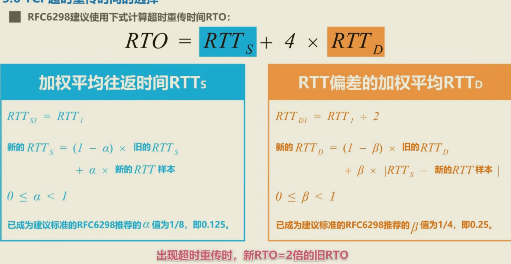

## 5.7 TCP可靠传输的实现

- TCP基于以字节为单位的滑动窗口来实现可靠传输
- 怎样描述发送窗口的状态
	使用三个指针 p1,p2,p3分别指向相应的字节序号
	- 小于p1的是已经发送并且收到确认的部分
	- 大于p3的是不允许发送的部分
	- p3-p1就是窗口尺寸
	- p2-p1就是已经发送但是没有收到确认的字节数
	- p3-p2就是运行发送但是尚未发送的字节数（可用窗口、有用窗口）


- 虽然发送方的发送窗口是根据接收方的接收窗口设置的，但是在同一时刻，发送方的发送窗口并不总是和接收方的接收窗口一样大
- 对于不按序到达的数据如何处理，TCP没有明确规定
- TCP要求接收方必须有累积确认和捎带确认机制，这样可以减小传输开销，接收方可以在合适的时候发送确认，也可以在自己有数据要发送的时候把确认信息捎带发送
- TCP的通信是全双工通信

## 5.8 TCP的运输连接管理

### 5.8.1 TCP连接：三次握手（Three-Way Handshake）

**场景**：客户端（Client）和服务器（Server）像两个陌生人建立信任关系

1. **第一次握手：SYN（同步请求）**
	→ **客户端**发送 `SYN=1 + seq=x`（随机序号）
	→ **潜台词**：”嗨！我想和你通话，我的暗号是x，能听到吗？“
	→ **客户端状态**：`SYN_SENT`（等待确认中）
2. **第二次握手：SYN+ACK（同步响应）**
	← **服务器**回复 `SYN=1 + ACK=1 + ack=x+1 + seq=y`（新序号）
	← **潜台词**：”收到你的x了！我也愿意连接，我的暗号是y！“
	→ **服务器状态**：`SYN_RECEIVED`
3. **第三次握手：ACK（最终确认）**
	→ **客户端**发送 `ACK=1 + ack=y+1`
	→ **潜台词**：”确认收到你的y！现在正式通话吧~“
	→ **双方状态**：`ESTABLISHED`（连接成功！）

✅ **灵魂拷问：为什么必须三次？**

> 两次不够：服务器无法确认客户端能接收消息（单相思风险）
> 四次多余：第三次握手已能确保双向通信能力（高效可靠）

### 5.8.2 TCP释放：四次挥手（Four-Way Handshake）

**场景**：客户端主动告别（全双工通信需双向关闭）

1. **第一次挥手：FIN（结束请求）**
	→ **客户端**发送 `FIN=1 + seq=u`
	→ **潜台词**：”我说完了，准备挂断（但还能听你讲）“
	→ **客户端状态**：`FIN_WAIT_1`
2. **第二次挥手：ACK（初步确认）**
	← **服务器**回复 `ACK=1 + ack=u+1`
	← **潜台词**：”收到结束请求！但我还有话要说…“
	→ **服务器状态**：`CLOSE_WAIT`
	→ **客户端状态**：`FIN_WAIT_2`（半关闭）
3. **第三次挥手：FIN（结束响应）**
	← **服务器**发送 `FIN=1 + seq=v`
	← **潜台词**：”我也说完了，一起关闭吧！“
	→ **服务器状态**：`LAST_ACK`
4. **第四次挥手：ACK（最终确认）**
	→ **客户端**回复 `ACK=1 + ack=v+1`
	→ **潜台词**：”收到！正式再见👋“
	→ **客户端状态**：`TIME_WAIT` → 等待 **2MSL**（最长报文寿命）后 `CLOSED`
	→ **服务器状态**：收到ACK立即 `CLOSED`

✅ **关键设计解析**

> **为什么挥手要四次？**
>
> - TCP是全双工通道（双向独立），需分别关闭发送通道
> - 第二次挥手后：服务器可能仍需传输剩余数据

> **TIME_WAIT的妙用**
>
> - 保底机制：确保最后一个ACK送达（若丢失，服务器会重发FIN）
> - 清场作用：让网络中旧数据包失效（避免污染新连接）


---

# 六、应用层

## 6.1 概述

解决通过应用进程的交互来实现特定网络的问题

- 是最顶层，是设计和建立计算机网络的最终目的
	- www
	- DNS域名系统
	- DHCP动态主机配置
	- 电子邮件
	- 文件传送FTP和P2P文件共享
	- 多媒体网络应用

## 6.2 C/S方式和P2P方式

开发网络应用首先要考虑网络应用程序在各种端系统上的组织方式和它们之间的关系

### C/S方式

- client和server是指通信中所涉及的两个应用进程
- C/S方式描述的是进程之间服务和被服务的关系
- client是服务请求方，server是服务提供方
- server总是处于运行状态，并等待client的服务请求。server具有固定端口号（如HTTP服器的默认端口号是80），运行服务器的主机也有固定的IP地址

- 通常是==服务集中型==的，即应用服务集中在网络中比客户计算机少的多的服务器计算机上
	- WWW,email，FTP等
- 由于一个server要向多个client提供服务，尝尝出现服务器计算机数量不够的情况
- 为此，常用计算机群集（服务器场）构建一个强大的虚拟服务器

### P2P方式

peer to peer

- 没有固定的服务请求者和服务提供者，相互对等，每个对等方同时是服务的请求者和提供者
- P2P文件共享、即时通信、P2P流媒体、分布式存储等
- ==服务分散型==，分散在大量的对等计算机中
- ==可扩展性==，系统性能不会因为规模增大而降低
- 有成本上的优势，不需要庞大的服务器设施和服务器带宽


## 6.3 动态主机配置DHCP

**核心功能**：自动为设备分配IP地址、子网掩码、网关、DNS等网络参数，告别手动配置！
**核心角色**：

- **DHCP客户端**：需要联网的设备（手机/电脑）
- **DHCP服务器**：管理IP地址池的“房东”
- **中继代理**（可选）：跨网段转发请求的“快递员”

>  **类比租房**：
>
> - **客户端** ≈ 租客（“我要租房！”）
> - **服务器** ≈ 房东（“有空房！租期1天~8天！”）
> - **IP地址** ≈ 房子（动态分配，到期回收）

### 工作过程

**▌ 第一步：Discover（客户端广播找服务器）**
→ 客户端发送 **`DHCP DISCOVER`** 广播包（目标IP：`255.255.255.255`，源地址 `0.0.0.0`）
→ **潜台词**：”有没有DHCP服务器？我要租个IP地址！“

**▌ 第二步：Offer（服务器响应报价）**
← 服务器回复 **`DHCP OFFER`** 广播包（客户主机此时没有IP地址，只能使用广播才能收到，包含**推荐IP**、子网掩码、地址租期默认网关等，当然需要使用ARP判断是否被使用）
← **潜台词**：”我这有空IP（如192.168.1.100），租你3天，要吗？“

**▌ 第三步：Request（客户端确认租房）**
→ 客户端发送 **`DHCP REQUEST`** 广播包（声明接受该IP）
→ **潜台词**：”我要租192.168.1.100！其他服务器不用报价了~“

**▌ 第四步：Acknowledge（服务器最终确认）**
← 服务器回复 **`DHCP ACK`** 广播包（正式分配IP，记录租约）
← **潜台词**：”成交！这是钥匙（IP参数），租期从此刻计算！“

> **特殊场景**：
>
> - 若服务器拒绝分配 → 回复 **`DHCP NAK`**（如IP已被占用）
> - 客户端重启时 → 直接广播 **`DHCP REQUEST`** 请求续租原IP
> - 租期达到一半时，客户请求更新租用期，源地址为租到的地址
> 	若同意，则发送确认报文ACK
> 	否则发送 NACK
> - 客户可以随时终止租用，只需发送`RELEASE`报文段即可


DHCP中继代理

在路由器上配置DHCP的服务器IP地址即可，不需要在每个网络都配置DHCP服务器


## 6.4 域名系统DNS（domin name system）

作用：将domin name翻译为 IP地址

**核心作用**：将人类可读的**域名**（如 `www.baidu.com`）转换为机器可识别的**IP地址**（如 `180.101.49.12`）。
**核心价值**：

>  **不用记IP**：记住 `taobao.com` 比记 `121.18.239.154` 简单多了！
> **负载均衡**：一个域名可对应多个IP（如访问淘宝时分配不同服务器）
> **灵活性**：IP变更时只需修改DNS记录，用户无感知


采用**层次树状结构的域名结构**

- 由若干个分量组成，分量之间用 点 隔开，代表不同级别的域名

`xxx.三级域名.二级域名.顶级域名`

- 每一级域名都由英文字母+数字，不超过63字符，不区分大小写
- 级别最低的域名写在最左，顶级域名最右
- 完整的域名不超过255字符
- 各级域名由上一级的域名管理，最高级的顶级域名由ICANN管理

`www.tju（三级域名）.edu（二级域名）.cn（顶级域名）`


顶级域名top level domin分为：

- 国家顶级域名 nTLD
- 通用顶级域名 gTLD
	`com`企业   `net`网络服务机构  `org`非营利组织 `int`国际组织 `edu`
- 反向域 `arpa0` 用于反向域名解析，即IP地址反向解析为域名


- 在国家顶级域名下注册的二级域名由国家自行确定
- 我国
	- `ac`科研机构
		`com` 工商金融等企业
		`edu`教育机构
		`gov`政府部门
		`net`提供网络服务的机构
		`mil`军事机构
		`org`非营利组织
- ==名字相同等级未必相同==


域名和IP的映射关系必须保存在域名服务器，以供查询

DNS使用分布在各地的域名服务器来实现域名到IP的转换

具体步骤

1. **本地查询**（秒级响应）
	→ 查 **浏览器缓存** → **系统缓存**（如hosts文件）→ **路由器缓存**
	→ 命中则直接返回IP！
2. **递归查询**（向本地DNS服务器求助）
	→ 电脑问 **本地DNS**（如运营商`114.114.114.114`）：”`www.taobao.com`的IP是啥？“
	→ 本地DNS若**无缓存**，则开启**迭代查询**：
3. **迭代查询**（本地DNS全球奔波）
	(1) 问 **根域名服务器**：”`.com` 该找谁？“
	← 回复：”去问 `.com` 顶级域服务器（如 `a.gtld-servers.net`）“
	(2) 问 **顶级域服务器**：”`taobao.com` 的IP谁管？“
	← 回复：”负责 `taobao.com` 的权威服务器是 `ns1.taobao.com`“
	(3) 问 **权威DNS服务器**（域名所有者管理）：”`www.taobao.com` 的IP是啥？“
	← 回复：”`180.101.49.12`“
4. **结果返回**
	→ 本地DNS缓存IP，并回复电脑
	→ 电脑缓存IP，发起连接！

- 为了提高DNS的查询效率，减轻根域名服务器的负荷和减少因特网上的DNS查询报文数量，在域名服务器使用 **高速缓存**,用于存放最近查询过的域名以及从何处获得域名映射信息的记录
- 映射关系是可能变动的，所以域名服务器应该为每项内容设置计时器并删除超过合理时间的项
- 用户主机也需要高速缓存


采用UDP协议进行封装，端口号是53

## 6.5 FTP文件传送协议

是使用最广泛的文件传送协议

- FTP提供交互式的访问，允许客户指明文件的类型和格式（比如是否使用ASCII码），允许文件具有存取权限

**核心作用**：在**客户端**和**服务器**间双向传输文件（上传/下载），支持目录管理、文件删除等操作。
**两大核心通道**：

| **通道**     | **端口**                     | **功能**                  |
| :----------- | :--------------------------- | :------------------------ |
| **控制连接** | 21                           | 传输命令（如`ls`、`get`） |
| **数据连接** | 20（主动）或随机端口（被动） | 实际传输文件内容          |

> **痛点**：明文传输（不安全）、配置复杂 → 逐渐被 **SFTP**、**SCP** 替代

 核心设计

- **双通道模型**：
	- **控制连接**（端口21）：传输命令（`LIST`/`RETR`）
	- **数据连接**（端口20或随机）：传输文件内容
- **工作模式**：
	- **主动模式(PORT)**：服务器主动连接客户端（易被防火墙拦截）
	- **被动模式(PASV)**：客户端连接服务器指定端口（主流）

 简化协议：TFTP

- 基于UDP，无身份验证
- 支持文件传输但**不支持交互**
- 通过确认+重传保证可靠性

## 6.6 远程登录 TELNET

1. **功能**：本地主机登录远程主机（透明传输键盘/屏幕数据）
2. **NVT模式**（网络虚拟终端）：
	- 客户端：用户命令 → NVT格式 → 服务器
	- 服务器：NVT格式 → 本地系统格式 → 执行
3. **衰落原因**：现代PC功能强大，SSH更安全


## 6.7 email

#### 核心组件

| **组件**       | **作用**                   | **协议**  |
| :------------- | :------------------------- | :-------- |
| 用户代理(UA)   | 邮件编辑/显示（如Outlook） | -         |
| 发送邮件服务器 | 转发邮件到接收服务器       | SMTP      |
| 接收邮件服务器 | 存储邮件到用户邮箱         | POP3/IMAP |

#### 邮件传输流程

1. 发件人UA → **SMTP** → 发送服务器
2. 发送服务器 → **SMTP** → 接收服务器
3. 接收服务器存储邮件至收件人邮箱
4. 收件人UA → **POP3** → 接收服务器取件

#### 邮件格式

- **信封**：路由信息（由邮件系统自动提取）
- **内容**：含头部（`To`/`Subject`/`From`）和正文


## 6.8 www

#### 核心三要素

| **要素** | **技术** | **作用**               |
| :------- | :------- | :--------------------- |
| 资源标识 | URL      | 唯一标识网络资源       |
| 传输协议 | HTTP     | 客户端与服务器通信规则 |
| 文档格式 | HTML     | 定义超文本结构与超链接 |

#### URL格式


```jade
<协议>://<主机>:<端口>/<路径>
示例：http://www.tju.edu.cn:80/chn/index.htm
```

#### HTTP工作流程

1. 浏览器解析URL → DNS查询IP
2. 建立TCP连接 → 发送HTTP请求（如 `GET /index.html`）
3. 服务器响应 → 返回HTML文档
4. 浏览器渲染页面 → 释放TCP连接

#### HTML关键特性

- **超链接类型**：
	- 远程链接：指向其他网站（`<A HREF="http://...">`）
	- 本地链接：简化协议/主机名（指向同主机资源）
- **标签作用**：定义排版（如 `<H1>`标题 `<P>`段落）
